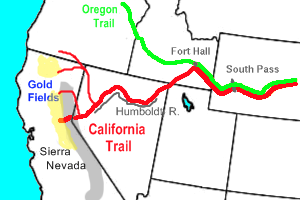

# The Applegate Trail

The Applegate Trail (sometimes called the California Trail) was a wilderness trail through today’s U.S. states of Idaho, Nevada, California, and Oregon, and was originally intended as a less dangerous route to the Oregon Territory.

In 1843, part of the Applegate family of Missouri headed west along the Oregon Trail to the Oregon Country.  Charles, Jesse, and Lindsay led their families along the trail and lost two children on the journey down the Columbia River. The hardships along the way influenced the family to find an easier and safer way to the Willamette Valley.

In 1846, the Oregon Provisional Legislature allowed the Applegates and others to attempt to find a more southerly route to Oregon. The group began the task on June 25, 1846, with Jesse Applegate, Lindsay Applegate, David Goff, John Owen, B. F. Burch, W. Sportsman, Robert Smith, a Mr. Goodhue, J. Jones, B. Ausbuan, and Levi Scott starting the survey. Leaving La Creole, the party spent three and a half months surveying a route to Fort Hall in present day Idaho. At that location the Applegate Trail departed the main branch of the Oregon Trail. On the return trip, the group brought approximately 150 immigrants along this southern route, also known as the South Road, South Emigrant Trail or the Scott-Applegate Trail.

From Fort Hall, the route headed south following the Humboldt River before passing through the Black Rock Desert (beautiful place to off road) in present-day Nevada. The trail then entered northern California and passed Goose and Tule lakes. After crossing the Lost River, the route then crossed the Klamath Basin and the Cascade Range into Southern Oregon. The trail then followed Keene Creek to the Siskiyou Mountains where it followed the south branch of the Rogue River. Heading northerly, the route followed the Umpqua River before crossing the Calapooya Mountains into the southern Willamette Valley.

The trail continued to be used and improved over the next few decades after the initial party traveled the trail. In 1848, when news of the California Gold Rush reached the Willamette Valley, many settlers left Oregon for the gold fields using the trail to reach northern California. This included Jesse and Lindsay Applegate. On August 3, 1992, the Applegate Trail became a National Historic Trail as part of the California National Historic Trail. The Nevada section of the trail is listed on the National Register of Historic Places as the Applegate-Lassen Trail.

Put your mark here… [txoutdoorx4](https://www.expeditionutah.com/forum/index.php?members/txoutdoorx4.2171/)

## Trip Planning & Resources

* [Expedition Utah forum: Applegate Trail](https://www.expeditionutah.com/forum/index.php?threads/applegate-trail.3392/)
* [The Applegate Trail](http://www.webtrail.com/applegate/)
* [Trails West - Trail Guides for Purchase](https://emigranttrailswest.org/trail-guides-for-purchase/applegate-trail-guide/)
* [Lassen Applegate Emigrant Trail Ride](http://www.highrocktrekkers.com/lassen-applegate-emigrant-trail-ride/)

