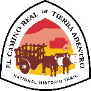
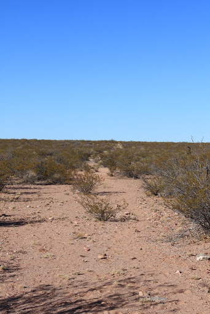
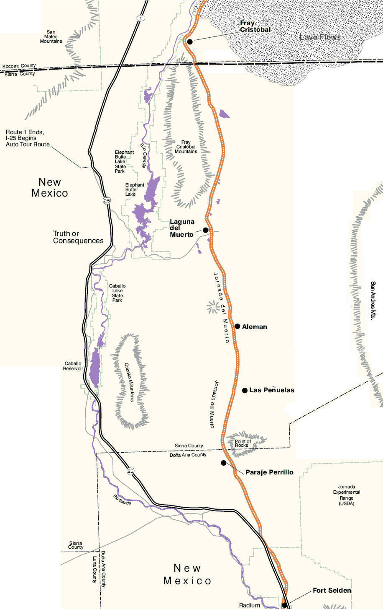
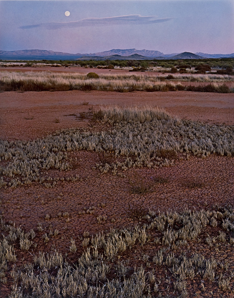

# El Camino Real de Tierra Adentro, Central New Mexico

El Camino Real de Tierra Adentro (Spanish for “The Royal Road of the Interior Land”), National Historic Trail is a part of the United States National Historic Trail system and was a 1,600 mile (2560 kilometre) long trade route between Mexico City, Mexico and Santa Fe, New Mexico from 1598 to 1882. The approximately 404 mile (646 km) section of the route within the United States was proclaimed as a National Historic Trail on October 13, 2000. The trail is overseen by both the National Park Service (NPS) and the U.S. Bureau of Land Management (BLM). This trail is also known as Royal Inland Road, as well as the Silver Route.

It is the USA’s oldest and longest continuously used “highway” bringing European colonists to “New Spain” (New Mexico) beginning 22 years before the Mayflower. Many of the people living in the Southwest today are descendants of these early settlers.

The El Camino Real International Heritage Center is one of New Mexico’s newest State Monuments, dedicated in November 2005. The Center contains award winning exhibits, an interpretive learning center, and artifacts presenting the history and heritage of El Camino Real de Tierra Adentro and is located a 5 minutes drive from I-25 exit 115.

From the Texas-New Mexico border to San Juan Pueblo north of Espanola, a drivable route, mostly part of former U.S. Route 85 (now I25), has been designated as a National Scenic Byway called El Camino Real.

Portions of the trade route corridor also contain pedestrian/bicycle/equestrian trails. These include the existing Paseo del Bosque Trail in Albuquerque and portions of the proposed Rio Grande Trail. Its northern terminus, Santa Fe, is a terminus also of the Old Spanish Trail and the Santa Fe Trail.

Along the trail, parajes (stop overs) that have been preserved today include El Rancho de Las Golondrinas. Fort Craig and Fort Selden are also located along the trail. The roughest and deadliest part of the Camino Real was the stretch between Las Cruces and Socorro in NM, called Jornada del Muerto or Journey of the Dead.

## History

The Camino Real de Tierra Adentro developed to serve the great mining initiatives in northern Mexico during the Spanish colonial period, with attendant farming, grazing and military support for mining activities. Concurrently, evangelists devoted themselves to the spiritual life of indigenous people and settlers who accompanied the mining process.

In the early stages the Camino Real de Tierra Adentro was not fixed in all its points and tracts. Even in later years it was not one fixed route, but can be seen as a gradual development of routes that linked what is now Mexico City to the remoter areas of the north where the mines and new towns were created. And along these routes, since the 16th century were planned development of forts, towns and haciendas to protect the routes.

The discovery of the mines of Zacatecas in 1546 was the fundamental starting point for this process, since it was indispensable to protect people and to guarantee the safe delivery of silver, mercury and the goods that were essential to supply the needs of the mining towns.

The wealth of the American North was exploited by conquerors, clerics and traders from Spain between 16th and 19th centuries. The first stages of the route linked the mines of Zacatecas, Guanajuato and San Luis Potosí to the city of México, capital of the viceroyalty of Nueva España.

The Camino Real de Tierra Adentro was itself connected, through Mexico City, to stretches of the Intercontinental Camino Real reaching Spanish dominions in the Philippines, Florida, the Antilles and the American South. Mexico City was linked overland to the port of Veracruz, on the Gulf of Mexico, to service the European trade and overland to the port of Acapulco on the Mexican Pacific coast, to link to the Asian trade.

The expansion of the route later continued north to the villa of Santa Fe of the viceroyalty of Nuevo Mexico (New Mexico) founded in 1598.

In 1552 the mines of Guanajuato were discovered and they quickly led to great wealth. That discovery was followed by the development of mines at San Martín, Fresnillo, Sombrerete, Chalchihuites, Nieves, Mazapil, Indé, Santa Bárbara, Parral and Pinos, all between 1556 and 1604.

Increasing quantities of silver were exported to Spain and large amounts of currency were coined at the Casa de Moneda of México, the first Mint of America, founded in 1535. All this led to a huge growth of international trade, to the monetarisation of the world economy and, in 18th century, one of the first global economic revolutions.

The operation of the Camino Real led to a wide range of architectural, urban, industrial, highway and cultural development. The intensive silver production, exploration and growth of trade laid the foundations for the reales de minas (royal mining camps) and their protective frontier institutions, the presidios and misiones. New cities exerted administrative, economic, political, religious and regional control to ensure continuity for early Spanish villas, with Indian settlements as essential sources of farm-workers.

Along the route, as it extended through the north of the viceroyalty of Nueva España, landmarks were introduced to signpost the route, especially when far from population nuclei. An understanding of the natural environment and its topography was essential to build safe, controllable roads for all forms of transport, as well as infrastructure for the mercantile traffic – bridges, paving and fords. This reality configured the character of each section of the Camino Real de Tierra Adentro and the propagation of Catholic dogma and the Hispanic language followed the trade.

The route had several periods of prosperity in the 17th and 18th centuries. This prosperity waxed and waned as new mines were discovered, epidemics took hold or there were hostilities. Taking a broad overview, the 16th century was the foundation of al that followed and the settlements and churches built then are of great importance as setting out the way ideas from Spain were modified for the needs of the territory. The late 16th century and early 17th century were periods of great expansion and prosperity in some places when wealthy mines were discovered, and towns were founded, such as Zacatecas which grew rapidly in an unplanned way.

Other towns were set up as staging posts along the road as were forts and land allocated for Spaniards to develop haciendas – in many cases in conjunction with mining activities. The road itself remained mostly unpaved and hazardous and difficult to navigate in wet weather although a few early bridges were created. Planned mining towns followed in the late 17th century such as San Luis Potosí, and these were sited some way from the mines they supported.

The second general period of prosperity, also based on the silver mines, was the second half of the 18th century. During this period money was spent on rebuilding churches – many from adobe to stone, in providing stone bridges over rivers and streams and in enlarging haciendas.

The third general period of prosperity was after the Wars of Independence in the mid 19th century when the opening up of the route into New Mexico led to increased trade with the north, and in a variety of goods, not just silver. Again many churches were rebuilt, as were houses and civil buildings in the towns and cities.

## Jornada del Muerto

The Jornada del Muerto (Spanish for “single day’s journey of the dead man” hence “route of the dead man” or “Dead Man’s Walk”) was the name given by the Spanish conquistadors to a desert basin and the particularly dry 90-100 mile (160 km) stretch of the route through it leading northward from central New Spain (modern-day Mexico) to the furthest reaches of the colony in northern Nuevo México (New Mexico).

The Jornada del Muerto runs between the Oscura and San Andres Mountains on the east, with the Caballo Mountains and the Fra Cristóbal Range on the west. The name Jornada del Muerto Volcano and  malpaís refers to a shield volcano and lava field, about 10 by 15 miles (16 x 24 km) in size and reaching an elevation of 5,136 ft (1,565 m), located at the northern end of the desert basin.

## History

Caravans left the comparative ease of the Rio Grande River at Points of Rocks, north of Las Cruces, and prepared for a brutal march with little rest and no water. Oñate, first blazing the trail in 1598, wrote that his group suffered for lack of water until someone’s dog appeared with muddy paws. The travelers followed the dog to temporary water where animals and people slaked their thirst. Known from then on as Los Charcos del Perillo (“the pools of the little dog”), it became a paraje, or camping place, where caravans watered, preparing for the harsh trip ahead.

The name, Journey of the Dead Man probably originated with a German man (Bernardo Gruber, a trader at Quarai Pueblo in New Mexico, who was called El Aleman (the German) by his friends) who died there while fleeing the Inquisition in the later 1600s although due to the complete lack of water, grazing or firewood, the route through this area already had a negative reputation. El Aleman was not the first to die in this terrible desert crossing, and he would certainly not be the last. But it was his death that would give this trail (and the desert it crossed) its grim name. Nobody knows how many people died along the Jornada del Muerto, although it probably numbered into the dozens, if not hundreds. Although quite flat, the Jornada del Muerto took several days to a week to cross and presented great difficulties to the earliest Spanish travelers who were on horseback, with wagons pulled by oxen or on foot.

After days of anxious passage, Oñate reached the river near present day San Marcial and encountered, not the Seven Cities of Cíbola (as they thought), but the humbler walled villages of the Pueblo dwellers of the village Teipana, who had a well-developed agriculture and a peaceable tradition, who gave food and succor to the strangers. At the first crossing, the Jornada del Muerto in 1598, Oñate named the pueblo Socorro (Spanish for ‘help’ or ‘assistance’).

In 1680, during the Pueblo Revolt against Spanish rule (killing many foreigners and driving the rest out), the settlers were forced to retreat southward, along the Jornada del Muerto, together with Indians from the Isleta and Socorro Pueblos, they gathered at Fra Cristobal paraje, the campsite at the northern end of the desert. Of the more than 2000 who left Socorro fewer than 1200 survived the crossing. The survivors resettled on the Rio Grande around and just north of El Paso del Norte, ‘the Pass to the North’, which is now separated between the Mexican city of Ciudad Juárez, Chihuahua, and the U.S. city of El Paso, Texas. In 1692, Diego de Vargas led a new group of settlers north across the Jornada del Muerto to northern New Mexico.

The Jornada was in the middle of Apache territory, and the Indians were always a threat to the safety of the caravans. Soldiers usually accompanied the traders and settlers. Caravans searching for temporary water sites made easy ambushes for the Apaches, another reason the treacherous route was given the label of death.

By the 1880s, railroad crews were building a track through the area. One of the biggest railroad towns was Engle, built right in the middle of the Jornada. Livestock and people now traveled safely over the Jornada del Muerto. Ranches were established and people built homes.

Homesteaders in the 1860s to 1920s tried to ranch in the Jornada del Muerto, digging wells for the cattle. The first well was at Aleman, dug by Lt. John Martin, and it appears to be the last of the homesteads to be abandoned at the end of the twentieth century.

Historians give the date 1885 as the death of El Camino Real, when the railroad effectively made the trail obsolete. The Atchison, Topeka and Santa Fe railroad closely follows El Camino Real including through the Jornada del Muerto.

In 1945, the U.S. Army chose the desolate Jornada del Muerto to detonate the first atomic bomb at the Trinity Site. The North American Trade Agreement (NAFTA) became fully implemented on January 1, 2008. There are four corridors established in the agreement one of which is the Central Western corridor. It has the second largest trade volume of all the North American corridors. The route links Chihuahua in Mexico to Denver, Colorado, via the Paso del Norte, the ports of entry of El Paso/Ciudad Juarez between Chihuahua and Texas, and Santa Teresa in New Mexico.

El Camino Real remains alive and well. Today Interstate I-25 serves the same purpose as the original trail, following the historic route along the west side of the Rio Grande quite closely. Today the Jornada del Muerto contains some of the best-preserved sections of El Camino Real.

> Gruber became drunk on Christmas Eve in 1666 and during midnight mass bragged to some friends about a spell he had learned. Word got back to the Inquisition’s agent at Santa Fe, and Gruber was arrested for witchcraft. After several years imprisoned in a makeshift cell at an estancia near present-day Albuquerque, Gruber made a daring escape and fled southward on the Camino Real with his Apache servant, Atanasio. They headed through Lava Gate and across the desert. After a harrowing ride, Gruber, parched and exhausted, halted at a place called Las Penuelas and sent Atanasio ahead for water. The servant rode like the wind, filled up a gourd, and flew back — only to break the gourd in his haste. He returned to the water and, with nothing else to carry it with, soaked a saddle blanket. When he got back to where he had left El Aleman, the man had taken a horse and disappeared. A month later, travelers across the desert found Gruber’s horse tied to a bush, dead. Nearby was a mass of human hair, a skull, and a few gnawed bones. They gathered the pathetic remains for burial and erected a cross, which stood for many years, becoming a well-known landmark known as La Cruz del Aleman, the Cross of the German.

## Geography

The Jornada del Muerto is a long stretch of flat, essentially waterless land about 90-100 miles (160 km) from north to south that remains almost entirely uninhabited and undeveloped to this day. The two small mountain ranges on the west, the Caballo Mountains on the south end and the Fra Cristobal Range on the north, prevent access to the Rio Grande which is the most stable water source in the area.

The Jornada del Muerto trail leaves the Rio Grande at old Fort Selden, just north of Las Cruces, New Mexico, and the last intermittent water is at Paraje Perillo. The trail passes Point of Rocks which is the southern most point of the closed Jornada basin. The trail heads basically north through mesquite scrub land to Aleman, named for a German merchant who died of thirst there in the 1670s. There is an old homestead there now. Further north the trail crosses a number of small dry lake beds, the largest of which is Laguna del Muerto (Engle lake).

At the upper end of the basin the trail is squeezed between the Fra Cristóbal Mountains and the Jornada del Muerto lava fields. The waterless portion of the trail ends at Paraje Fra Cristóbal, but the trail continues north across a small portion of the lava fields which originally reached across the Rio Grande. This large lava field, over 170 miles² (440 km²) in size and called the Jornada del Muerto Volcano by volcanologists, erupted about 760,000 years ago. It produced a slow and viscous ‘AA’ lava which has a very rough surface, making travel across it even more difficult. (I had to put a bit of geology in here).

Located just to the east of the southernmost portion of the Jornada del Muerto is the Jornada LTER (Long-Term Ecological Research) station, used for study of desert ecology, land management, plant physiology, and related topics.

## Sources

* [Friends of El Camino Real](http://www.caminorealheritage.org/index.html)
* Members of ExpeditionUtah
* National Park Service
* Flickr.com
* wikimedia.org
* nmartmuseum.org
* byways.org

Here is what I have been able to put together so far for a GPX file.

Still need a lot of help in verifying data, markers, sites, photos, etc. Please post up on [forum here](https://www.expeditionutah.com/forum/index.php?threads/el-camino-real-de-tierra-adentro-national-historic-trail.504).

## GPX File

Download the GPX file: [elcamino.gpx](elcamino.gpx)
(Right-click and “Save Link As” to transfer file to your device)