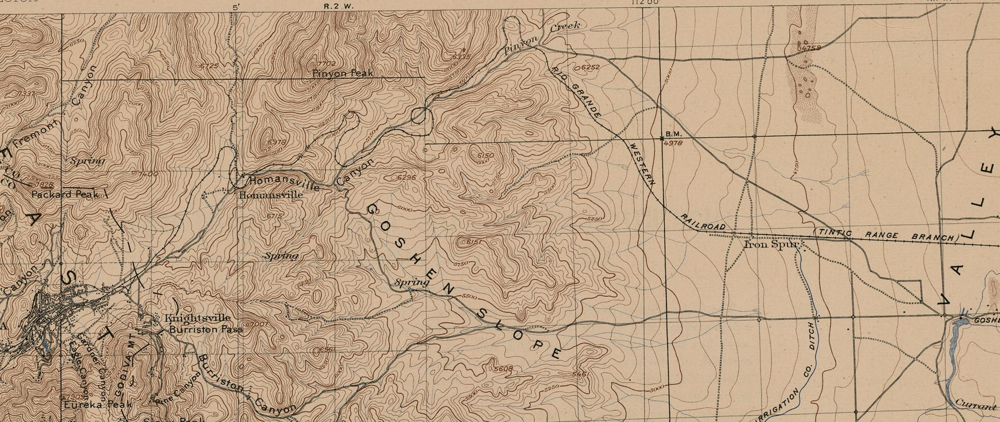
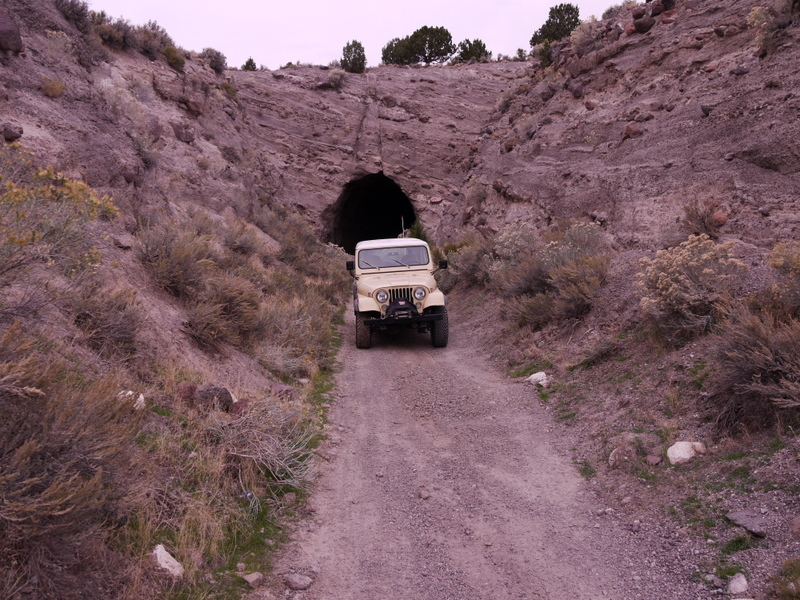
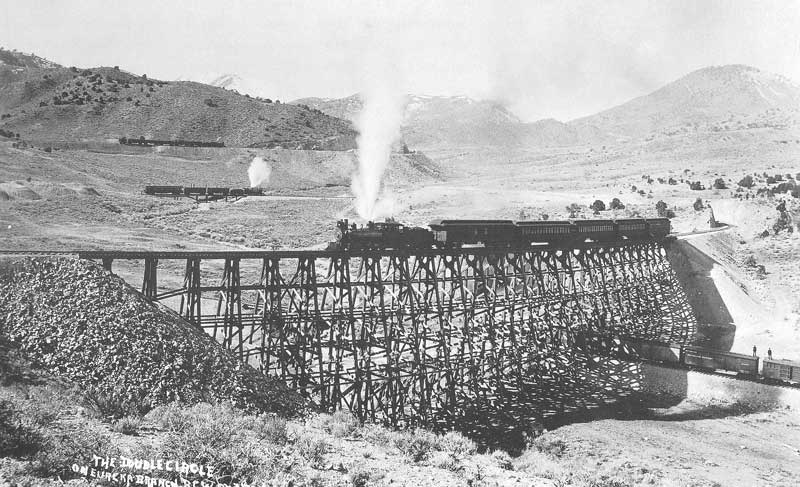
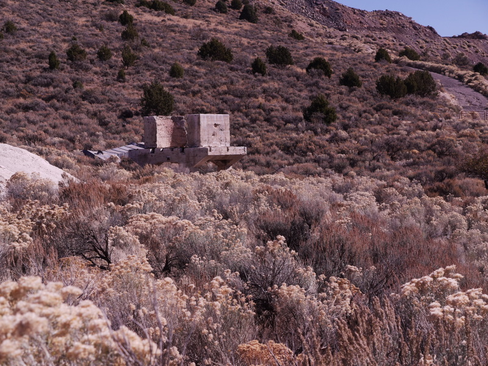

# Eureka Ghost Rail: Tintic Range Railroad

> The Tintic Range Railroad branch was built in 1891 to service the mines in Eureka. It started at the existing track in Springville and went south to Santaquin then turned west to Elberta. From Elberta it went up Pinion Canyon and Homansville Canyon and ended in Eureka. 39 miles total. A couple of years later it was extended 4 miles to Mammoth and Silver City. The extension to Silver City was abandoned in 1943. The line from Pearl Junction, a couple of miles west of Elberta, to Eureka was abandoned somewhere around 1966 or '67.
>
> — Old Jeeper

Read the [full trip report by Old Jeeper.](https://www.expeditionutah.com/forum/index.php?threads/eureka-ghost-rail-tintic-range-railroad.5086/)

This article features the 11 mile section between Pearl and Eureka. On the trail, you'll encounter tunnels, rail sidings, and other railroad ruins.

While the trestle no longer exists, the abutments are still there along with the concrete foundations for the supports.

Following the route will lead through Homansville Canyon, where across the canyon is Highway 6. Nearby is the ghost town of [Homansville](http://www.ghosttowns.com/states/ut/homansville.html) and the siding called Saddle. Saddle has quite a bit of concrete ruins scattered about.

## Trip Planning & Resources

* [Full trip report by Old Jeeper](https://www.expeditionutah.com/forum/index.php?threads/eureka-ghost-rail-tintic-range-railroad.5086/)
* Book: Historical Guide to Utah Ghost Towns - Stephen L. Carr
* Book: Utah Ghost Rails - Stephen L. Carr & Robert W. Edwards
* Book: Faith, Hope and Prosperity: The Tintic Mining District - Philip F. Notarianni
* [D&RGW Tintic Branch History](http://www.drgw.net/info/TinticBranch)
* [Camp Floyd, a Cave, and a Tunnel](https://www.expeditionutah.com/forum/index.php?threads/camp-floyd-a-cave-and-a-tunnel.3963/)
* [Mining Districts of Utah](https://www.expeditionutah.com/forum/index.php?threads/mining-districts-of-utah.384/)
* [Railroads and Mining at Tintic](http://utahrails.net/articles/tintic.php)
* [Homansville](http://www.ghosttowns.com/states/ut/homansville.html)

