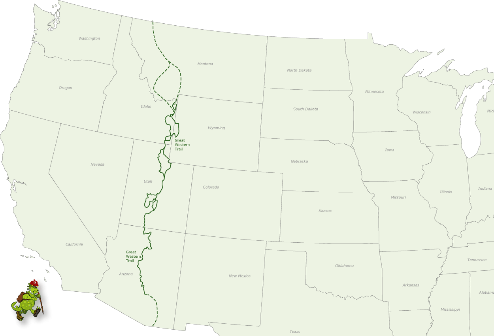

# The Great Western Trail

> **Note:** As this trail is not complete in construction or permitting…please feel free to add to this article, correct it, etc. please let the administrator know and he will give you access.

The Great Western Trail (GWT) is a north-south unique corridor of braided and paralleling trails encompassing many of the local popular trails for both motorized and non-motorized users and traverses some 4,455 mile (7,170 km)  from Canada to Mexico through 5 western states (AZ, UT, ID, WY, & MT). It is the longest truly multiple-use trail system in the world and is one of the finest examples in the USA of what can be accomplished when all users come together on a mutually beneficial project.

It incorporates stunning desert and canyon landscapes, plateaus, woodlands, dense forests and alpine meadows. It links 18 National Forests, Tribal, State and BLM administered lands and encompasses the most diverse vegetation, topography and wildlife in the western United States.

A trail concept was conceived about 1980 by Utah horsemen, hikers, and the U. S. Forest Service to build a regional trail along the Wasatch Crest. The idea languished until about 1985 when the idea was expanded to create a trail that extended from the Grand Canyon to Yellowstone National Park. Shortly thereafter two backpackers from New York City hiked from Canada to Mexico along this embryonic trail system, and now the GWT is becoming real. Eventually the trail will connect Mexico with Canada through Axizona, Utah, Idaho and Montana. The trail is “work in progress” with a concept  to designate a trail system that traverses thousands of miles through Arizona, Utah, Idaho, Wyoming, and Montana.

In 1996, the GWT was designated Utah’s Centennial Trail as part of the Statehood Centennial celebration. In 2000, the GWT was designated one of 16 National Millennium Trails by the White House and the Department of Transportation. The Great Western Trail is currently under study by the U.S Congress.

Trail enthusiasts and government officials from Canada and Alaska have expressed interest in extending this series of trails north into Alaska potentially doubling its length.

A route is possible and actually in place through much of the area. The route being chosen for this trail corridor and at least one tread alignment takes advantage of the rich abundance of public lands throughout the heart of the Rockies. By following mostly existing roads and trails, very little right-of-way acquisition and minimal new construction is needed. This trail would be mostly on National Forests and some public domain administered by the Bureau of Land Management in Idaho, Wyoming, Utah, and Arizona.

The GWT is actually much more than a trail, but rather a corridor of trails and passageways designed to serve the many types of trail interests and users. Using whatever was available, travellers in the Old West made their way by foot or horseback, or by using a variety of vehicles including wagons and water craft as they moved between communities, over mountain passes, down rivers, and across valleys. And so it is today along the Great Western Trail as the magic and romance of the Old West unfolds once more to recreational enthusiasts from across the nation and many foreign countries. Opportunities exist for hikers, horseback riders, boaters, mountain bikers, cross-country skiers, and off-road vehicle and snowmobile riders to traverse this scenic and culturally rich area of our nation in a variety of ways.  In Utah the route is best describes as a “way” rather that a single trail because it is a network of trails in a corridor. Some of the trails are in primitive areas or designated wilderness where motorized vehicles are prohibited. Such trails are paralleled by shared-use trails that accommodate motorized travellers.

## Arizona

**Maps:** [Arizona](https://docs.google.com/viewer?url=http://azstateparks.com/OHV/downloads/OHV_GWT_Map.pdf)

Since 1992, a diverse partnership of land managment agencies, the  GWT Association, and the Arizona State Association of 4-Wheel Drive Clubs have been hard at work making the Arizona Section of the GWT a reality. Once only a concept, the GWT is evolving as a dynamic opportunity for adventurous people to discover Arizona on a road less- travelled.

Although not complete and still under development, the approximately 800-mile (1280 km) Arizona section of the GWT is nearly 50% complete and located on existing backcountry routes.  North of Phoenix, the GWT traverses rugged and beautiful country on the Tonto, Prescott and Kaibab National Forests, as well as BLM lands on the Arizona Strip. Some segments require vehicles to be highway-licensed/legal. A diverse partnership of land management agencies, the Arizona Great Western Trail Association (AZGWT), and many local organizations worked hard at making the Arizona section of the GWT a reality.

At the southern Utah border, the GWT corridor could extend through Arizona completing the link to the border of Mexico.’ This extension could follow a proposed motorized trail route and be known as the El Camino Grande section of the GWT. This section would extend south and east through Arizona crossing the Colorado River upstream of the Grand Canyon NP and head south passing Flagstaff, Phoenix, and Tucson finally reaching the border of Mexico.

The Arizona Section materialized in April, 1996 on the Tonto National Forest when the first segment of the trail was established on the Bulldog Canyon Trail of the Mesa Ranger District. On April 25, 1998 the 72-mile Cave Creek Segment also on the Tonto NF, was dedicated along with Sears-Kay Ruin-the first sanctioned “Point of Discovery” along the trail. The Ruin is an ancient Hohokam village atop a hill overlooking the GWT north of Carefree and Cave Creek.

In 2000, 72 miles was  dedicated and signed on the Prescott NF. On the South Kaibab NF, 84 miles of GWT has been located and all trail improvements were completed. In order for the South Kaibab section to connect to State Highway 64, up to 21 miles of highway/road on the Navajo Reservation must be used.

On this route, you’ll experience the desert oasis that is 7- Springs Campground, on to Bloody Basin up the Prescott Rim to Prescott NF and the Verde Segment of the GWT. Sycamore Creek, Agua Fria Grasslands, Dugas then across the Black Canyon Freeway on the Cherry Overpass. The trail traverses up through chaparral brush then on to the cool Ponderosa Pine forest on Mingus Mountain. The trail meanders into historic Jerome dubbed “a town on the move” because some buildings clinging to steep hillsides have crept several inches down the hill over the years. Here you can visit Jerome Historic State Park which is the old “Douglas Mansion.”

The trail leaves Jerome and Mingus Mountain behind as it drops into the Verde Valley at Perkinsville. North of the river the GWT climbs a relatively gentle portion of the Mogollon Rim. Above the rim is the world’s largest stand of Ponderosa Pine trees. White Horse Lake is a cool retreat along the trail. Another “Point of Discovery” is at a vista that overlooks Sycamore Canyon. Past Garland Prairie and up I-40, the GWT goes through the small community of Parks. Here you will find the only gas station along the GWT since Fountain Hills. North of Parks the trail continues through the Kaibab National Forest and north of Highway 180 to the Tusayan Ranger District. The GWT winds it’s way near the Grandview Lookout Tower where visitors can get a spectacular view of the Grand Canyon. Naturally travellers have the opportunity to leave the GWT and visit Grand Canyon National Park, the Trail’s most awesome “Point of Discovery.”

From Grandview Lookout the proposed concept of the trail eventually slips off the Coconino Rim and down into the Navajo Nation and the surreal Colorado Plateau to the austere world of red and white sandstone The stark landscape captivates the imagination; go with beauty and above all, treat the Dinee (the Navajo people) and their land with respect.

At Cameron one must stop in at the Navajo Tribal Park Ranger Station for a back country permit (for travel, camping or hiking), then on to the Cameron Trading Post to indulge in the best Navajo Tacos on the planet as well as exquisite Native American jewelry, pottery and blankets.

North of the Little Colorado River one proposed route of the GWT roams the country west of Highway 89 and the rugged and beautiful Echo Cliffs. This is the Blue Moon Bench and Little Colorado River Gorge Navajo Tribal Park. Shinumo Altar looms large as a prominent landmark just east of the Marble Canyon Gorge.

Near Bitter Springs the lay of the land forces travellers onto the paved Highway 89-A as a tangle of side canyons rapidly fall into the abyss as you approach the Navajo Bridge over Marble Canyon Gorge. At this point the topography has squeezed you onto the pavement until you wrap around the gorge and find yourself under the towering Vermillion Cliffs.

Near House Rock Valley you slip off the highway and to the south. More big country, Buffalo Ranch and a different perspective of Shinumo Altar. Since Navajo Bridge you’ve been on the Arizona Strip BLM lands. Just north of South Fork Canyon the GWT begins to ascend the North Kaibab Plateau of the Kaibab National Forest. There are several vistas along this segment where you might just be lucky enough to spot a gigantic California Condor orbiting in the thermals above the Vermillion Cliffs.

Cross 89-A just a few miles east of Jacob Lake and on to Orderville Canyon north as you descend the North Kaibab Plateau toward the Buckskin Mountains. At the southern Utah border, the GWT corridor could extend through Arizona completing the link to the border of Mexico.’ This extension could follow a proposed motorized trail route and be known as the El Camino Grande section of the GWT. This section would extend south and east through Arizona crossing the Colorado River upstream of the Grand Canyon NP and head south passing Flagstaff, Phoenix, and Tucson finally reaching the border of Mexico.

For more information on this portion of the trail, please [click here.](../greatWesternArizona/greatWesternArizona.md)

## Utah

**Maps:** [Utah](https://docs.google.com/viewer?url=http://greatwesterntrail.org/maps/oldgwt.org/utah.pdf)

Approximately 90% of the Utah portion of the GWT will be completed using existing roads and trails. The trail enters the state from the north near Beaver Mountain on the Wasatch-Cache NF and continues south through the Uinta, Manti-LaSal, Fishlake, and Dixie NFs. It crosses BLM land before exiting into Arizona.

To assist travellers, the entire trail will be signed using the GWT symbol with the Utah section having a covered wagon symbolizing the pioneer spirit. The state of Utah is divided into 10 travel regions and the GWT crosses through 6 of these regions.

Travelling south along the GWT you will enter Utah and the Wasatch-Cache NF near the head of Logan Canyon and travel along the east side of Logan River dropping into the Blacksmith Fork drainage. Side trips might include visits to historic Tony Grove Ranger Station or visits to the ever popular Ricks Springs. You may want to visit the grave site of renegade bear, Old Ephraim. Fishermen using the trail may want to try their luck in the Blacksmith Fork drainage as the head toward Hyrum where the trail turns south toward the small towns of Paradise and Avon.

The trail follows road #162 into Weber County, crosses the North Fork of Ogden River and then turns west towards Ben Lomond Peak. Trail users will enjoy beautiful vistas of the Great Salt Lake and Salt Lake Valley as they follow the Skyline Trail to Ogden Canyon. The route then passes Snow Basin ski area on past Mt. Ogden heading down Beus Canyon to Ogden. Heading south along Highway 89, the trail turns east near Hill Air Force Base and climbs to the top of the Wasatch Range past Francis Peak. It follows the crest of the range past the historic Davis County Watershed and into City Creek.

Going south, the trail crosses the historic Mormon Pioneer and Pony Express Trails and then passes under the freeway (I-80) at the Lambs Canyon interchange. The trail then heads up Lambs Canyon into Mill Canyon and onto the crest of the Wasatch Range again. Trail users should note that restrictions regarding animals (pets) along this section are in effect because of the watershed requirements of Salt Lake City.

The Uinta NF section of the trail is 65 miles long. Beginning at Sunset Peak east of Lone Peak Wilderness, adjacent to Wasatch Mountain State Park, the trail parallels an area rich in mining history. The trail continues south, joining the Ridge Trail adjacent to Mt. Timpanogos Wilderness. Access to this wilderness will provide the traveler with an opportunity to view waterfalls, glacial cirques, rugged terrain, and wildflowers. The trail continues south through the South Fork of Provo Canyon and east down Strawberry Ridge, displaying some of the most rugged country on the forest. Strawberry Reservoir, part of the massive Central Utah Project, can be viewed in its entirety from this section of the trail. Watch for wildlife such as mountain goats, elk, moose, bear, deer, and many small animals and birds along the route. The trail follows the Tie Fork Drainage to Spanish Fork Canyon, and then continues onto the Manti-LaSal NF.

This 85 mile section of the trail across the Manti-LaSal NF follows Skyline Drive form the small town of Tucker to the Sanpete and Sevier county line. Along this scenic route, you will be able to enjoy fishing in adjacent streams and lakes. The 11,000 foot trail offers a birds-eye view of the area including the unique desert landscape in the valley to the east. Several parallel trails are being planned for foot, horse, or mountain bike travel. Highlights along this section include: camping and fishing in the Gooseberry-Fairview Reservoir area; a side trip to Joe’s Valley Reservoir for camping and fishing; camping and fishing at Ferron Reservoir; a short side trip to Grove of Aspen Giants Scenic Area.

This section of trail on the Fishlake NF starts at the White Rim offering spectacular views of Salina Canyon to the south. From there the trail heads southwest through aspen stands and meadows, past 10,986 foot Musinea Peak, along Dead Horse Ridge around Bull Valley Mountain and past Steve’s Mountain, eventually crossing I-70 near the Gooseberry Interchange. Trail users then head southeast on a combination of trails and roads passing such interesting places as UM Plateau, Windstorm Peak, Willies Flat Reservoir, and Floating Island Lake. You may want to stay overnight at the Elkhorn Campground located adjacent to the trail Users along this section of the trail will enjoy the picturesque stands of aspen and conifer interspersed with meadows, opportunities to enjoy periods of solitude, and spectacular vistas of the San Rafael Swell, Henry Mountains, LaSal Mountains, Burr Desert, and Waterpocket Fold. The trail continues south past Thousand Lake Mountain and the towering cliffs of Hells Hole into Red Rock Desert. It follows Sand Creek into Torrey where trail users will be able to buy supplies at the small general store.

Trail users wanting more information about the trail across the Dixie NF may want to stop at the Teasdale Ranger Station 3 miles away. The trail heads south out of Torrey along the county road onto the forest and up Fish Creek drainage to Boulder Top. The walk across the top will be the highest point on the trail in Utah with some elevations above 11,000 feet.

The trail leaves the top at Bowns Point and heads southwest through stands of aspen and open meadows with some stands of ponderosa pine. Fishing opportunities abound in lakes and streams near the trail. Camping is available at Blue Spruce, Posey Lake, Barker Reservoir, and Pine Lake.

The trail travels along John’s Valley Road to Ruby’s Inn and then into the East Fork of the Sevier River Drainage where it leaves the forest at Crawford Pass. This section of the trail offers interesting side trips to Bryce Canyon National Park. In fact, you may want to hide an alternate route down Podunk Creek through Bryce Canyon National Park. Remember that animals are not permitted in the park.

The trail heads south on BLM administered land, down Meadow Canyon to the Deer Springs Ranch eventually reaching Deer Spring Wash. Trail users will enjoy the change of climate and vegetation as the trail enters a more arid part of the state. Stands of juniper stand out against the backdrop of Navajo sandstone common to the area.

The trail continues south into Kitchen Corral Wash crossing Highway 89 into Kaibab Wash where the Utah trail reaches one of its lowest points, at approximately 4,800 feet. Turning southwest, the trail enters Arizona near Pine Hollow Canyon.

## Idaho
**Maps:** [Idaho](http://greatwesterntrail.org/maps/GWT-Idaho.jpg)

The preferred route from north to south would include the Idaho Centennial Trail route to the Magruder Corridor (Idaho Panhandle National Forest (NF), Clearwater NF, & Nez Perce NF), then east between the Selway Bitterroot and Frank Church River of No Return Wilderness areas (Bitterroot NF and Salmon NF). An additional alternate southern route floatable by permitted water craft along the historic main Salmon River east/west through Idaho is possible (Clearwater NF & Salmon NF).

Once at the ldahoMontana border the GWT corridor then extends south along the alignment of the existing Continental Divide National Scenic Trail to the Trail Pass (Salmon NF & Beaverhead NF), then south through the Targhee NF past the west side of Yellowstone NP to Palisades Reservoir, where the route splits.

An additional alternate route is being considered for pedestrian and horse access across the southwest corner of Yellowstone NP. From there it continues south in Idaho through the Caribou NF near Soda Springs, and Montpelier to the Utah border west of Bear Lake.

Again at the Palisades Reservoir, the trail splits and extends along the east side of the reservoir to Alpine, Wyoming, then south along the Greys River to La Barge and Smith Fork, then northwest into Star Valley, Wyoming (Bridgerf Teton NF), then west into Idaho past Montpelier, connecting again on the ridge west of Bear Lake (Caribou NF)

## Wyoming

**Maps:** [Wyoming](https://docs.google.com/viewer?url=http://greatwesterntrail.org/maps/oldgwt.org/wyoming.pdf)

*Need more info here…*

## Montana

**Maps:** [Montana](https://docs.google.com/viewer?url=http://greatwesterntrail.org/maps/oldgwt.org/montana.pdf)

*Need more info here…*

 
## References

* [Great Western Trail](http://www.greatwesterntrail.org/forum/)

## Additional Reading

* Pamphlet – The Great Western Trail, Corridor of Diversity, Utah Section. USDA Forest Service Intermountain Region, Ogden, Utah. 23.97.407/89
* Map – Dixie National Forest. USDA Forest Service Intermountain Region, Ogden, Utah. 28.44.407.01/82C Reprinted 1991
* Map – Fishlake National Forest. USDA Forest Service Intermountain Region, Ogden, Utah. 23.13.408.12/89C Reprinted 1991
* Map – Manti-LaSal National Forest. USDA Forest Service Intermountain Region, Ogden, Utah. 23.76.410.04/89C
* Map – Uinta National Forest. USDA Forest Service Intermountain Region, Ogden, Utah. 23.41.418.02/93C

The following series of maps are an excellent resource in the field. They are topographical maps that are printed on a plastic coated paper that will not tear or become damaged in the rain. The Great Western Trail is identified on the map. More maps of the different sections of the Great Western Trail are scheduled to be map in the future.

* Map – Trails, Uinta National Forest. Trails Illustrated Topo Maps, Map #701. Ponderosa Publishing Co. P.O. Box 3610 Evergreen, Colorado 80439. 1989
* Map – Trails, Wasatch Front – Strawberry Valley. Trails Illustrated Topo Maps,Map #709. Ponderosa Publishing Co. P.O. Box 3610 Evergreen, Colorado 80439.
* Map – Trails, Bryce Canyon – Mt. Dutton. Trails Illustrated Topo Maps, Map #705. Ponderosa Publishing Co. P.O. Box 3610 Evergreen, Colorado 80439.
* Map – Trails, Canyons of the Escalante. Trails Illustrated Topo Maps, Map #710. Ponderosa Publishing Co. P.O. Box 3610 Evergreen, Colorado 80439.

## Sources

* [http://azstateparks.com/OHV/wheretoride.html#ohv33](http://azstateparks.com/OHV/wheretoride.html#ohv33)
* [http://gwt.org/](http://gwt.org/)
* [http://www.utah.com/hike/great_western_trail.htm](http://www.utah.com/hike/great_western_trail.htm)

## Other Information

### Forest Service Offices
Wasatch-Cache National Forest
8230 Federal Building
Salt Lake City, UT 84138
(801) 524-5030

Logan Ranger District
860 North 1200 East
Logan, UT 84321
(801) 753-2772

Ogden Ranger District
507 25th Street, Suite 103
Ogden, UT 84401
(801) 625-5112

Salt Lake Ranger District
6944 South 3000 East
Salt Lake City, UT 84121
(801) 524-5042

### Uinta National Forest

88 West 100 North
P.O. Box 1428
Provo, UT 84603
(801) 377-5780

Pleasant Grove Ranger District
390 North 100 East
P.O. Box 228
Pleasant Grove, UT 84062
(801) 785-3563

Spanish Fork Ranger District
44 West 400 North
Spanish Fork, UT 84660
(801) 798-3571

Manti-LaSal National Forest
599 West Price River Drive
Price, UT 84501
(801) 637-2817

Price Ranger District
599 West Price River Drive
Price, UT 84501
(801) 637-2817

Sanpete Ranger District
150 South Main Street
P.O. Box 692
Ephraim, UT 84627
(801) 283-4151

### Fishlake National Forest

115 East 900 North
Richfield, UT 84701
(801) 896-9233

Richfield Ranger District
115 East 900 North
Richfield, UT 84701
(801) 896-9233

Loa Ranger District
138 South Main
P.O. Box 129
Loa, UT 84747
(801) 836-2811

Beaver Ranger District
190 North 100 East
P.O. Box E
Beaver, UT 84713
(801) 438-2436

Dixie National Forest
82 North 100 East
P.O. Box 0580
Cedar City, UT 84721
(801) 865-3700

Cedar City Ranger District
82 North 100 East
P.O. Box 0627
Cedar City, UT 84721
(801) 865-3200

Powell Ranger District
225 East Center
P.O. Box 80
Panguitch, UT 84759
(801) 676-8815

Escalante Ranger District
270 West Main
Escalante, UT 84726
(801) 826-3400

Teasdale Ranger District
138 East Main
P.O. Box 99
Teasdale, UT 84773
(801) 425-3702

### Bureau of Land Management

Cedar District Office
176 East D L Sargent Drive
Cedar City, UT 84720
(801) 586-2401

Utah Travel Regions
Bridgerland
52 West 200 North
Logan, UT 84321
(801) 752-2161

Golden Spike Empire
P.O. Box 1601
Ogden, UT 84402
(801) 629-8288

Great Salt Lake Country
180 South West Temple
Salt Lake City, UT 84101
(801) 521-2822

Mountainland
2545 North Canyon Road
Provo, UT 84604
(801) 377-2262

Panoramaland
P.O. Box 788
Richfield, UT 84701
(801) 896-9222

Color Country
237 North St. George Blvd.
Suite 2
St. George, UT 84770
(801) 628-4171

### Other Participating Agencies

Utah Division of Parks and Recreation
1636 West North Temple
Salt Lake City, UT 84116
(801) 538-7220

### Volunteer Information

Utah Travel Council
Council Hall – Capitol Hill
Salt Lake City, UT 84114
(801) 538-1030

Great Western Trail Association
P.O. Box 1428
Provo, UT 84602

### Boy Scouts of America Offices

Utah National Parks Council
250 West 500 North
P.O. Box 106
Provo, UT 84603
(801) 373-4185

Great Salt Lake Council
525 South Foothill Blvd.
Salt Lake City, UT 84112
(801) 582-3663

Boy Scouts of America
Trapper Trails Council
1200 East 5400 South
Ogden, UT 84403
(801) 479-5460