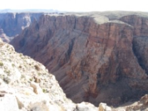

# Great Western Trail in Arizona

##Driving the Great Western Trail in Arizona

In 1776, while states on America’s east coast were declaring independence from England, two Spanish priests, Dominguez and Escalante, were camping with Paiute Indians at the base of the Kaibab Plateau in northern Arizona. The (later named) Jacob Hamblin/Mormon Honeymoon Trail the Indians showed them still exists, as do the Beale Wagon Road and the Moqui Stage Station. You can travel these trails and visit these sites along the Great Western Trail on All Terrain Vehicles (ATVs), bicycles, horseback, snowmobiles, or in a modified Jeep towing an off-road trailer as we do.

These trails welcome those yearning to follow in their ancestors’ wagon ruts, and, except for the fires, floods, and landslides that have occurred over the past centuries, they remain as they were when pioneers, cattle ranchers, and Mormon honeymooners first ventured into the area: teeming with wildlife, exotic plants, and breathtaking rock formations that expose the earth’s history.

The Trail was conceived in the 1980s as a network of preexisting trails that would traverse a corridor through Arizona, Utah, and Wyoming, and end at the Idaho-Montana border with Canada. It derives its name from the joining of the Arizona and Bonneville Rim Trails. In Arizona it presently extends from Phoenix to the Utah border along many of the same roads your ancestors travelled.

You can find general information about the Great Western Trail [LINK_TO_UTAH_PAGE] and we recommend it to anyone interested in knowing the history and present status of the Trail. This page is dedicated solely to the GWT in Arizona.

Although various publications state the Trail is 800 miles long in Arizona, it is incomplete and its actual length is less than 360 miles. Jeff Prince, the OHV Program Director at Arizona State Parks, is asking for assistance [here](http://www.greatwesterntrail.org/forum/index.php?topic=45.0) in completing the unfinished sections south of Phoenix and on the Navajo Reservation. We have offered to help, and will update this site and our guidebook, *Driving the Great Western Trail in Arizona*, should this happen. When we spoke to the Navajo Rangers and a representative of the committee formed to consider allowing the Trail to pass through their reservation, they told me the Navajo were adamantly against it. For a small fee, however, they let us drive on it and camp wherever we liked.
*(Note: linked thread asking for assistance is now offline. Check with the authors of this book for any potential updates.)*

The Arizona section of the Trail with its “Points of Discovery” (historic and instructive sites), begins in Phoenix in the southern Basin and Range (desert) Region where vegetation is sparse, but cacti, mixed grasses, chaparral, and sagebrush thrive in the alkali soil. It then travels through the Central Highlands (mountainous) Region in the middle of the state. Here, at elevations between 5,000 and 10,000 feet, temperatures remain high throughout the year, and piñon trees, Apache fir, aspen, and bristlecone pine abound. It ends in the northern Colorado Plateau Region with tablelands ranging from 5,000 to 7,000 feet. Winters are cold, but summers are warm. Rain is common, and Douglas fir and Ponderosa pine grow in the Kaibab National Forest and on these high plateaus.

The first leg of the Trail, Bulldog Canyon in the Tonto National Forest, was dedicated in April 1996. Two years later the Cave Creek segment and the Sears-Kay Ruin were added. This passes the Seven Springs Campground, an oasis developed by the Civilian Conservation Corps 100 years ago, as it winds its way to Bloody Basin Road and the Agua Fria National Monument. You can drive through the monument to I-17 or turn north on a rocky trail that crosses shale ledges and rivers to Dugas and then to the San Dominique Winery before reaching Interstate 17.

The Trail continues across I-17, winding its way through grasslands, across riverbeds, and over Mingus Mountain, to Highway 89A where it enters the Martin Canyon, also known as Smiley Rock because of a pumpkin sized rock on the side of the Trail that seems to have eyes, nose, and a mouth.

Before continuing north, you can drive along a narrow shelf road to Jerome, a mining town that became a ghost town half a century ago, and which, according to local lore, is inhabited by specters. Artisans have revived it and it is now a well-known tourist destination. The town sits on unstable ground and its constant downhill motion is documented by necklaces that swing almost imperceptibly on their stands in jewelry store display cases.

After Jerome the Trail goes north to Perkinsville in the Verde Valley, then onto the Mogollon Rim and White Horse Lake. Nearby Sycamore Canyon with its red sandstone sculptures is an unsung treasure and you should not miss it.

The Trail continues through forests and prairies to Parks and Williams. It is less challenging as it continues north of Parks though the grasslands and forests of the Williams Ranger District of the Kaibab National Forest, until it enters the Tusayan Ranger District and then the Navajo Reservation. After finding your way through a bewildering patchwork of unmarked paths, you will get a spectacular view of the Little Colorado River Gorge as you descend to Highway 64.

The Trail ends here before restarting at House Rock on Highway 89A, but stop at the Navajo Tribal Park Ranger Station at the junction of Highways 89 and 64 to pick up a permit to camp on the reservation near the Hopi Salt Trail. In Cameron you can also get supplies, a mouth-watering Navajo Taco, and Native American jewelry and pottery.

 Continuing north on Highway 89 on your way to the last legs of the Trail, you will cross Marble Canyon Gorge on the Navajo Bridge and then flank the Vermilion Cliffs. The views along this highway of Echo Cliffs and the green, gray, blue, and lavender hills of Chinle Formation are spectacular.

 At House Rock the Trail begins with a difficult ascent into the mountains along a trail that skirts the base of the Kaibab Plateau. A marker states that Spanish priests Dominquez and Escalante traded for food with the Paiute Indians in 1776. The last leg, from Jacob Lake to Utah with its breath-taking view of the Chocolate, Vermilion, and White Cliffs, may be the most scenic.

Arizona wildlife is abundant along the GWT, and you will see Rocky Mountain elk, white-tailed and mule deer, horses, antelope, black bear, and many others. Contrary to picture-postcards sold in tourist stops, however the jackalope, a jack rabbit with antelope horns, is not native to the state.

The Great Western Trail is long and lonely, and for some people, days without Facebook and Twitter can lead to erratic and violent behavior, yet if you are willing to leave civilization behind, driving through Arizona’s spectacular backcountry is an experience you will not forget. It will challenge the most adventurous, and will enlighten and amaze those searching for a return to a primitive and exciting respite from the hustle and bustle of civilization.

Our guidebook, *Driving the Great Western Trail in Arizona*, which details the twelve segments of the Trail (you can [download a pdf of one of them here](http://www.greatwesterntrailguide.com)), offers information and advice regarding permits, conditions, difficulty and remoteness ratings, is not a survival manual. We wrote it to help you enjoy the splendor of Arizona’s backcountry, but off-road travel always presents risks, and the mere fact that a trail or road has been described in our guide does not mean it will be safe for you to travel on it. Road conditions will change after floods, landslides, and other natural disasters, and you may encounter obstacles far worse than what we encountered and describe. It is therefore incumbent upon you to check road conditions and to know your vehicle’s limitations before attempting to drive any of these trails.

Although you can drive some sections in a passenger car, we assume you are an experienced off-road driver and will be driving a high-clearance 4-wheel drive vehicle that is properly maintained and equipped for travel on unmaintained, unpaved, primitive, and remote roads and trails. *Driving the Great Western Trail in Arizona* is not an instruction manual, since experience driving on primitive roads can come only through practice under the guidance of an expert. Nor is it intended to be the sole source of information regarding the Trail. Maps and other information are available at no charge from the Ranger Stations in the various Forest Districts, although some of the information is erroneous. We have corrected those errors in our guide.

Be safe! Exercise caution, bring proper supplies and be ready to treat injuries and to repair vehicle breakdowns yourself. It may be a long time before help reaches you on the more remote trails.

This article and its photographs were excerpted from *Driving the Great Western Trail in Arizona*, by Raymond C and Jennifer L Andrews.

## Trip Planning & Resources
* [Off-Road in Arizona: DRIVING the GREAT WESTERN TRAIL in ARIZONA](http://www.greatwesterntrailguide.com)