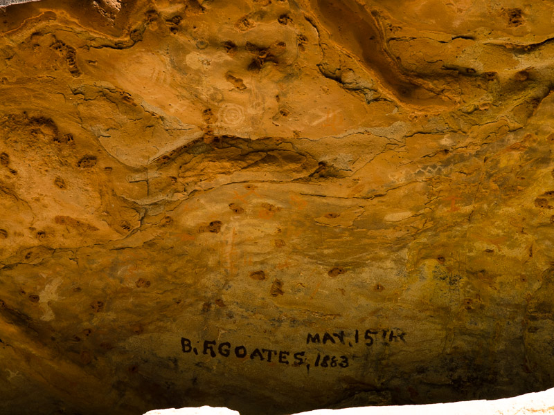
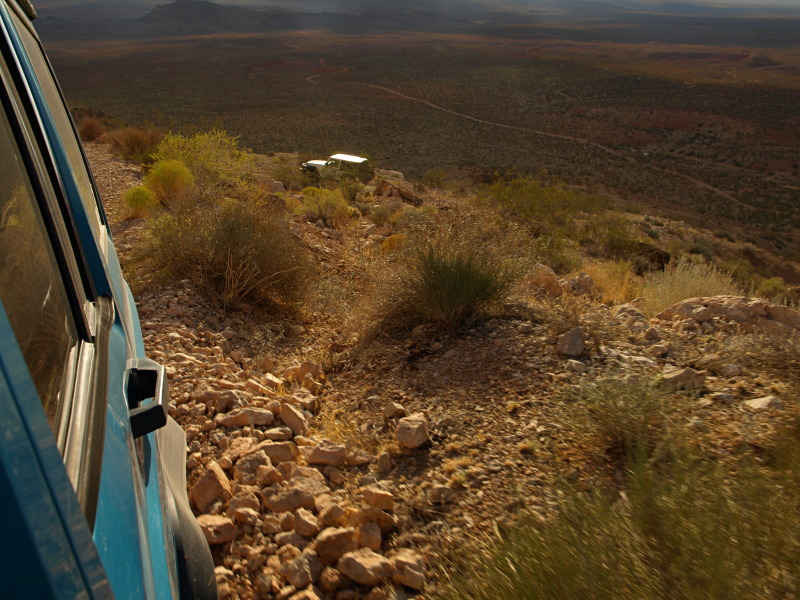
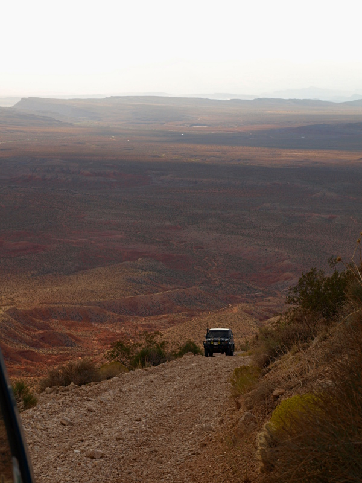

# The Honeymoon Trail
## a.k.a. Old Mormon Trail, Old Road to Arizona

I was doing a little research out of curiosity what settlements the trail connected to, and decided to throw it all together.

Not much of this historic wagon trail lies within Utah but it's primary destination was St George and specifically the temple there,
the first LDS temple completed in Utah (& west of the Mississippi) by 1877. Over 400 desolate miles all totaled up, the trail was
used by missionary/settlers called by Brigham Young to populate the upper Little Colorado Valley areas in northern Arizona around
1876 after a couple of scouting expeditions and became the primary link for those people with friends and relatives and the
church back in Utah (was also used by a couple southern Utah settlements, joining in at Kanab).

Why the name Honeymoon trail? LDS couples would save up enough to get an outfit together and make the rugged often six week
round trip journey to be married in the temple. Making the journey usually in groups, chaperoned if not yet wed, or sometimes they
would be married civilly first, then going later or as a family to enjoy the sealing ceremonies so special and important to them, that
only the temple provided. Will C. Barnes writing an article about it for Arizona Highways in 1934 coined the phrase and it has since
stuck. The first wedding party said to make the trip did so in the fall of 1881.

The trail in Utah: After the dangerous Colorado River crossing at Lee's Ferry and the Kiabab Plateau travelers stopped briefly in Kanab
first, then dipped back across the border to Pipe Springs and on toward the Hurricane Cliffs. The trail crosses back in to Utah for a
short distance where it took a steep route down the Hurricane Cliffs and dipped back across the border before re-entering Utah and
following Ft Pearce wash or Warner Valley (depending on conditions) on in toward St George. This last segment was also the winter
route of the related historic Temple Trail which was used to ship wood from a mill at Mt Trumbull in to St. George for construction of
the Temple. They often spent the last night at the spring where Ft Pearce was constructed to protect the trail. Historic names
can be found carved in rock and written with axle grease at several points along the trail.

Use of the trail declined once the railroad went in, though later on bridges were built making it easier, then finally an LDS Temple was
built in Mesa AZ, closer to the surviving settlements.

Read [the full report by iceaxe](https://www.expeditionutah.com/forum/index.php?threads/honeymoon-trail.2292/) this article is based on.

## Trip Planning & Resources

### Brief Histories & Descriptions
* [The Honeymoon Trail](http://www.stgeorgetemplevisitorscenter.info/temple/honeymoon.html)
* [BLM: Honeymoon Trail](https://www.blm.gov/visit/search-details/16454/2)
* [Vermilion Cliffs National Monument Proclamation](https://www.blm.gov/sites/blm.gov/files/documents/az_verm_proc.pdf)
* [Historic Trails of Arizona - Mormon Honeymoon Trail](https://azstateparks.com/historic-trails-of-arizona-mormon-honeymoon-trail)
* [Family Search: Honeymoon Trail](https://wiki.familysearch.org/en/Honeymoon_Trail)
* [The Honeymoon Trail: Text from the July 1989 *Ensign*](http://www.george-and-ann-prior-jarvis.org/html_docs/honeymoon_trail.html)
* [DUP Collecting Arizona 'Honeymoon Trail' Stories for Book](http://www.mormonstoday.com/010525/N6AZHoneymoonTrail01.shtml)

### Trail Historic Markers & Plaques
* [35 W State St, Hurricane, UT - Link broken, but marker may still exist at street address listed](http://history.utah.gov/apps/markers/detailed_results.php?markerid=3178)
* [Pioneer Park, on E Main St (526 East Main Street) Mesa AZ](http://www.hmdb.org/marker.asp?marker=27552)
* [St George, Utah LDS Temple](http://www.untraveledroad.com/USA/Utah/Washington/StGeorge/46WSign.htm)
* [Sunset Crossing historical marker Winslow AZ, Route 66 rest area, 35° 0.89′ N, 110° 40.743′ W](http://www.hmdb.org/marker.asp?marker=32722)

### Books

* [*Arizona's Honeymoon Trail and Mormon Wagon Roads* by Norma Baldwin Ricketts](https://www.amazon.com/Arizonas-Honeymoon-Trail-Mormon-Wagon/dp/B000JGQ3XS)

### Magazine Articles

* Barnes, Will C. 1934. "The Honeymoon Trail to Utah". Arizona Highways. 6-7
* May 1978 "The Honeymoon Trail, 5th Calvary Rides Again". Arizona Highways?
* 4-Wheel Drive and Sport Utility - May 2011, Part I
* 4-Wheel Drive and Sport Utility - June 2011, Part II

### Newspaper Articles
* [July 8th 2010 Church News](https://web.archive.org/web/20120921042742/http://www.ldschurchnews.com/articles/59586/Jacob-Hamblin-History-of-Honeymoon-Trail.html)
* [Deseret News, Mormon Times, "10 Lesser-known LDS Church Sites"](http://www.deseretnews.com/top/152/1390/10-lesser-known-LDS-Church-sites--Honeymoon-trail-Winslow-Ariz-to-St-George.html)
* Arizona Republic 20th May 2001 "Honeymoon Trail"

### Church references
* 
* [LDS.org: The Honeymoon Trail](https://www.churchofjesuschrist.org/study/liahona/1997/10/the-honeymoon-trail?lang=eng)

### Honeymoon Trail Gravesites
* [Find a Grave: May Whiting](http://www.findagrave.com/cgi-bin/fg.cgi?page=gr&GScid=2321222&GRid=41101745&)
* [Find a Grave: Ida May Turley](http://www.findagrave.com/cgi-bin/fg.cgi?page=gr&GScid=2321222&GRid=41425061&)

### ATV Utah ATV loop
* [Arizona Strip Frontier ATV Trail](http://www.atvutah.com/riders_reports/Ridgrunr/index.htm)

### Mountain biking trails, Warner Valley
* [Warner Valley Loop](http://www.utahmountainbiking.com/trails/warner.htm)

### Related/Intersecting Historic Trails

* Temple Trail
* Armijo route - Old Spanish Trail
* Dominguez Escalante route