# The Old Spanish Trail

> Not to be confused with the Old Spanish Trail Auto Trail (also referred to as the [OST](http://www.oldspanishtrailcentennial.com/)) which once spanned the country with a southern network of 3,000 miles (4,800 km) of roadway from ocean to ocean crossing 67 counties and eight states along the Southern border of the United States. This auto highway began in 1915 and, by the 1920s, linked St. Augustine, Florida, to San Diego, California, with its centre and headquarters in San Antonio, Texas. The cities in between boasted a shared heritage of Spanish missions, forts and Spanish colonization.

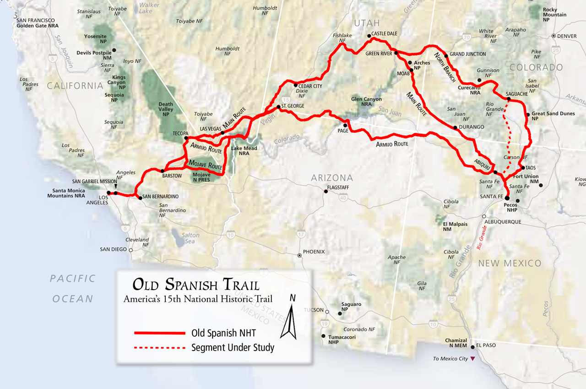

This Featured Trail article will focus only on the historical trade route known as the Old Spanish Trail, which connected the northern New Mexico settlements near or in Santa Fe with that of Los Angeles, California and southern California. Approximately 1,200 miles (1,900 kms) long, it ran through areas of high mountains, arid deserts, and deep canyons. It is considered one of the most arduous of all trade routes ever established in the United States. Explored, in part, by Spanish explorers as early as 1776, the Trail saw extensive use by pack trains from about 1830 until the mid-1850s.

The Old Spanish Trail became the 15th national historic trail when Congress adopted S. 1946 in November and President George W. Bush signed the bill early in December 2002. This trail linked two provinces (Santa Fe, Los Angeles) of historical Mexico separated by such difficult topography and climatic extremes that, despite attempts beginning as early as 1776, a route was successfully opened only in 1829.

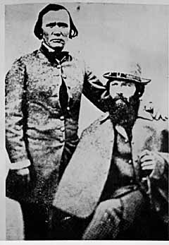

The name of the trail comes from the acknowledgement of a trail that had already been known to the Spanish since the 17th century  and is in the publication of [John C. Frémont’s](http://en.wikipedia.org/wiki/John_C._Fr%C3%A9mont) report of his 1844 journey for the U.S. Topographical Corps. guided by Kit Carson from California to New Mexico. The trail is significant to New Mexico history, because it established a grueling but usable trade route with California.

## History

This trail is a combination of known trails that were established by Spanish and European explorers,settlers, trappers and traders with the Jicarilla Apaches, Southern Utes and Navajos and other Indians throughout the region. The eastern areas of what became called the Old Spanish Trail, including SW Colorado and SE Utah, were explored by Juan Maria de Rivera in 1765. Franciscan missionaries Francisco Atanasio Domínguez and Silvestre Vélez de Escalante unsuccessfully attempted the trip to California, which was just being settled, leaving Santa Fe in 1776 and making it all the way into the Great Basin near Utah Lake before returning via the Arizona Strip. Other expeditions under another Franciscan missionary Francisco Garcés, and Captain Juan Bautista de Anza then explored and traded in the southern part of the region, finding shorter and less strenuous routes through the mountains and deserts which connected Sonora to New Mexico and California, but did not become part of the Old Spanish Trail, with the exception of some of the paths through the Mojave Desert. The middle part of the trail through Nevada and California was worked out by trappers led by Jedediah Smith in about 1827.

## Ancient Indian Trails

The Trail originated in ancient, native American Indian trade routes.  Two of these routes ran north-south along the eastern and western margins of the upper Rio Grande Valley, between the adobe pueblos of present-day New Mexico and Colorado’s San Luis Valley.  Perhaps the oldest, in use for nearly 1,000 years, later became the West Fork of the North Branch (see below).

## Early Spanish Expeditions

Between 1598 and 1830, Spanish (1598-1821) and later Mexican (1821-1830), and American (1821-1830) traders connected these native trade routes to complete the Old Spanish Trail.

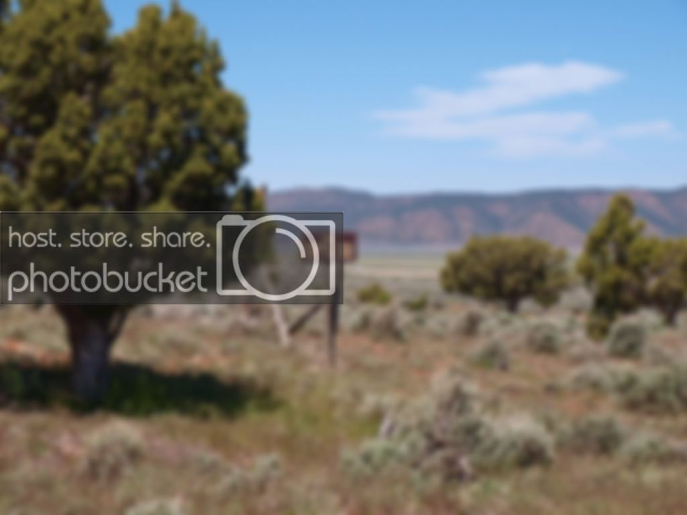

Well-documented Spanish expeditions that led from Santa Fe to central Utah, along the eastern half of the Trail, include Juan Maria Antonio de Rivera in 1765, the Dominquez-Escalante party of 1776, Manuel Mestas in 1805, and the Arze-Garcia party of 1813.  But Spanish traffic was fairly constant between 1765 and 1821 to trade with the Ute, including for slaves.

In the 1820s, fur-trapping parties pushed west from New Mexico, following the Gila and Colorado rivers south of the Trail, while others used the Spanish route northwest from Santa Fe to trap the Green River in eastern Utah.  These men included:  Antoine Robidoux (who built forts on the North Branch), Ewing Young, Etienne Provost, William Wolfskill, George Yount, Jose Martin, Jedediah Smith, Kit Carson, and Ceran St. Vrain.

## Other Route Segments

People made use of the Spanish Trail for a variety of purposes, which over time led to the development of several main routes and numerous alternates. The Old Spanish National Historic Trail Feasibility Study recognizes several main routes and the Armijo trace in identifying the period of significance for the trail.

## Armijo Route

[Armijo Route](http://www.oldspanishtrail.org/assets/PDFs/Armijo1830SpanishDiaryUNMRoneyDec09.pdf)

Using a short cut discovered by Rafael Rivera the previous year, the 1829 Armijo Route, which first opened the Old Spanish Trail, took a more direct path, combining information from many explorer (the routes of the Rivera and Domínguez-Escalante Expeditions and the Jedediah Smith explorations with the approaches to San Gabriel Mission through the Mojave along the Mojave Rivers), across northern Arizona and southern Utah passing near present day Monument Valley, Navajo National Monument, Glen Canyon National Recreation Area, Grand Staircase-Escalante National Monument, and Pipe Spring National Monument.  After this date, the route began to be used by traders for usually a single annual round trip. Upon the return of Antonio Armijo, the governor of New Mexico immediately announced the success to his superiors in Mexico City. As a reward, the governor officially named Armijo “Commander for the Discovery of the Route to California.”

[Antonio Armijo](http://oldspanishtrail.org/assets/PDFs/TrailPersonalityProfile-Armijo.pdf), a merchant from Santa Fe, led 60 men and 100 mules on the known trails blazed northward by trappers and traders with the Utes, and backtracked along the route Spanish padres Dominguez and Escalante recorded as they returned to Santa Fe from southern Utah more than 50years earlier.

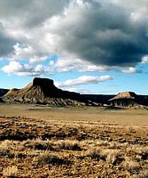

Armijo’s group then blazed a new path using parts of Jedediah Smith’s routes of 1826 and 1827, and Rafael Rivera’s route of 1828. Armijo avoided the worst of the Mojave Desert, traveling south of Death Valley following intermittent streams and locating springs to support the party. He arrived at San Gabriel Mission in California with his group intact, although the men were forced to rely on mule meat during their final days on the trail. In California, they traded the blankets and other goods carried by packsaddle from Santa Fe for horses and mules, available in great numbers and little valued by the Californios. Several thousand of these horses were driven back to Santa Fe, where they became important in trade with both Chihuahua and St. Louis.

The return journey marked the first time a caravan made a round trip between Santa Fe and Los Angeles, and the governor of New Mexico trumpeted this fact immediately to his superiors in Mexico City. There was finally a land link between these two regions; no longer was Santa Fe so land locked, because California provided access to foreign markets via her seaports. The international trade between the United States and Mexico via Santa Fe would be enhanced by the commercial traffic between Santa Fe and Los Angeles made possible by Armijo’s success. For his efforts, New Mexico’s governor appointed Armijo “Commander for the Discovery of the Route to California.”

## North Branch

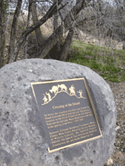

The North Branch variant travels from Santa Fe northeastward to Taos, NM and into Colorado near Great Sand Dunes National Park. From there, the trail makes its way across the Continental Divide and the Gunnison National Forest. River crossings were made at Grand Junction, CO and at Green River, UT.

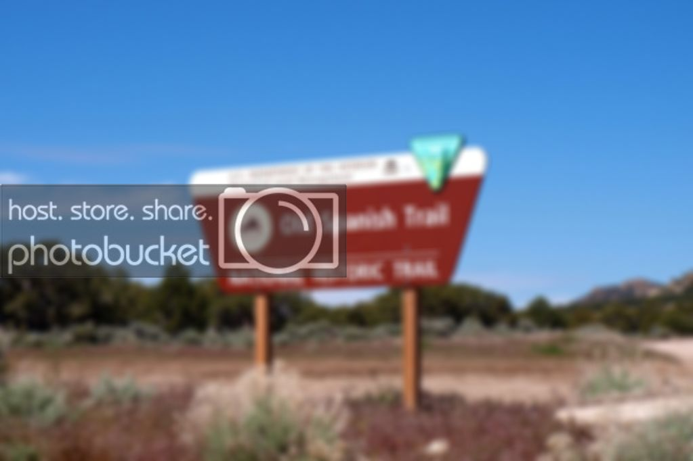

The year after Armijo’s journey, 1830-1831, William Wolfskill and George Yount blazed a different route that used some of the same landmarks. Their route, following the Colorado River to Needles, and up the Mojave River to Cajon Pass, was much favored by later travelers. Some trail users chose to trade with the Utes as far north as Salt Lake, and followed a path now labeled the “North Branch,” which led to Grand Junction, Colorado before heading south to rejoin the other major route from Santa Fe via Green River, Utah. Several variants of these two routes were also used, but all came together in southern Utah, fanning out once again into separate trails from southern Nevada to SE California. They came together again at the Mojave River, which brought travellers to the Cajon Pass portal of southern California. The group of main trails and alternates together form the Old Spanish Trail.

## Use During the Mexican War

During the Mexican War, 1846-1848, the Americans’ Army of the West conquered New Mexico, then blazed a new, southern variant of the route to California, hastening the end of the Old Spanish Trail.  Several famous journeys were made along the Trail, from west-to-east, including one by Kit Carson and Lieutenant George D. Brewerton in 1848.

After the Mexican War, wagon roads on competing routes largely ended use of the Trail.

## Government Mapping Expeditions

In the 1850s and 1860s, portions of the Trail’s eastern end were mapped by U.S. government expeditions, while the western portion of the trail witnessed Mormons heading to California.  U.S. government expeditions included Capt. John W. Gunnison in 1853, and Lieutenant E.F. Beale in 1853.

By then commercial traffic had died out, leaving wagon ruts visible where once only mules trod.

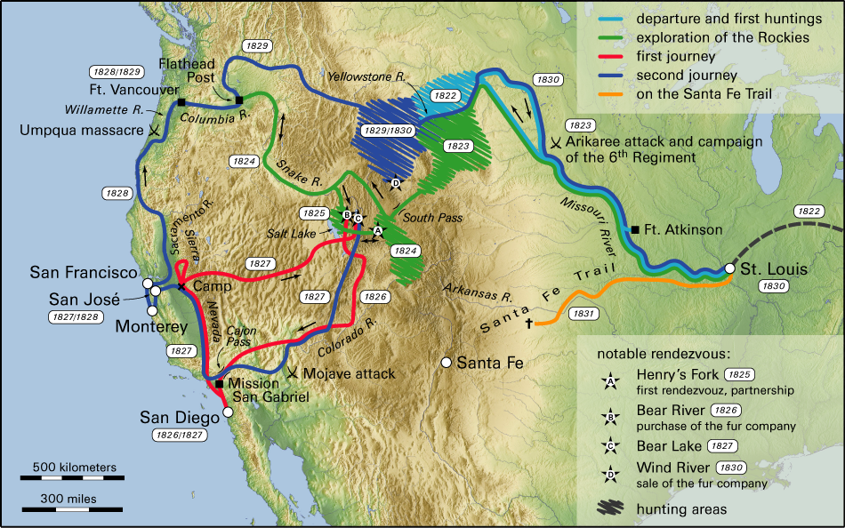

Word spread about the successful trade expedition and some commerce began between Santa Fe and Los Angeles. This commerce usually consisted of one mule-laden pack train from Santa Fe with 20 to 200 members, with roughly twice as many mules, bringing New Mexico goods hand-woven by Indians, such as serapes and blankets, to California. California had many horses and mules, many growing wild, with no local market, which were readily traded for hand-woven Indian products. Usually two blankets were traded for one horse, more blankets were usually required for a mule. California had almost no wool processing industry and few weavers, so woven products were a welcome commodity. The trading party usually left New Mexico in early November to take advantage of winter rains to cross the deserts on the trail and would arrive in California in early February. The return party would usually leave California for New Mexico in early April to get over the trail before the water holes dried up and the melting snow raised the rivers too high. The return party often consisted of several hundred to a few thousand horses and mules. Low-scale emigration from New Mexico to California used parts of the trail in the late 1830s when the trapping trade began to die. The trail was also used for illicit purposes, namely to raid the California ranchos for horses and for an extensive Indian slave trade. These horse raids were made by Mexicans, ex-trappers and Indian tribes who together stole hundreds to thousands of horses in one raid. Native Americans, usually women and children, were captured and sold to Mexican ranchers, etc., in both California and New Mexico for domestic servants. Mexican traders and Indian raiding parties both participated in this slave trade. The consequences of this human trafficking had a long-standing effect for those who lived along the trail, even after the trail was no longer in use. Intermittent Indian warfare along the trail often resulted from these slave raids by unscrupulous traders and raiding Indians.

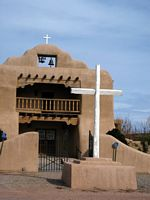

New Mexico-California trade continued until the mid-1850s, when a shift to the use of freight wagons and the development of wagon trails made the old pack trail route obsolete. By 1846 both New Mexico and California had become U.S. territories as a result of the Mexican-American War of 1846-1848, and after 1848 large numbers of Mormon immigrants were settling in Utah, Nevada and California all along the trail, affecting both trade interests and tolerance for the slavery of American Natives.

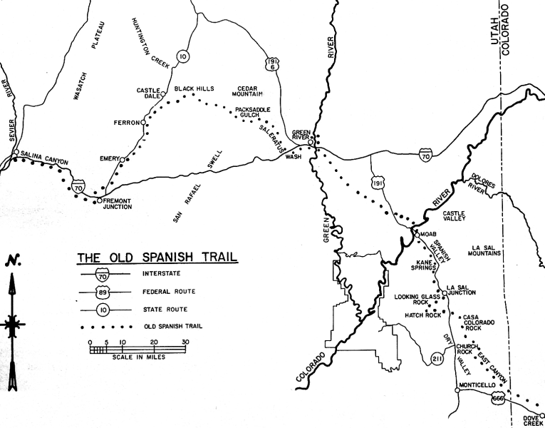

The central route of the Old Spanish Trail, which had to swing north to avoid the impassable Grand and Glen Canyons on the Colorado River, ran northwest from Santa Fe through southwestern Colorado, past the San Juan Mountains, Mancos, and Dove Creek, entering Utah near present day Monticello, Utah. The trail then proceeded north through difficult terrain to Spanish Valley near today’s Moab, Utah, where it crossed the difficult and wide Colorado River and then turned northwest to cross the treacherous Green River near present day Green River, Utah.The route then passed through (or around) the San Rafael Swell, the northernmost reach of the Trail. Entering the Great Basin in Utah via Salina Canyon, the trail turned southwest following the Sevier River, Santa Clara River and Virgin River before ascending the Mormon Plateau and hitting the Muddy River in present-day Nevada. From there, it was a 55 miles (89 km) waterless trip crossing southern Nevada to the springs at Las Vegas, Nevada. From Las Vegas, the trail went across the Mojave desert from Mountain, Resting, Salt and Bitter springs (which were sometimes dry), each about a day’s travel apart across the Mojave Desert until it reached the only intermittently-dependable Mojave River. The river was followed to a point near Cajon Pass over the San Bernardino Mountains. If parts of the Mojave River were dry, travelers could sometimes find water by digging in the old river bed. Descending Cajon Pass to reach the coastal plains, the trail turned west along the foot of the San Gabriel Mountains to where the Mission San Gabriel Arcángel and El Pueblo de Los Ángeles in California were located. In all, the route involved several dry sections with limited grass and sometimes limited water, crossed two deserts, and was often littered with the bones of horses that had died of thirst. The route could only be used semi-reliably in winter when winter rains or snows deposited water in the desert. In summer, there was often no water and the oppressive heat could kill. A single round trip per year was about all that was feasible. Later parts of the trail were used for winter access to California when other trails were closed by snow. Alternate routes for this journey existed through central Colorado and through the Arizona Strip.

__________________________________________________________________________________________________________________

The Spanish Trail name and use lapsed after the War with Mexico ended in 1848. There was no longer any need to link Santa Fe with Los Angeles by this difficult mule trail – other more wagon-friendly routes were opened. The Spanish Trail was not a route of major emigration to the West; trails to the north and south of it were preferred for this wagon traffic. Spanish Trail caravans continued to trade with the Mormons in Utah, but by 1853 they were no longer welcome there. The New Mexican caravans were out of business.

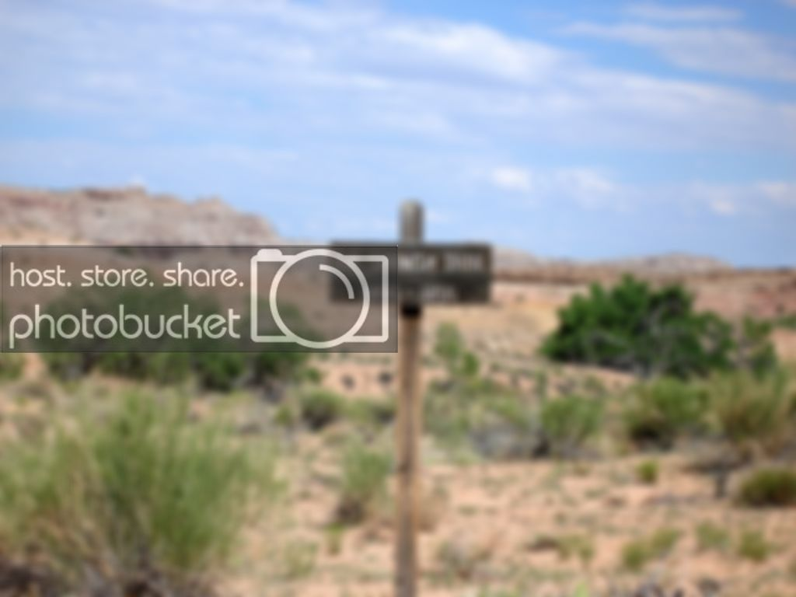

Popular and academic interest in the trail was only sporadically evident over the ensuing decades. Interest in the trail began to revive beginning in 1921, with the publication of an article by Joseph J. Hill, the 1930 and 1931 work of Eleanor F. Lawrence, and the publication in 1930 of George Brewerton’s Overland with Kit Carson. William R. Palmer of Cedar City, Utah organized the Spanish Trail Association in 1946. This group placed 100 markers along the trail between Santa Fe and Los Angeles, but faded soon after accomplishing this task in 1950. LeRoy and Ann Hafen of Utah published their definitive history of the trail in 1954; this work inspired still other research, and the post WWII jeep made it possible for the general public to explore the desert, stimulating interest in the trail.

Efforts to mark the trail revived. Nevada, in celebration of its centennial, marked the Fremont route in 1964-65. In Utah, the Emery County Historical Society placed markers in the Green River area in the early 1990s, while in the mid-1990s, Iron County Boy Scouts of America marked the trail through their territory. New energy to identify and mark the trail arose among the people of Grand Junction, Colorado in the 1990s as well. This effort focused much attention on the trail’s North Branch, energizing discussions about the Spanish Trail and its importance for the region. Beginning in 1992, a strategy for attaining National Historic Trail designation was laid out by individuals connected with the Riverfront Commission in Grand Junction and the Colorado Board of Parks and Outdoor Recreation.

In 1993 these trail aficionados convinced Colorado’s Senator Ben Nighthorse Campbell and Representative Scott McInnis to introduce a bill authorizing the NPS to study the feasibility of including the Old Spanish Trail in the National Trails System as a National Historic Trail. In 1994, Colorado supporters founded the present Old Spanish Trail Association (OSTA). This group teamed up with the Colorado delegates and senators from New Mexico, Utah, and California to keep the legislation alive. Senator Campbell and Congressman McInnis succeeded in including the Old Spanish Trail feasibility study in the 1996 Omnibus Parks and Public Lands Management Act.

The first draft of the feasibility study, issued in July 2000, found insufficient information to conclude that the Old Spanish Trail was nationally significant. OSTA mobilized its resources and crafted a response, which tipped the scale in favor of national historic trail designation. The NPS Advisory Board voted to recommend inclusion of the Old Spanish Trail in the national trail system, and in July 2001, the NPS issued a final feasibility study that concluded the Old Spanish Trail is “nationally significant within the theme of the Changing Role of the United States in the World Community and the topics of trade and commerce, during the period of 1829-1848.”

Early in 2002, Senator Campbell introduced S 1946, the Old Spanish Trail Recognition Act. In 2002, Congress passed the bill unanimously. Secretary of Interior Gale Norton assigned preparation of a Comprehensive Management Plan to both the Bureau of Land Management (BLM) and the National Park Service (NPS) ; both agencies are now working on implementing this order, modeled on the approach that produced a plan for managing the Camino Real de Tierra Adentro National Historic Trail in New Mexico. The Old Spanish Trail Association is eager to participate in the preparation of this plan.

Although few traces of the early traders’ trail remain, the Old Spanish Trail is now commemorated in many local street and road names, and numerous historical markers (please send coords/tracks to CanuckMariner on this forum) in the states that it crossed. It is listed as the Old Spanish National Historic Trail by the BLM and NPS.  Portions of US 160 in Colorado and US 191 in Utah are similarly designated.

In 1988, a section of the trail in Arches National Park was placed on the National Register of Historic Places. In 2001, the section of the Trail that runs across Nevada from the Arizona border to California (known as the “Old Spanish Trail-Mormon Road Historic District”) was placed on the National Register of Historic Places.

__________________________________________________________________________________________________________________

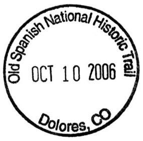

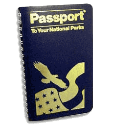

The NPS has a [passport port program](http://www.nps.gov/olsp/planyourvisit/passport-program.htm) at various sites along the trail.

## Resources

* An interactive map is available [here.](http://tour.mapsalive.com/5788/page1.htm?cs=2)
* For more reading on [this historical trail.](http://books.google.ca/books?id=AfWI6X7odFAC&printsec=frontcover&dq=old+Spanish+trail&source=bl&ots=2Vg_epxmWm&sig=K5Knaa4MT86r2tRS9VmcfqFO6Fk&hl=en&ei=xW9qTZCDOYausAOqtdWmBA&sa=X&oi=book_result&ct=result&resnum=12&ved=0CG4Q6AEwCw#v=onepage&q&f=false)

## Sources

Members of Expedition Utah for their input, assistance and contributions, as well as all research from the internet:

* oldspanishtrail.org
* billmarkley.com
* sanluisvalleyheritage.com
* wikimedia.org
* mountainsofstone.com
* nps.gov

[Here is a GPX file](OSTRoute.gpx) which is being compiled with the help of this forum’s interested members, and is posted here as a work in progress. (Right Click – “Save Link As”.) Please feel free to email the author (CanuckMariner as per profile) with any additions, corrections or omissions.