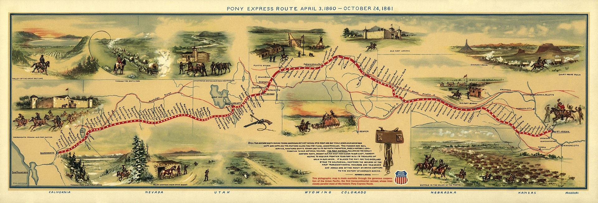

# Overland Trail

Starting at the terminus of the railroad in Atchison, the Overland Trail paralleled the other emigrant trails on the [Great Platte River Road](https://en.wikipedia.org/wiki/Great_Platte_River_Road) along the [North Platte River](https://en.wikipedia.org/wiki/North_Platte_River) in Kansas and Nebraska. At [Julesburg, Colorado](https://en.wikipedia.org/wiki/Julesburg,_Colorado), the trail splits from the others and continues along the [South Platte River](http://en.wikipedia.org/wiki/South_Platte_River). Following the same general path that miners used during the [Pike’s Peak Gold Rush](http://en.wikipedia.org/wiki/Pike%27s_Peak_Gold_Rush), the trail follows the South Platte through the present day towns of [Sterling](http://en.wikipedia.org/wiki/Sterling,_Colorado), [Fort Morgan](http://en.wikipedia.org/wiki/Fort_Morgan,_Colorado) and to Latham, the last station on the South Platte. Located near the present day city of Greeley, Latham was an important stage stop and junction joining the Overland Trail and a short spur connecting the trail to [Denver](http://en.wikipedia.org/wiki/Denver,_Colorado) and the surrounding mining towns. From Latham the stage route crosses the South Platte to [Laporte](http://en.wikipedia.org/wiki/Laporte,_Colorado) and strikes the well established Cherokee Trail going north into Wyoming. In 1862, the [Fort Morgan Cut-Off](http://en.wikipedia.org/wiki/Fort_Morgan_Cut-Off) was established between Fort Morgan and Denver saving 3 days and 40 miles from the previous route and cutting off stations between Fort Morgan and Latham.

In Wyoming, the trail goes through the Laramie River Valley and skirts the northern side of Elk Mountain. Fort Halleck was established here in 1862 to protect travelers on the trail. Following the same path as the later transcontinental railroad and modern [Interstate 80](http://en.wikipedia.org/wiki/Interstate_80), the trail crosses the [Red Desert](http://en.wikipedia.org/wiki/Red_Desert_%28Wyoming%29) and follows [Bitter Creek](http://en.wikipedia.org/wiki/Bitter_Creek_%28Wyoming%29) through the present towns of [Rock Springs](http://en.wikipedia.org/wiki/Rock_Springs,_Wyoming), [Point of Rocks](http://en.wikipedia.org/wiki/Point_of_Rocks,_Wyoming), and [Green River](http://en.wikipedia.org/wiki/Green_River,_Wyoming). From Green River the trail proceeds west to [Blacks Fork](http://en.wikipedia.org/wiki/Blacks_Fork), following it upstream to [Granger](http://en.wikipedia.org/wiki/Granger,_Wyoming) where it joins the emigrant trails descending from [South Pass](http://en.wikipedia.org/wiki/South_Pass) and continues to [Fort Bridger](https://en.wikipedia.org/wiki/Fort_Bridger). From Fort Bridger the stage route follows the Mormon Trail the remainder of the way to Salt Lake City.

## Trip Planning & Resources

* [Wikipedia: Overland Trail](https://en.wikipedia.org/wiki/Overland_Trail)