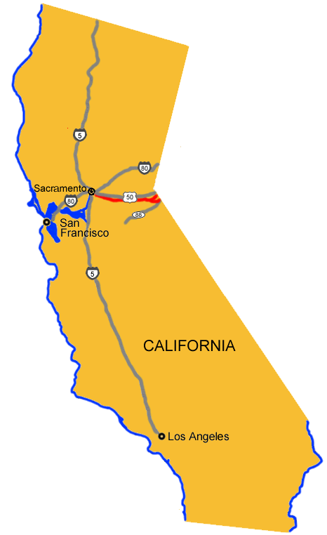

# California Pony Express Stations

## DIVISION 5

167. **Woodford’s Station**

It was operated as a remount station at Cary’s Barn for 5 weeks when the service first began in 1860. The first white settlement in Alpine County was established here in 1847 and was known under several names. A Historical Marker is located in front of the current store on Old Pony Express Road, just east of the junction of State Routes 88 and 89.

168. **Fountain Place Station**

169. **Yank’s Station**

Upon completion of the wagon road over Kingsberry Grade, the Pony Express route continued along the south shore of Lake Tahoe stopping at Yank’s Station Toll House, near Myers on U.S. 50. This was the easternmost remount station in California. It was also a trading post, hotel and stage stop. The toll house was knocked off its foundation by flood waters and is currently located on blocks adjacent to the Tahoe Paradise Museum.

170. **Strawberry Station**

Established by Swift and Watson in 1856 and was a popular resort and stop for stages and teams of the Comstock. It became a remount station of the Central Overland Pony Express on April 4, 1860. Here, on that date, Division Superintendent Bolivar Roberts left with a string of mules to help pony rider Warren Upson through the snow storm at Echo Summit. Not named for the fruit, but rather for a man named Berry who operated the stage stop. He was known to feed horses and other livestock straw instead of hay. A Historical Marker is located opposite the house off U.S. 50.) From Strawberry the route followed the South Fork of the American River, over Echo Summit, down Hawley Grade, into Tahoe Valley. For the first few months of operation the Pony Express route continued over Luther Pass (State Route 89) to Woodfords in upper Carson Valley.

171. **Webster’s/Sugar Loaf House Station**

Just west of Kyburz, Webster’s Sugar Loaf House was a remount station and horse change station for stage companies. A Historical Marker is located 1 mile west of Kyburz on U.S. 50.

172. **Moss/Moore/Riverton Station**

11 miles E of Sportsman’s Hall on Ice House Road, Moore’s (Riverton) Station was a remount station and horse change station for stage companies. A Historical Marker is located just west of the American River Bridge on U.S. 50.

173. **Sportsman’s Hall Station**

174. **Placerville Station**

175. **El Dorado/Nevada House/Mud Springs Station**

176. **Mormon Tavern/Sunrise House Station**

177. **Fifteen Mile House Station**

Located 4 miles east of Mills Station was owned and operated from 1857 as a stage station by Henry F. W. Deterding and was the site of the 2nd remount station on the route eastward from Sacramento to Missouri. Here on April 4, 1860, Sam Hamilton with the first eastward mail of the the Pony Express changed ponies with Mormon Station as his next stop. A Historical Marker is located on White Rock Road, south of Folsom Boulevard, Sacramento. Until July 1860, the route then continued along White Rock Road to the site of Mormon Tavern, then on to El Dorado and Diamond Springs. The Pony Express route then continued on to Placerville via a road which is now State Route 49..

178. **Five Mile House Station**

Also called Mills Station by some, was the first Pony Express remount station on the eastward leg of the express route leaving Sacramento. On the morning of April 4, 1860, rider Sam Hamilton quickly changed ponies here and sped on to the next stop at Fifteen Mile House.

A Historical Marker is located at the foot of Guy West Bridge, California State University, 6000 J Street, Sacramento. A new granite monument has been place at 7716 Folsom Boulevard, near the corner of Howe Avenue.

179. **Pleasant Grove House Station**

180. **Duroc Station**

181. **Folsom Station**

182. **Sacramento Station**

183. **Benicia, Martinez, and Oakland Stations**

184. **San Francisco Station**