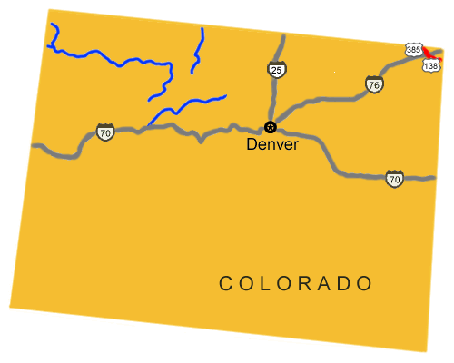

# Colorado Pony Express Stations

## DIVISION 2

42. **Frontz’s/South Platte Station**

43. **Julesburg Station**

“Old Julesburg” was a rough frontier town named for Jules Beni, a French Canadian frontiersman whose trading post was established at the famous and hazardous Upper California Crossing of the South Platte River. An important station of the overland stagecoach route was located here.

Beni was also a Division Agent for the Pony Express. In those days, Juelsburg was a gathering place for unsavory characters and for soldiers, traders, hunters, and other frontiersmen who went there to spend their money in riotous pleasure.  The stage schedules were disordered, wagon trains were attacked by outlaws, and livestock was stolen. Soon it was learned the Jules himself was the leader of the outlaws and the source of their uncannily accurate information. Eventually Russell, Majors, and Waddell discharged Beni and replaced him with Captian Jack Slade. Furious at his discharge and replacement, Beni ambushed Slade and shot him in cold blood. Slade survived, and after recovering, hunted Beni down. He lashed his prisoner to a corral post overnight in the cold. The following morning Slade began to use Beni for target practice. Beni died with 22 holes in him. Slade cut off his ears and carried them around as souvenirs.

There is a small museum with trail information in Julesburg.