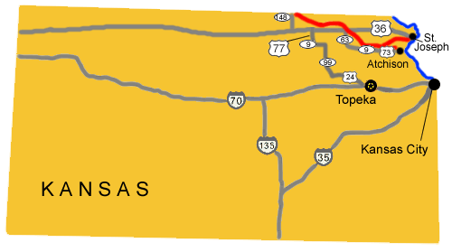

# Kansas Pony Express Stations

## DIVISION 1

1. **Elmwood**

2. **Troy Station**

3. **Lewis Station?**

4. **Kennekuk (Kinnekuk) Station**

5. **Kickapoo/Goteschall Station**

6. **Log Chain Station**

Log Chain (Sec. 19, T3S, R14E) was the relay station between Kickapoo and Seneca. It was on Locknane’s Creek. There are a couple of theories about the name. One is that it was a corruption of the creek’s name. Another is that since Log Chain was on the old military road where wagons often had trouble crossing the swampy ground around Locknane Creek, that wagon chains often broke there.

In 1861, Don’s Father N. H. Rising, built the noted “Log Chain” ranch, at the crossing of the old military road over the creek of that name. It measured 24′ x 40′ and the barn was 70′ long. It may be noted here that when General Albert Sidney Johnston was sent with United States troops to quiet the impudent Mormons, he had great trouble in crossing this creek, and scores of heavy chains were broken by the teams of 24and 36 yoke of oxen hitched to the heavily-laden government wagons, and that the broken chains pile on the bank of the creek gave it the name of Log Chain Creek, when the country was first settled. Mr. Rising’s business was most lively here for about 18 months, at the end of which he built the “Reserve Station” on Plum Creek, and flourished here about 5 years, the men and teams of the old stage companies being regular patrons.

The altered Log Chain home is still there and at one time the American Pioneer Trails Association had one of their round, metal shilouette rider signs above the door. However, within the last 10 years it has disappeared. Occasionally, the NPEA was met by a neighborhood group with refreshments there when they did their yearly re-ride.

**Granada** – It is the name for a town near Log Chain. The Pony Express/Military Road goes about 1 mile to the north of Granada. There is an old building in Granada that says Pony Express on it. It is possible that an occasional rider may have stopped in at Granada, but it was most probably used just after the Pony Express as a stage stop.

7. **Seneca Station**

In Seneca, some 70 miles west of St. Joseph, Pony Express riders could look forward to a good meal and soft bed at the Smith Hotel, the first Home Station westbound.

The Smith Hotel became one of the best-known hotels in northeast Kansas Territory. John Smith established the hotel in 1858 at the present-day location of Fourth and Main Streets. The building also served as a restaurant and school. Although the Pony Express mail delivery system lasted only 18 months, from 1860 to 1861, Smith’s Hotel was one of Kansas’s Home Stations. The station keeper was the backbone of the Pony Express event though the keepers did not receive as much attention in later history as the Pony Express riders. Seneca was an indispensable service point. Beside the Pony Express, and the Overland stage line, the local post office, established in December, 1858, was a mail station on the overland mail route with entrepreneurial John Smith as postmaster.

8. **Ash Point/Laramie Creek Station**

9. **Guittard (Gantard’s, Guttard) Station**

10. **Marysville Station** (N39 50 29.8 W96 38 53.0)

Marysville was settled mainly by travelers along a feeder of the Oregon Trail and was named for the wife of merchant Frank Marshall, who operated a ferry across the Big Blue River here. Among the emigrant parties who encamped near the crossing during the 1840’s and 1850’s was, in 1846, the Donner Party, destined for disaster in California’s Sierra Nevada.

Original Pony Express Home Station No. 1 Museum (1859), at 106 South 8th Street, served as a headquarters for the mounted postal riders before the introduction of the telegraph to the western territories.

Pony Express rider Jack Keetley was the first rider to gallop west from Marysville the night of April 3, 1860, on the initial run to Sacramento, California.

11. **Cottonwood/Hollenberg Station** (N39 54 03.0 W96 50 37.0)

Also known as Cottonwood, it is now located on Hollenberg Ranch State Park. Built by Gerat H. Hollenberg in 1857 or 1858, this cabin was associated with the Oregon and California Trails, the Pony Express, and the Butterfield Overland Mail and believed to be the first house built in the county. It became his family home, a neighborhood store, a tavern, a stage station for the Overland Express, and in 1860 a station for the Pony Express. Hollenberg traded with emigrants on the trails, operated the westernmost Pony Express station in Kansas, and provided relay services for the Overland Mail. The building has never been moved and retains its original dimensions.

Two miles east of Hanover on SR243, Hollenberg Pony Express Station State Historic Site is the only unaltered Pony Express station remaining in its original location. This most westerly Pony Express station in Kansas, 123 miles west from St. Joseph, was also called Cottonwood Station because of its proximity to Cottonwood Creek. Past this site ran the Oregon-California Trail, which was also the road to Fort Kearney, Nebraska. It was one of the most travelled routes to the West.

The station was a long, frame structure with six rooms on the ground floor. In one of them Hollenberg kept a small stack of groceries and dry goods and operated as an unofficial post office. Another room served as a bar and tavern. The rest of the rooms were used for family living. Upstairs a loft ran the length of the building where stagecoach and Pony Express employees had a common sleeping room. Nearby was a large stable where fresh mounts were kept for the riders.

12. **Atchison Station**

13. **Lancaster Station**