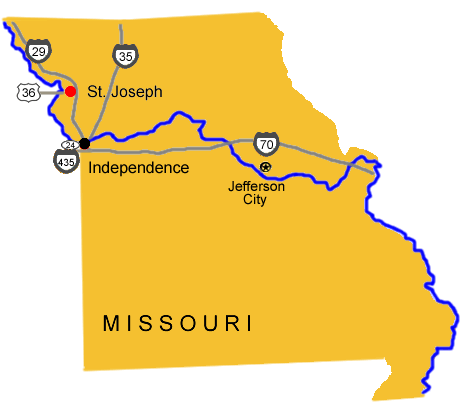

# Missouri Pony Express Stations

## DIVISION 1

1. **St. Joseph Station** (N39 45 22.5 W94 50 56.7)

The Pony Express National Memorial was the home of the Pony Express. The museum houses exhibits on the history of St. Joseph during the 18 months that the Pony Express operated.

The Patee House was, when it opened in 1858, one of the finest hotels west of the Missisippi and was the headquarters of the Pony Express. The museum contains the reconstructed Hanibal and St. Joseph Railroad and Pony Express office and Pony Express artifacts.