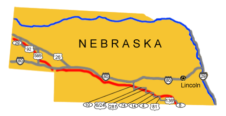

# Nebraska Pony Express Stations

## DIVISION 1

Nebraska Pony Express Stations
Posted on January 2, 2011 by admin — No Comments ↓
Image map of the auto tour route driving directions across Nebraska.

From North Platte to Fort Kearney the Pony Express Trail and the Oregon Trail were located on the south side of the Platte River, while the Mormon Trail was on the north side. Later the railroad chose the north side of the river as did later highways. From Fort Kearney the Pony Express Trail headed southeast out of the Platte Valley following the Little Blue River.

DIVISION 1 (cont’d):

14. Rock House Station
15. Rock/Turkey Creek Station (N40 07 00.1 W97 03 48.7)

Rock Creek Station near Fairbury was an important road ranch on the Oregon Trail. Established in 1857 by S. C. Glenn, Rock Creek Station evolved from a small cabin with a lean-to and barn, situated on the west side of Rock Creek. This road ranch catered to stages, freight lines, and emigrant traffic on the Oregon Trail. The lean-to was set up as a primitive store, where hay, grain, and supplies could be bought, sold, or traded.

In 1859, Dave McCanles bought Rock Creek Station and built a log cabin and dug a good well on the east side of Rock Creek. He built a toll bridge across the creek, eliminating the crude rock ford. His normal fee ranged from 10 – 50 cents, depending on a person’s ability to pay. The following year, he rented the East Ranch to Russell, Majors and Waddell for use as a swing station where Pony Express riders could quickly change their mounts.

James Butler Hickok, who became the legendary gunfighter and lawman Wild Bill Hickok, was an assistant station tender at Rock Creek Station where, in a still disputed gunfight with station agent David McCanles, McCanles and three other men were killed by Hickok.

Rock Creek Station State Historical Park is open daily.

16. Virginia City
17. Big Sandy Station
18. Millersville/Thompson’s Station
19. Kiowa Station (N40 13 37.6 W97 45 24.5)
20. Little Blue/Oak Grove Station (N40 13 48.8 W97 52 24.6)
21. Liberty Farm Station (N40 21 42.8 W98 07 57.4)
22. Spring Ranch/Lone Tree Station
23. Thirty-two Mile Creek Station

Thirty-two Mile Creek Station is located 25 miles west of Liberty Farm Station in the NE 1/4, Sec. 6, T6N, R10W, about 6 miles southwest of Hastings, Nebraska. A numberless Nebraska Monument marks the site as “Dinner Statioin. I.O.O.F.E., Pony Express.” This was a long one-story building operated by George A. Comstock. It was abandoned after the 1864 raids.

?? Lone Tree
24. Sand Hill/Summit Station
25. Hook’s/Kearney/Valley Station

Pumpkinseed Station (N40 30 11.2 W98 57 04.6) – The Harold Warp Pioneer Village in Minden displays more than 50,000 historical items that depict America’s progress since 1830. Among the buildings is the original Pumpkinseed Pony Express Station. This crude cabin served as a stagecoach and Pony Express Station at Pumpkinseed Creek Crossing 6 miles south of Bridgeport during and after the great Black Hills Gold Rush of 1876. It was the last stop on the Deadwood Trail before reaching the famous bridge across the North Platte River at Old Camp Clark, three miles west of Bridgeport. This Pony Express Relay station was moved to its present site in 1955. This station was the subject of William Henry Jackson’s famous painting “Changing Horses, Pumpkinseed Station, Nebraska”.

26. Fort Kearney (N40 38 27.6 W99 00 22.1)

The growth of overland emigration to Oregon after 1842 resulted in the establishment of military posts across the west to protect the travelers. The first post, Fort Kearny, was established in the spring of 1848 near the head of Grand Island along the Platte River by Lieutenant Daniel P. Woodbury. Fort Kearny was a way station, sentinel post, supply depot and message center for ’49ers bound for California and home seekers traveling to Oregon and the Pacific Northwest. By the 1860’s the Fort had become a significant stage and freighting station. The Fort also provided protection for the crews constructing the Union Pacific Railroad after the Civil War. On the grounds of Fort Kearny State Historical Park is a stockade replica and a reconstructed blacksmith shop.

Kearney City (Dobytown)

2 miles west of Fort Kearny, the small commercial center of Kearney City was established in 1859. The town’s more common name, Dobytown, was derived from the resemblance of its 12-15 earthen buildings of adobe structures. Dobytown developed in response to the thousands of soldiers, freighters and travelers whose “needs” could not be met within the Fort. Gambling, liquor and disreputable men and women were its principal attractions. However, in addition to its notorious functions, Dobytown also served as the major outfitting point west of the Missouri River, the center of frontier transportation form 1860 to 1868, and a Pony Express Station.

DIVISION 2:

27. Seventeen Mile/Platte Station

28. Garden/Craigs Station

29. Plum Creek Station

Lexington evolved in the 1860’s from a small settlement called Plum Creek which consisted of a Pony Express station and the Daniel Freeman trading post on the Oregon Trail south of the Platte River. A cabin from the Plum Creek Pony Express Stationmay be seen in the city park.

30. Willow Island/Willow Bend Station (N40 51 39.8 W99 59 02.5)

Robert Henry Museum and Walkway commemorates the artist career of the town’s native son and preserves several historic buildings including the Willow Island Pony Express Station.

This cabin, built about 1849, was originally located on the south bank of the Plate River south of Darr. It was first used as a post to trade with the Indians. Later it was known as Willow Island Station and was used as a stage and Pony Express station. Billy Campbell and Melville Baugh both were riders on this portion of the trail.

31. Cold Water/Midway Ranch Station
32. Gilman’s Station
33. Sam Machette’s Station (Gothenburg) (N40 56 01.6 W100 09 33.2)

The history of Gothenburg dates back to the great westward expansion, when thousands of pioneers crossed through here on the Mormon and Oregon Trails. In 1860 and 1861 the town boasted a station for the Pony Express. The original Pony Express Station is in Ehmen Park.

34. Cottonwood Springs Station
35. Cold Springs Station
36. Fremont Springs Station
37. O’Fallon’s Bluff/Dansey’s/Elkhorn Station
38. Alkali Lake Station
39. Gill’s/Sand Hill Station
40. Beauvais Ranch Station
41. Diamond Springs Station

DIVISION 2 (cont’d)

44. Nine Mile Station
45. Pole Creek No. 2/Lodge Pole Station
46. Pole Creek No. 3/30 Mile Ridge Station

This site was on the north side of Lodgepole Creek, on the old St. George Cattle Ranch, about 3½  miles east of Sidney, Cheyenne County. Old maps identify this as the stage ranch of Rouliette and Pringle, with well fortified buildings part dugout, part sod and logs. The ford must have been at or near this point. This place had importance as the junction of the old California Road and stage route heading for the North Platte, and a new stage route heading due west for Bridger Pass and Salt Lake City. (This is the “Lodgepole Route” which later became the Union Pacific route to Cheyenne.)

47. Midway Station

48. Mud Springs Station (N41 28 57.6 W103 00 42.6)
49. Court House (Rock) Station (~N41 35 51.5 W103 06 54.8)

Courthouse Rock is one of the most famous landmarks in the North Platte Valley. Its prominence is attested to by the numerous references made to it in the diaries, letters and other writings of emigrants, military men, traders, trappers, and explorers on their way to Oregon, California and Utah.

Courthouse Rock, and its less famous counterpart, Jail Rock, are located about 5 miles south of Bridgeport, and rise about 400′ above the North Plate River.

As the emigrants moved west across the broad plains, the altitude increased and the air became thinner. As the sun beamed its rays with more intensity, the ability to judge distance accurately decreased. Many pioneers mentioned going over to examine Courthouse Rock, which they reckoned to be a mile or two away from the trail. Actually, the rock was 6 -7 miles away. Most travelers returned to their camping places without getting a close-up view of the bluff.

?? Junction
50. Chimney Rock Station

Rising 470′ above the North Platte River Valley stands Chimney Rock, the most celebrated of all natural formations along the overland route to California, Oregon and Utah. Chimney Rock was an early landmark for fur traders, trappers, and mountain men as they made their way from the Rockies to the Missouri River. To later emigrants, the solitary spire marked the end of plains travel and the beginning of the rugged mountain portion of their journey. Thousands of travelers carved their names into the soft base only to have those records eroded away by the forces of nature.

One curious aspect of Chimney Rock, commented on by a large number of emigrants, was the deceptive distance of the formation from the beholder. This has been attributed to the extreme clarity of the atmosphere in these parts and the unfamiliarity of the emigrants with distances on the High Plains. It was also difficult to gauge the height of Chimney Rock for lack of any handy comparisons. Estimates varied from 50′ – 700′. The Rock was actually about 2 miles south of the main trail, but was in the view of westbound emigrants for 30 – 40 miles from the east, or 2 full days’ travel.

The rock formation can be reached by a 1 1/2 – 2-mile gravel road off SR92, then a 1/2-mile hike on an unimproved path. A good view is also available from the Chimney Rock Station Museum on SR92. The site is especially scenic at night, when the rock is illuminated from dusk to about 10:30pm.

In the immediate vicinity of Chimney Rock was an excellent spring which made it a favorite camp-site. Later Chimney Rock Station was located between Chimney Rock and the North Platte River and was an important Pony Express stop between stations at Courthouse Rock and Ficklin’s Springs.

51. Ficklin’s Springs Station
52. Scott’s Bluff Station

Scott’s Bluff National Monument near Gering has a museum, overland trail history, artifacts, and an extensive collection of the paintings of William Henry Jackson.

53. Horse Creek Station