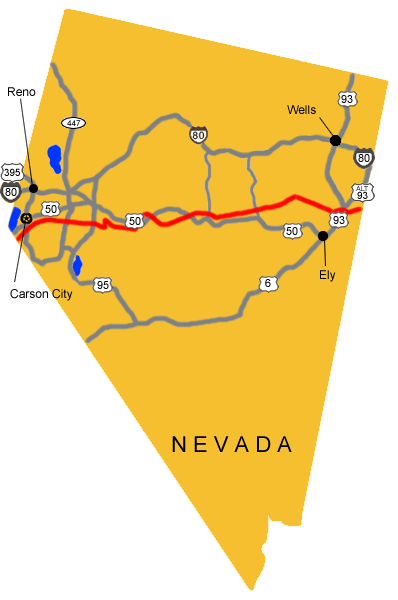

# Nevada Pony Express Stations

The BLM has marked the Pony Express Trail across Nevada. About 80% of the route is on national resource lands and, therefore, is accessible to the public. Maps and detailed descriptions of each site and route have been preserved. Nearly 500 miles of this trail lay through Nevada’s desolate and uninhabited wilderness.

DIVISION 4 (Cont’d):

124. Prairie Gate/Eight Mile Station (N39 58 15.6 W114 04 33.1)

125. Antelope Springs Station (N39 49 46.7 W114 23 20.9)

126. Spring Valley Station (N39 49 36.2 W114 33 39.6)

127. Schell Creek Station (N39 47 55.5 W114 40 42.7) (P)

There is a historical marker a few miles west where the dirt road hits Hwy 93.

128. Egan’s Canyon/Egan’s Station (N39 51 37.8 W114 56 09.5)

Located ~30 miles north of Ely west of US 93 on Eagan Canyon Road.  White Pine County Road 18 west to CR 23 and Eagan Canyon Road junction, turn southwesterly ~ 2 miles. It is currently marked with a stainless steel stake and once you find it, you’ll likely find the foundations of the old station building

The canyon was named for Howard Egan who had been in the area since the 1850s. He later became a Pony Express agent. Egan Canyon was the site of many Indian ambushes. In July 1860, U.S. troops travelling from Fort Ruby to Schell Creek came upon an Indian attack at the station barely saving the lives of the 2 station masters. Indian survivors of that skirmish took revenge on the next Pony Express stop, Schell Creek Station, killing the stationmaster and 2 assistance and running off all of the livestock.

The original Pony Express Trail through Egan Canyon is suitable for motor vehicle travel, hiking, and horseback riding. When you travel through the canyon you can easily see why it was an ideal ambush place. Go 1/2 mile south from junction and turn west on the County Road to Egan Canyon. Travel time by vehicle through the canyon and back is about ~1 hour.

129. Bates’/Butte Station (N39 56 05.1 W115 12 10.2)

There is still what is either the remains of a rock wall or a large rock fireplace standing. But there isn’t any signs or markers or anything and it’s pretty hard to see if you aren’t really looking for it (I had driven past it half a dozen times over a period of years before finally noticing it).  There are also some very old building remains at the mouth of the canyon (coming from the East), which are even harder to see, even if you know exactly where to look, and another site a few miles away further up the mountain, but I’m pretty sure the station site is the one with the stone remains noted above.

130. Mountain Spring(s) Station (N40 00 54.2 W115 20 22.5)

This station is very well signed, very easy to find and see.

131. Ruby Valley Station (N40 02 52.8 W115 29 42.2)

Relocated to the grounds of the Northeastern Nevada Museum in Elko in 1960.

132. Jacob’s Well Station

Jacob's Well

Jacob’s Well is often included in published lists of Pony Express Stations. However there was no station at the site in October of 1860, 7 months after the inception of the Pony, as documented by Sir Richard Burton.

Today nothing remains but a few old stones from which the old well has long since caved in with rock and dirt. It was not only was a change station for the Pony Express until its demise as well as the Overland Stage Line until 1869, but it later served the Hill Beachy Road to Hamilton and the White Pine Mines.

 

Jacob's Well

133. Diamond Springs Station (N39 54 47.7 W115 52 21.2) (P)

Diamond Springs

 

Today the site of the station sits on private land owned by Olive Thompson. The limestone slab section of the original Pony Express station that Edna Patterson spoke of in her narrative is still partially standing among large cottonwoods at the mouth of Telegraph Canyon. Diamond Springs, overgrown with cat tail and salt grass, is located in the meadow nearby. There is another stone dugout among the trees, but no one knows how long it has been there. The structures are visible from the country road on the west side of the Diamond Mountains. There is a brass Pony Express centennial plaque mounted in a stone and concrete monument near the ranch house just one mile south of the actual station site.

Diamond Springs

 

134. Sulphur Springs Station (N39 50 05.7 W116 04 08.3)

Sulphur Springs

Sulphur Springs is commonly listed as a Pony Express Station. However, it could not have been one of the original stations built in the spring of 1860. In reviewing the literature, there is no mention of this station prior to the Overland Stage and Mail Express maps of 1863. Sulphur Springs was probably built in July of 1861 to facilitate the opening of the Overland Stage. Since it was on, or at least near, the Pony Express Route it was probably used as a way station for horse changes from the time of the station’s inception to the demise of the Pony. It was used as an Overland stop until 1869.

Sulphur Springs

At Sulphur Springs, which is now fenced in, and across the road there are several types of ruins. There is one remnant of a log wall, several stone foundations, and many pieces of old artifacts. This is possibly the site of the Overland Stage Station. The site is 1-2 miles N of the Pony Express Trail and about 2 miles S of the Sulphur Springs Ranch which has since been renamed the Diamond Star Ranch. The site is on private land owned by John Trowbridge.

 

 

 

 

135. Roberts Creek Station (N39 45 00.8 W116 17 05.2)

This was one of the original Pony Express stations built in the spring of 1860. It is difficult to say whether Bolivar Roberts or Howard Egan built Robert’s Creek. Some accounts say Bolivar Roberts and his crew built stations as far east as Robert’s Creek. However, Burton (1963) says Robert’s Creek was the western most extent of Egan’s division. It seems that the station was still intact around May, 1860. After this time it is thought that the station was destroyed by Indians and Bolivar Roberts set out to rebuild destroyed stations and restock them. This time the buildings were better constructed and men left to occupy each one until the Indian troubles were over. On June 16 they met Howard Egan at Robert’s Creek.

Robert's CreekRobert's Creek

Robert’s Creek Station was a telegraph station as well as an Overland Stage Station. It was an Overland stop until 1869. The site of the station is now on the Robert’s Creek Ranch owned by Filbert Etcheverry of Bakersfield, California. Peter Damele noted the old Pony Express station, a log structure, has long since been obliterated by the owners. There is a log dugout very near the Express site he described, but no one knows if it is part of the original station or not. Robert’s Creek is 15 miles north of Highway 50.

DIVISION 5:

136. Camp Station/Grub(b)s Well Station (N39 37 24.8 W116 28 33.4)

Grubb's Well

Grubb’s Well is commonly mentioned in the published lists of Pony Express stations, and is also listed with Overland Stage stations, however there was no station at the site in the fall of 1860.

Grubb's WellIt was in existence by August 1861, and the Pony ran until October 1861. In July 1861, John Butterfield began his Overland Mail and Stage Express and Freight Service just prior to the demise of the Pony Express. He ran his stage fairly closely along the Pony Express route, but he built some additional stations along the route. Grubb’s Well was probably built in July 1861 for the Overland Stage.

Since it was right on the Pony Express Trail it was probably used as a way station for the last few months of the Pony. Its use by the Overland continued until 1869. In 1861 the station was a tepee-like structure of rough poles covered by rushes and grass. There was fresh milk from a rare milk cow kept by the hostler. The well here was only 10′ deep and was open to anyone who would haul the harshly alkaline water. There are no original buildings here. Don Smith of Battle Mountain is the owner of the patented land on which the structures are located. Just SW of the site sits a rock and concrete monument bearing another brass centennial Pony Express marker. Grubb’s Well is 8 miles north of Highway 50.

137. Dry Creek Station (N39 32 41.8 W116 35 50.3)

This being the last of the original Pony Express stations on Bolivar Roberts division, was most likely built by his crew in the spring of 1860. The Transcontinental Telegraph was rapidly being constructed in 1861. As fast as outer stations were established, the important news of the day was sent to them by wire and transferred to the Pony Express. This meant that, so far as telegraphic communications were concerned, the Pony Express was playing a constantly lessening role. The newspapers, in introductory lines which were significantly descriptive, told of the progress of the telegraph across the country. Thus the San Francisco Bulletin of August 13, 1861 said the Pony Express rider was leaving his dispatches for the Bulletin and other Pacific Coast newspapers at Dry Creek station.

Dry Creek

Dry Creek

Dry Creek was used by the Overland Stage & Mail Company as a way stop from 1861 to 1869. It was from Dry Creek west that the stage route and Pony Express route differed slightly. The Pony traveled almost directly westward from here to the north of Eagle butte and on to Simpson Park. The stage went south around Cape Horn and then west. An additional station on the Overland, Cape Horn Station, was built on this longer route, that was not needed by the Pony.

Remains of the Dry Creek Pony Express station are on the Dry Creek Ranch located 4 miles north of Highway 50. The ranch is owned by Peter Damele who has been in the area since 1898. Peter and his son Bennie are both excellent authorities on the history of the surrounding ranches as well as their own. A few rock foundations, overgrown with sagebrush, mark the mound above the creek where the station was situated. A rock monument built by the Damele’s in 1960 bearing a brass commemorative plate, distributed as part of the Pony Express Centennial in 1960, sits near the station site. Remnants of the old trail leading over to Eagle Butte along the shortcut are barely visible to the west of the station. Bennie Damele says it’s called Streep’s Cutoff. (It’s also called Streeper’s Cutoff after William Streeper.) Remains of the Overland Stage Station, a stone structure, sit just off the main gravel road before it turns to go up to the ranch.

Cape Horn

138. Simpson Park Station (N39 30 00.0 W116 57 07.9) (P)

Located on private land approximately 15 miles NE of Austin. This was one of the original Pony Express stations having been built in the spring of 1860. This area was named for Captain J.H. Simpson who first visited here on May 27, 1859 and spent the night in the vicinity. Simpson Park was probably used by the Overland Mail and Stage Line from July 1861 to 1862 or 1863, when the run was changed to go through Austin.

Simpson Park

George Washington Perkins or “Wash” was a rider on the run between this station and Ruby Valley. In 1861 William James was hired on the run from here to Cold Springs. At 18, he was one of the best Pony Express riders in the service. He rode only 60 miles each way but covered his round trip of 120 miles in 12 hours including all stops. He always rode California mustangs, using 5 of these animals each way. His route crossed the summits of 2 mountain ridges, lay through the Shoshone Indian country and was one of the loneliest and most dangerous divisions on the line.

A visitor to the station in 1949 gave this impression of what was left: The station foundations are visible. At the mouth of Simpson Park Canyon on the east side of Simpson Park lies a fenced meadow. Peter and Bennie Damele said the foundations were on a little mound in the east end of the meadow near an old fenced corral. The stone foundations outline probably 2 structures. The land is owned by Mr. and Mrs. Howard Wolf of Austin.

139. Reese River/Jacob’s Spring Station (N39 30 06.9 W117 10 56.1)

Reese River

Stations were set up at Simpson Park, just east of the sub-basin, and Jacobs Springs, about 2 miles east of Reese River. The latter station was named after Washington Jacobs, district agent in charge there; Jacobsville, the first town in the sub-basin grew up at the station. After Jacobsville was abandoned as the Lander county seat in favor of Austin in 1863, the stage station there was moved 2 miles westward, to the east bank of Reese River.

The Overland Stage and Mail Company used this as a way stop at least until the discovery at Austin in May 1862.

But after it began to boom, the stage and mail stop was moved to Austin. Rock foundations on the west side of the Reese River just north of the highway mark the site of the Overland Stage station. These ruins are on patented land owned by Paul Inchauspe of Austin. However, the Pony Express station ruins are all but gone.

140. Dry Wells Station (N39 23 05.7 W117 23 14.4)

Dry Wells

This station was probably built in the summer of 1861 for the Overland Stage Route which went through this way until late 1862 or early 1863 when this part of the route was then moved northward to run over New Pass (Ream). Today there is no sign of where the station may have been situated in the canyon. There are old telegraph poles still standing but no sign of insulators or wire. The canyon is on public land located just north of Railroad Pass in the Shoshone Mountains.

 

Mt. Airy

141. Smith’s Creek Station (N39 23 00.1 W117 37 40.1)

Smith Creek

Remains of this station are on the present day Smith Creek Ranch located 14 miles north of State Highway 2 on the east side of the Desatoya Mountains. There is one adobe building with a willow thatch roof and a second building with one section of adobe and another section of rock also with a thatch roof. The first building has been identified as the location of the corral. The adobe section of the second building is the original Pony Express Station house.

142. Castle Rock Station

143. Edward’s Creek Station

144. Cold Springs/East Gate Station (N39 24 56.1 W117 50 32.2)

Located on US 50 65 miles west of Austin. An interpretive center near the highway explains the history of the site and marks the beginning of a 1-1/2-mile trail to the station. In March of 1860, the station was built by Superintendent Bolivar Roberts, J.G. Kelly and others. It was put to use by the Pony Express in early April. Jim McNaughton was the station keeper at Cold Springs until he became a rider. J. G. Kelly was assistant station keeper at Cold Springs for a while.

Cold Springs

The 1860 structure was built of large native rocks and mud. It was a large station, measuring 116′ x 51′. The walls were 4-6′ high and up to 3’thick. There were 4 distinct rooms — storage area, barn, corral, and living quarters.

Cold Springs

 

The horse corral was located next to the living quarters primarily as a safety measure to guard the valuable animals. This location also took full advantage of the animals’ body heat during cold Nevada winters. The only other source of heat was from one small fireplace.

Station keepers and riders were continually changing. Another rider that stayed at Cold Springs was William James. He rode in 1861 between Simpson Park and Cold Springs. Today at Cold Springs a substantial fortress still stands out on the trail. Living quarters and corral are easily recognized as well as windows, gun holes, and a fireplace. The “rivulet of good water from the neighboring hills, that Burton found so refreshing is still running by the old ruins.

145. Middle Creek/Gate Station (N39 17 48.4 W117 56 51.6)

Middle GateMiddlegate

The site location is unknown. There are two likely areas for this station. One is at White Rock Springs, a ½ mile south of US 50 and about 1½ miles east of Middlegate Butte. Another would be anywhere along the 4 miles between Middlegate and Westgate along an arroyo that often has seeps or short lengths of running water. The meadows between Middlegate and Westgate also would attract an Overland station because of the native hay ripe after June each year.

 

 

 

 

 

146. West Gate Station (N39 17 27.2 W118 03 10.4)

147. Sand Springs Station (N39 16 30.6 W118 24 48.5)

Sand Springs

 

About 20 miles east of Fallon on US 50 an unimproved road leads to Sand Mountain and Sand Springs Pony Express Station. The station has a number of interpretive signs. In March of’ 1860 Bolivar Roberts, J.G. Kelley and others built the station. James McNaughton was station keeper for a while before he became a rider.

The striking sand dune known as Sand Mountain is highly visible from a distance. The mountin of clean, white sand is a single dune 500′ high and 1½ miles long surrounded by lesser dunes. The mountin is formed as sand blown by the prevailing SW wind is dropped at the end of the valley, where the terrain forces the wind upwward. The dunes begain forming about 4000 years ago after the vast, ancient Lake Lahonton receded from the valleys of the Truckee, Carson and Walker Rivers.

Sand Springs

>Sand Springs

148. Sand Hill Station

149. Carson Sink/Sink of the Carson Station (N39 16 48.7 W118 47 40.6)

In March of 1860, Bolivar Roberts, J.G. Kelly and others built this station. Today very little remains of this once busy station. 2 adobe walls of the corral are visible, but they are rapidly melting back into the alkali. In 1960, Walt Mulcahy found faint ruins of 4 – maybe live – buildings beside the corral. He said all of them faced north with 3 in a small flat just north of the dunes and 2 partially in the dunes.

Carson Sink

150. Williams Station

151. Desert/Hooten Wells Station (N39 16 18.4 W119 02 17.6)

Rock ruins (including the Strong house and parts of the stone corral wall) remain 12 east of US 95 alternate at a point 2 miles south of Buckland’s Station. Hooten Wells was probably used by the Pony Express for its last few months and later during freight and staging efforts. The site of Desert Station is located near Hooten Wells on the Rafter D Ranch. This station site was not used since August 1861, when the route was moved further to the north.

Hooten Wells - Desert Station

152. Buckland’s Station (N39 17 41.4 W119 15 01.5)

Located across the Carson River from what was to be the future site of Fort Churchill, Buckland’s Station consisting of a log cabin and saloon was established by Samuel S. Buckland who had come to California in 1850 via the Isthmus of Panama. During the cold winter of 1859-60, Buckland constructed a toll bridge across the Carson River, and set the following fees for its use: $2.00 for heavy wagons, $1.50 for light wagons, $1.00 for buggies, and $.25 for pedestrians.

Buckland's Station

A bridge across the river, supplies for sale, extra livestock to replace trail-weary animals, and a good supply of gut-warming whiskey made Buckland’s Station a natural stopping place for men who had crossed the Great Basin, or who were headed into the desert wilderness.

 

In March of 1860, Bolivar Roberts made arrangements with Samuel Sanford Buckland to use his “good-sized cabin” as a station. Apparently the rancher declined employment as keeper, for this position was taken by W.C. Marley. The place served as a rider-relay, or home station, until the establishment of Fort Churchill in the summer of 1860.

Buckland's Station

Prior to the establishment of the fort, several memorable events took place at Buckland’s Station including Johnson Richardson’s refusal to relieve Bob Haslarn forcing the latter to make his famous ride. “Pony Bob” Haslam, one of the most famous riders of the Pony Express, rode regularly from Lake Tahoe to Buckland’s Station near Fort Churchill. Perhaps his greatest ride, 120 miles in 8 hours and 20 minutes while wounded, was an important contribution to the fastest trip ever made by the Pony Express — the message carried, Lincoln’s Inaugural Address.

On May 11, 1860 men on their way to battle at Pyramid Lake stayed at Buckland’s. They took Pony Express horses with them, and four days later, the survivors of the battle straggled back to Buckland’s. By the end of the summer of 1860, Indian troubles had forced the establishment of Fort Churchill. From then until the end of the Pony Express, the headquarters building at the fort was used as a stopping station instead of Buckland’s. Today the original log cabin used by the Pony Express is gone,but a house built later marks the spot. It is located 8½ miles south of Silver Springs on US 95 Alternate.

153. Fort Churchill Station (N39 17 52.1 W119 15 45.8)

Fort Churchill is a state park located ~8 miles south of Silver Springs on US 95 Alternate. Although Fort Churchill is now in ruins, a visitor center reconstructs its colorful history with interpretive exhibits. The headquarters building, which was a stopping point for the Pony Express, still stands.

Fort ChurchillFort Churchill

 

Fort Churchill

Indians on the warpath and interrupted Pony Express mail service, led to the establishment of Fort Churchill. After the first battle at Pyramid Lake, troops were dispatched from California and following several more battles at Pyramid Lake, Captain Joseph Stewart’s Carson River Expedition was ordered to establish a post. Construction began on July 20, 1860. Built by Captain Stewart and his men, the fort was rhomboid in shape. It occupied 1,384 acres and adjoined Buckland’s Ranch on the banks of the Carson River. It was built as a permanent installation consisting of adobe buildings erected on stone foundations. This U.S. Army outpost served as the largest calvary battalion in the West, and was the main supply depot for all expeditions against the Indians. For several months after October 1860, Fort Churchill was the eastern terminus of telegraphic communication for California. Important dispatches sent from the east by Pony Express were removed from the rider’s pouch and telegraphed to California to speed their delivery, although dispatches were frequently delayed because of downed wires.

154. Fairview Station

155. Mountain Well Station

156. Stillwater Station

157. Old River Station (N39 29 18.6 W118 47 41.5)

158. Bisby’s Station

159. Nevada Station

160. Ragtown Station

161. Desert Wells Station

162. Miller’s/Reed’s Station (N39 17 37.9 W119 27 24.7) (P)

Miller's StationToday the site of Miller’s or Reed’s Station is on private land ~8 miles from Dayton down the Old River Road. Nothing remains because the lumber in the building was used elsewhere. It was originally one of the 20 or so stations along the Carson River branch of the California Emigrant Trail in 1849 and 1850. It became a relay station when the Pony Express started in 1860. It became known as Reed’s Station when G.W. Reed purchased it on July 1, 1861.Miller's Station

163. Dayton Station (N39 14 09.7 W119 35 27.1)

One of the first settlements in Nevada, was first known as a stopping place on the Carson River for California-bound pioneers. Coming in from the desert they rested here before continuing westward. In 1849, gold was found at the mouth of Gold Canyon and prospecting began in the canyons to the west leading to the discovery of the fabulous ore deposits of Gold Hill and Virginia City in 1859. The first Pony Express stop was at Spafford Hall’s Station, which is now a gravel pit. The Union Hotel now occupies the 2nd site for the remount station. The free-standing rock wall is the original wall of the Overland Stage Station and Pony Express stop.

Dayton StationDayton Station

164. Carson City Station (N39 09 42.3 W119 46 10.8)

Carson CityCarson City Station

Founded in 1858, it was was named for Kit Carson. As the social and supply center for the nearby mining settlements of the Comstock Lode in the mid-1800’s, Carson City prospered. In 1864 it was designated the state capital. In 1860. there was only one street that was little more than a double row of saloons, a few assay offices, a general store, and the hotel that was the relay station for the Pony Express located between 4th and 5th Streets, near the original Ormsby House.

 

 

 

 

 

 

165. Genoa Station (N39 00 15.6 W119 50 49.6)

Van Sickle Station (N38 58 20.7 W119 50 16.7)

Van Sickle's farm

Van Sickle Station Hotel on Foothill Boulevard about a mile north from the junction with Kingsbury Grade was built in 1857 on the Emigrant Trail and contained a bar, a huge kitchen and a store. Henry Van Sickle, who had helped to finance the construction of the new road, was toll-master of Kingsbury Grade.

 

 

 

 

166. Friday’s/Lakeside Station (N38 57 50.8 W119 56 15.9) (M) (P)

Friday's StationFriday's StationThis was the point where the Pony Express riders crossed the California-Nevada line. “Friday” Burke and James Small were granted a franchise to operate a station along the western section of the Kingsbury Grade and Mac Donald Road. In the 1860’s Friday’s Station was an important remount stop for the Pony Express riders, and continued as a Way Station for the Pioneer stage lines and freight teams and wagons on the Bonanza Road. There is a marker 3/4 miles east of the California-Nevada State Line on U.S. 50 on the property where the Pony Express riders rode up to the remount station off Loop Road, across from Caesar’s Tahoe. Although it is on private property, you can see the original blacksmith shop. The Pony Express statue in front of Harrah’s Casino, Stateline, Nevada, commemorates the site of Friday’s Station which was located about a mile east.

>From Friday’s Station, the route takes the Kingsbury Grade over Daggett Pass into the Carson Valley. The Old Kingsbury Grade is blocked by private ownership and the criss-crossing of U.S. 50, but the new paved road is near the actual route. The Kingsbury Grade wagon road was built in 1860 by Kingsbury and McDonald as a replacement of the old Dagget Pass Trail. The new road shortened the distance between Sacramento and Virginia City by 15 miles. The toll for a wagon and 4 horses was $17.50 round trip from Shingle Springs, California, to Henry Van Sickle’s station near the eastern foot of the grade.