# Utah Pony Express Stations

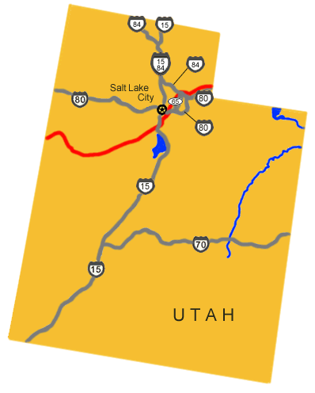

https://www.expeditionutah.com/featured-trails/pony-express-trail/utah-pony-express-stations/

The Great Salt Lake Desert was a major obstacle facing travelers to California. Most California emigrants took the California cutoff of the Oregon Trail north of Salt Lake. That trail offered water and feed for livestock, but was closed by snow in the winter and did not serve the need for year-round communication between California and the East.

Early efforts to find a route across the desert ran afoul of salt, heat, and lack of water. Finally, a trail was pioneered that skirted the worst of the salt desert, going from spring to spring, “following the moistures”. The route was poor in feed, extremely isolated, muddy in spring and fall, dusty or cold otherwise, and plagued by Indians. In spite of these drawbacks, it served the communication need and became famous as the Overland Route (some sections are labelled as such on some maps).

The route of the Pony Express (since 1992, the Pony Express National Historic Trail) angles south and west from South Pass, across the Green River and on to Fort Bridger. The trail continues at a distance south of Interstate 80 and follows Coyote Creek, entering Utah from the east at The Needles, a few miles south of where Evanston, WY, now stands. The riders proceeded past historic Cache Cave and down Echo Canyon, the modern route or I-80 and I-84, to the present-day town of Henefer. There they turned south through East Canyon, crossed Big and Little Mountains, and entered the Salt Lake Valley by way of Emigration Canyon. The trail to Salt Lake City followed in large measure, the trail of the Donner Party and the Mormon Pioneers; you will see markings, monuments along the way.

From Salt Lake City, they rode south, pretty much along the modern State Street to the area of the Utah State Prison, then crossed the Jordan River and angled south and west to the town of Fairfield and Camp Floyd, a site steeped in history. The route then led south and mostly west past Simpson Springs, Fish Springs, Willow Springs, and across the northern end of the Deep Creek Mountains to the present-day village of Ibapah.

## DIVISION 3

96. **The Needles/Needle Rock(s) Station** (N41 09 50.0 W111 02 57.0) (P)

Located (NE1/4NW1/4 Section 21, Township 5 North, Range 8 East, Salt Lake Meridian.) just on the Utah side of the border with Wyoming, it lies on Yellow Creek, almost 10 miles south of the town of Evanston, approximately 8 miles from Bear River Station, Wyoming.

Little is known of the station, as none of the contemporary writers left a description. The station is named for a rock formation described by British explorer Sir Richard Burton as “…a huge Stonehenge, a crown of broken and somewhat lanceolate perpendicular conglomerates or cemented pudding stones called not inappropriately Needle Rocks.” Two stone foundations remain at the location (N41 10 16.9 W111 02 41.7) of the station. The site is on private land.

The 1869 GLO cadastral plat (right figure) shows the station location being at Porter’s Ranch along the Omaha to Salt Lake Valley Road. The route through this area also was used by the Donner-Reed party in 1846, the Mormon Pioneers in 1847, by General Johnston’s Army in 1858, and the transcontinental telegraph in 1861.

97. **(Head of) Echo Canyon Station** (N41 07 28.0 W111 11 15.0) (P)

Location: Lot 3, Section 6, Township 4 North, Range 7 East, Salt Lake Meridian.

About 8 miles from Needle Rock Station, this station, the first in Echo Canyon, was named for the large sandstone formation located near the site. The station, made of logs, was sold to a French trapper and moved a mile away in 1867. The station site is located approximately where the old Castle Rock grocery store now stands.

The station at the head of Echo Canyon was also known as Frenchies and Castle Rock. It was a contract station on the Pony Express and Stage route. Jabusch believes that the station originally stood in the abandoned town called Castle Rock, which was located about 1½ miles down the canyon from the present junk yard site known as Castle Rock. The structure was apparently built of logs, and after being sold to a French trapper in 1867, was moved up to the canyon to the junk yard site, owned in recent years by the late Curtis Moore.

Nothing remains of this site.

Back to the SE, and unfortunately on private land, one finds the well-known trail landmark called Cache Cave. The cave was a popular camping spot on the Emigrant Trail, and, high up on the cave walls where livestock cannot rub, the names of many Mormon Pioneers can still be seen.

98. **Halfway Station** (N41 03 00.0 W111 18 13.0) (NM)

Location: NW1/4SW1/4 Section 29, Township 4 North, Range 6 East, Salt Lake Meridian.

Approximately 7 miles from Head of Echo Canyon Station, about half way down Echo Canyon was the appropriately named Halfway Station. The 3rd contract station in Utah, it was also called Emory, Daniels (an operator), or sometimes Hanging Rock. Unfortunately, Halfway Station remains obscure in history. An undated photograph published in Fike and Headley’s 1979 monograph, and labeled as “Government Creek Telegraph Station,” was ascertained by Jabusch and Nardone to actually depict Halfway Station. The photo shows an old log cabin with a covered entry, and a newer structure of sawn lumber. The structure was apparently torn down after the railroad went through in 1868.

Fike and Headley tell an unresearched story that, in the early days of the Pony, rustlers in the area would steal the express horses, then later sell them back to the company. When the horses began to be branded with the XP (Express) brand, the rustling ended. It was likely destroyed when the existing highway was built as nothing can be found.

99. **Weber Station** (N40 58 21.8 W111 26 18.5) (M – N40 58 22.0 W111 26 18.0) (P)

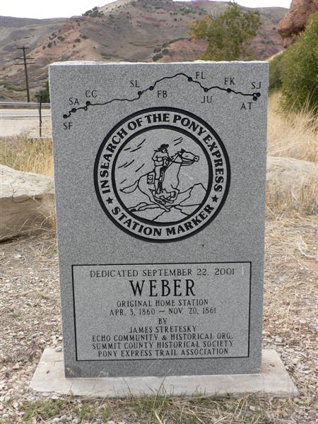

Location: NW1/4NE1/4 Section 25 Township 3 North, Range 4 East, Salt Lake Meridian, about 9¾ miles from Halfway Station.

Known by a variety of names, including Bromley’s, Pulpit Rock, Hanging Rock, and Echo, it was Utah’s 4thcontract station. The appearance of the station and its actual location have been the subject of much debate. Old photographs are available, but as David Jabusch notes, “Interpretation of these old photographs is more an art than the science one might suppose.” By the time of the Pony Express, a small village existed here, and it is difficult to determine which of the photographed structures might have served as the station. Modern developments including the building of the railroad, U.S. Highway 30, and later, the Interstate freeways have destroyed much of the original topography, including the Obelisks and Pulpit Rock, making futile any appeal to archaeology. James Bromley settled here in 1854. He was later hired by Russell, Majors, and Waddell as division superintendent for the section of the line between Pacific Springs and Salt Lake City, and his ranch at Weber became the Pony Express and Stage station.

Passing through in 1859, Greeley found “Two ‘groceries,’ a blacksmith’s shop, and a mail station” at the location. Burton also describes the location, saying, “…we debauched upon Weber River Station. It lies at the mouth of the ravine almost under the shadow of the lofty red bluffs, called ‘The Obelisks,’ and the green and sunny landscape contrasting with the sterile grandeur behind, is exceedingly pleasing…. The station was tolerably comfortable, and the welcome addition of potatoes and onions to our fare was not to be despised.”

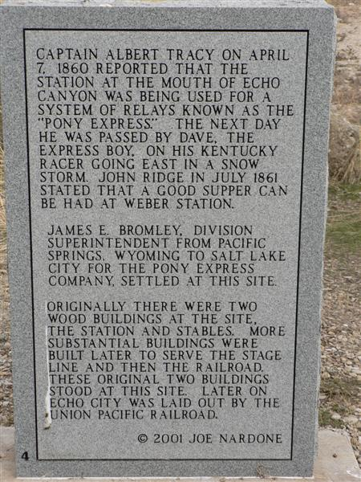

About 2 miles west of Weber Station, the mail was transported across Forney’s Bridge on the Weber River. The bridge was constructed prior to June 1858. From this location, the Express riders traveled up Bachelors Canyon to the top of Dixie Hollow. When the crossing was unsafe or the canyons were snowed in, the rider could go on down the valley to the Brimville Emergency Station or Henneforville, now Henefer and around by Little East Canyon to Dixie Hollow. The pioneer immigrants came part way down Dixie Hollow, turned right, crossed the ridge, and then went south into East Canyon. By the time of the Express, the road was built all the way down the hollow to just south of where it opens into East Canyon.

100. **Brimville Emergency Station/Dixie Hollow Station** (N40 56 26.0 W111 33 38.0) (P)

Location: NE1/4SE1/4 Section 10, Township 2 North, Range 3 East, Salt Lake Meridian, about 10½ miles from Weber via Bachelors Canyon or about 13½miles from Weber via Henefer.

This station in Dixie Hollow was also commonly known as Dixie Creek , East Canyon, and Snyder’s Mill. The exact location has been a matter of considerable debate. Joe Nardone agrees with Mormon Trail authority Lamar Barrett that the station sat directly in the mouth of the draw, at a site marked by a pile of rocks. David and Susan Jabusch found no artifacts of any type during their initial and thorough survey. According to members of the Bertagnole family, who have been on the land for generations, the right location is a short distance to the south where a catch basin for watering livestock and a small grove of trees are found today. Construction of the small reservoir obliterated any evidence of a station at that spot. The U.S. Geological Survey, after consultation with prominent Utah historians, placed Dixie Station at the Bertagnole site. Brimville Emergency Station was located in Henefer and only used during bad weather. Located on private land but visible from the highway. Nothing remains but the location (N40 56 25.8 W111 33 36.8) is shown on USGS 1:24000 scale maps and is believed to be correct.

101-103. **Bauchmann’s/Carson House Station/East Canyon Station/Wheaton Springs Station** (N40 51 23.8 W111 35 20.8) (NM?) (P)

Location: SE1/4NE1/4 Section 5, Township 1 North, Range 3 East, Salt Lake Meridian, approximately 8 miles from East Canyon, it was a stop for both the Pony Express and the stagecoach. It was the 6th contract station in Utah. The station was also known as East Canyon and Carson House Station, or sometimes as Dutchman’s Flat by riders who could not remember the name of the German, Bauchmann.

The station was a one-room cabin built of squared logs. As it appears today, the building has been extensively remodeled to make an attractive and comfortable summer cabin. It has been moved ~100 yards SW from its original location. The station and site are owned by the Clayton-Macfarlane Ranch.

Burton’s party stopped for the night at “the ‘Carson House Station’ at Bauchmin’s Fork.” Although his stay was not unpleasant, his sleep was somewhat disturbed by a skunk which prowled the grounds at night and threatened to enter the cabin. “And why, naturally asks the reader, did you not shut the door? Because there was none.”

The station is on private property and the ranch owners have moved and restored it. USGS maps show a monument location (N40 51 20.0 W111 35 19.0) but it appears to be no longer be there.

104. **Mountain Dell/Dale/Ephraim Hanks Station** (N40 46 52.8 W111 40 58.8) (M?) ($)

Location: NE1/4SW1/4 Section 33, Township 1 North, Range 2 East, Salt Lake Meridian, about 8¾ miles from Wheaton Springs. A vandalized monument in the NW1/4 of the NW1/4 of Section 36 presently marks the location of the assumed station site.

The contract lists the 7th Utah station as being in “Mountain Dale.” It was also called Big Canyon Creek, and often, Hanks Station for Ephraim Hanks who managed the place. This is another station the exact location of which has been much debated. It stood a distance up the slope from Little Dell Reservoir (The site is owned by SLC and there is an entrance fee to get closer to where the monument is?), but neither study of contemporary accounts nor an extensive archaeological dig conducted by researchers from BYU has answered the question of the actual station site.

Station keeper Ephraim Hanks was a colorful character on the Mormon frontier. It was widely rumored that he was a leading figure among a group of Mormon “hit-men” called the Danites, or Destroying Angels.

105. **Salt Lake City Station** (N40 45 58.4 W111 53 27.9) (M)

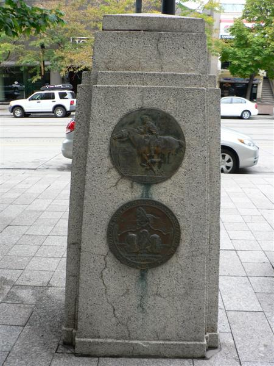

Location: NW1/4NW1/4 Section 6, Township 1 South, Range 1 East, Salt Lake Meridian approximately 9 miles from Mountain Dale.

This station, similar in construction to Brigham Young’s Beehive House, stood where the Salt Lake Tribune Building now stands, at 143 South Main. Because of recent street beautification, the monument has been moved to the south. According to Sir Richard Burton, the station was one of the better facilities along the Overland Trail for food and lodging. Horace Greeley and Mark Twain were among the guests. This was a home station for Pony Express riders. It was a long, two-story structure with a veranda in front and a large livestock yard in the rear. A granite monument with bronze plaques marks the location today.

## DIVISION 4

106. **Trader’s Rest/Traveler’s Rest Station** (N40 37 59.9 W111 53 21.8) (M)

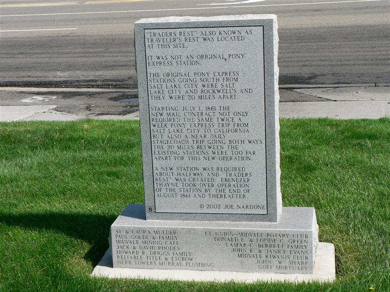

Location: Lot 2, Township 2 South, Range 1 East, Salt Lake Meridian, 9 miles south of Salt Lake House.

Constructed of adobe, in later years, the structure was covered with wood siding and a false front and re-converted into a business (See Photo 14). More recently it served as a garage.

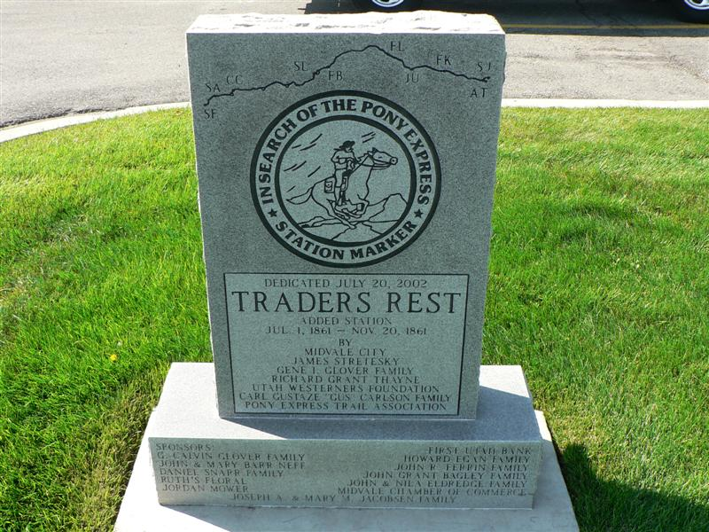

Located just north of 7200 South street, on the west side of State Street, about 2 miles NNW of Union Fort. Travelers’ Rest, or Traders’ Rest, the 1st pony express station out of Salt Lake City. The area was called Lovendahl’s Corner after Swen Lovendahl, an early settler. This station was probably used only for a short time, and no evidence of its existence can be found at the site. The location (N40 37 15.6 W111 53 26.9) is marked by a granite marker placed by the Pony Express Trail Association.

107. **Rockwell’s Station** (N40 29 07.0 W111 54 14.0) (M)

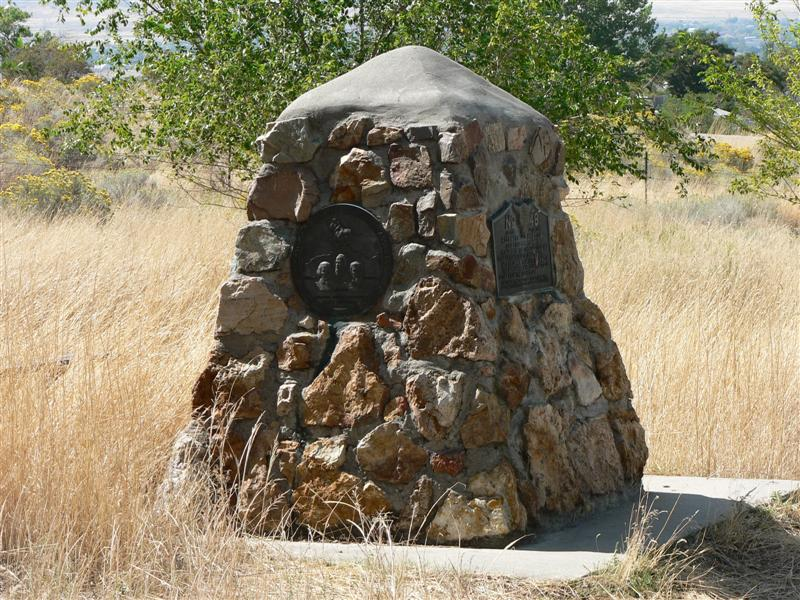

Location: SW1/4NW1/4 Section 15, Township 4 South, Range 1 West, Salt Lake Meridian, 10 miles south of Trader’s Rest Station.

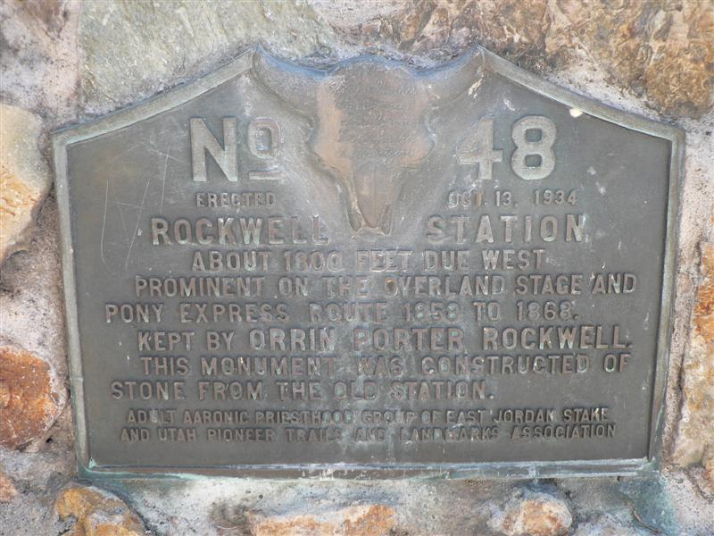

The west-bound pony rider proceeded south along today’s State Street to the next station which was located just south of the Utah State Prison. This was at Porter Rockwell’s Hot Springs Brewery Hotel. The hotel and brewery made this a popular stopping point for travelers. A large adobe barn stood at the site well in to the previous century. A stone monument (N40 29 10.0 W111 54 01.0), largely vandalized of plaques, can be found at the south-east corner of the prison compound and north of the highway.

Orrin Porter Rockwell was one of the most colorful characters on the Mormon frontier. He was a Danite (member of the Mormon protection group, organized in Missouri to protect against terrorist activities) and became a close friend and adherent of Joseph Smith while still in his teens. He served as bodyguard for both Joseph Smith and Brigham Young. In Utah, Rockwell served as a territorial law-man, with a reputation for relentless pursuit, and swift and final justice. Whether he was in fact a loyal defender of his Church and its leaders, or a cold blooded murderous villain, Porter is said to have asserted that he “never killed a man who didn’t need killing.” Photographs and drawings of Porter Rockwell show him with long, flowing hair and beard. It is said that Joseph Smith promised him that as long as he never cut his hair, a bullet would not take his life. Indeed, Porter died of heart failure in 1878, at age 65.

108. **Dugout/Joe’s Dugout Station** (N40 21 19.0 W111 59 34.0) (M)

Location: SW1/4NE1/4 Section 30, Township 5 South, Range 1 West, Salt Lake Meridian, 11 miles from Rockwell’s Station.

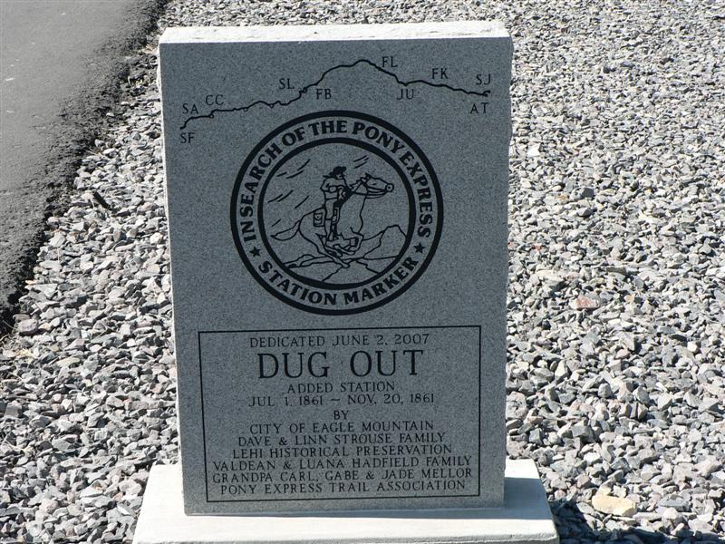
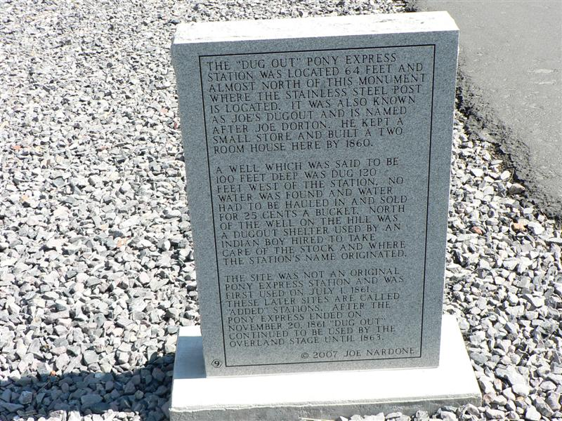

Joe’s Dugout (aka Dugout, Joe Butcher’s, Seven Mile). The site is on the pass between Utah Valley and Cedar Valley. Nothing remains. There is a monument (N40 21 23.0 W111 59 18.0) at the bottom of the pass on the east side.

In conjunction with the Express and stage operation, Joseph Dorton operated a small grocery store. Clients were generally the soldiers from Camp Floyd. He also built a two-room brick home and log barn and provided a dugout for an Indian boy helper. Besides well water, water was hauled from Utah Lake and sold for 25 cents/bucket.  Use of the station after 1861 is unknown. It may have continued in use as a stage station.

109. **Camp Floyd/Fairfield Station** (N40 15 37.9 W112 05 34.4) (M#82)

Location: NE1/4NW1/4 Section 32, Township 6 South, Range 2 West, Salt Lake Meridian, 8 ¼ miles from Dugout Station.

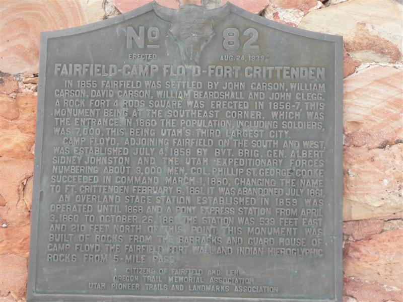
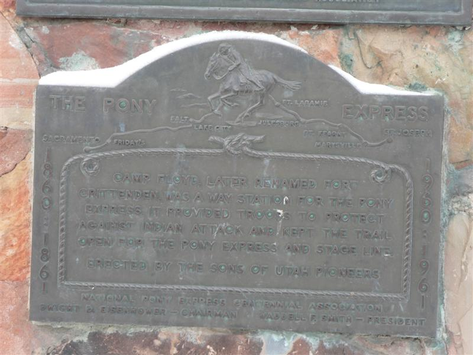

In 1857, President James Buchanan sent an army of U.S. troops under Albert Sidney Johnston to quell a purported uprising in Utah. When the “Mormon War” was settled in 1858 without a battle, Johnston and his army of 3000 Union soldiers built Camp Floyd, named for Secretary of War John B. Floyd. The pastoral village of Fairfield soon became a raucous town of 7000, including 17 saloons, the third largest city in Utah. Then the Civil War broke out and in early summer of 1861, the army, now under Col. Phillip St. George Cooke, was recalled to the United States. John Carson built his two story home in Fairfield in 1855. The Carson Inn, the building now known as the Stagecoach Inn, served as an Inn and a station for the Overland Stage. Today it is the centerpiece of Camp Floyd/Stagecoach Inn State Park. The Pony Express Station was a small adobe building about a block northeast of the Inn. It is still standing, has a wooden facade, and is open to the public as a Utah State Park. It was operated by the family until 1947. Such personages as Horace Greeley, Mark Twain, Sir Richard Burton, Porter Rockwell, Bill Hickman, and General (then Colonel) Albert Johnston stopped at the inn.

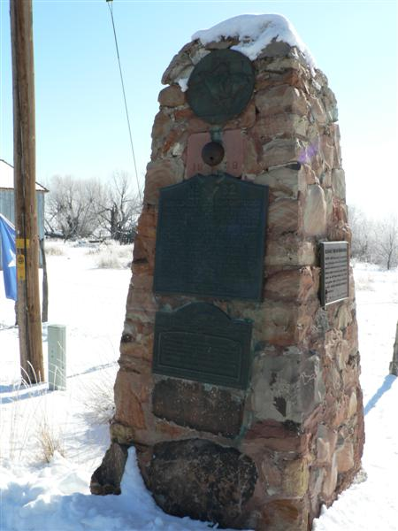

For soldiers marooned in this desert spot, knowing that civil war seemed eminent, news from the east was eagerly awaited. On “Pony Day,” the day when the pony express mail was to arrive, a lookout was stationed on the roof of one of the camp buildings to raise a cry when the pony rider came in sight.

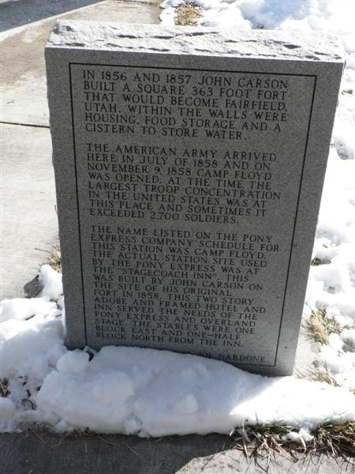
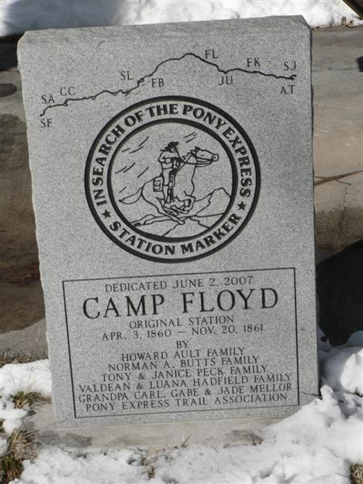

In 1858 James Hervey Simpson was a Captain in the Army Corp of Topographical Engineers. When President Buchanan ordered the Army to send troops to Utah to put down “The Mormon Rebellion,” Simpson was attached to the command of Brigadier General Johnston and sent to Camp Floyd. Soon after arriving here he was assigned to make a preliminary reconnaissance into the desert to the west in an effort to find a central route to California. Prior to this time, anyone heading west from Salt Lake City had to go around the north end of the Great Salt Lake and down the Humboldt River, or follow the Mormon Corridor and the Old Spanish Trail to Las Vegas and Los Angeles. In October of 1858 Simpson, with a small expedition of about 40 men and 5 army wagons left Camp Floyd and headed west. After going about 70 miles, winter weather started closing in and they returned to Camp Floyd. Simpson was optimistic about what he had seen and the following May, he started out again, this time to go all the way to Genoa, just south of Carson City, Nevada, and then to return by another route. This was the opening of the Central Overland Wagon Road. A few emigrants started using it right away and the following year its route was adopted by the Overland Stage and the Pony Express. A grove of trees can be seen about a ¼ mile south of SR 73. This is the cemetery where soldiers and other residents of Camp Floyd were buried.

Nothing remains but there is a monument (N40 15 38.0 W112 05 34.0) to the east across from the restored Stagecoach Inn. The visitor center has a small bookstore and is good for information. All that remains are the commissary building, where the museum is now, and the cemetery. The Stagecoach Inn was built in 1858 across the street from the commissary and served as a Pony Express stop. The inn was restored in 1959. The museum is open year-round from 9 -5 but is closed on Thanksgiving, Christmas and New Year’s Day. Day-use facilities include picnic tables with drinking water, restrooms, barbecue grills, fire pits and covered pavilions.

Fort Crittenden and Camp Floyd are one in the same. Camp Floyd was named after Secretary of War John Floyd. As the civil war flared up Floyd sympathized with the south, the base was renamed Fort Crittenden.

The camp was built in July of 1858 and in December of 1860, Camp Floyd was renamed Fort Crittenden. It was abandoned in July 1861 when the troops were called back to the east for the escalating north-south tension. The almost dismantled Camp/Fort which once housed up to 7000, and what little was left, has been taken by locals.

The last half of the Pony Express operations, it would have officially been known as Fort Crittenden though very little bears that name today, in fact everything official refers to it as Cedar Fort. The Cedar Fort /Stagecoach Inn State Park features a stagecoach hotel and small museum with artifacts and pictures of the once bustling fort.

110. **Pass/East Rush Valley Station** (N40 12 23.1 W112 17 35.6) (M)

Location: NE1/4SE1/4 Section 16, Township 7 South, Range 4 West, Salt Lake Meridian, 10 miles from Fairfield Camp Floyd.

The first Pony Express station in Tooele County, UT, is located in Rush Valley while heading west from Utah County toward Faust on Faust Road, which is also the original Pony Express Trail. Faust Road begins at Five Mile Pass on the county line between Tooele and Utah Counties, and ends at Faust near Vernon. East Rush Valley Station, built as a dugout, was listed by Howard Egan as being very active even though it is not identified as a contract station. The military road ran just to the south of the station, toward Vernon, and is still quite visible today.

Also called “No Name” or Five Mile Pass, this station’s stone monument out on the flats at the site is typical of those found at the location of Pony Express Stations all across western Utah. Not much is known about the structure which was here or its use. It was not listed as a Pony Express contract station. The monuments were constructed in the late 1930’s by the Civilian Conservation Corps (CCC) and the workers were stationed at a CCC camp at Simpson Springs, and left a legacy of monuments, trails, and other improvements around the region. Each monument featured two bronze plaques. One was a circular Pony Express Rider plaque, sculpted by A. Phimster Proctor. The other was rectangular, and gave information describing the nearby station. The plaques were provided by the Utah Pioneer Trails and Landmarks Association. Most of the bronze plaques have been stolen, but in recent years the Utah Division of the National Pony Express Association has been working with the BLM to maintain these markers and to replace the round horse-and-rider plaques.

When in early 1861 Colonel Johnston left the Union to fight for the Confederacy, Colonel Phillip St. George Cook became the new post commander. The name was changed to Ft. Crittenden, but by May of 1861 the Fort was abandoned and ordered destroyed. By September of that year, Fairfield’s population had dwindled to about 18 families.

111. **Faust’s Station** (N40 10 27.0 W112 25 38.8 (M#53) (P)

Location: Lot 4, Section 5, Township 8 South, Range 5 West, Salt Lake Meridian, 8 ¾ miles from East Rush Valley.

Rush Valley Station was also known Meadow Creek Station, Doc. Faust’s and, erroneously, as Bush Valley. Although identified in the 1861 mail contract as Bush Valley, it is apparently a typographical error or was copied as a result of a misinterpreted hand-written contract. This station was established originally by George Chorpenning in late 1858. Within Utah (present boundaries), Chorpenning had built two relay stations, the one at Rush Valley called Meadow Creek Mail Station and the other at Smith Springs (Fish Springs). There is a question whether the stone building still standing at Rush Valley is the station house. The 1871 survey plat names this building Faust’s House, while the survey notes call it Faust’s Station. This building also has been called the old Fletcher house. We are told the remains of a depression marked the structure known as the station house. It was apparently evident for many years to the east and north of the present structure.

Today, it is commonly called Faust’s Station. It was the first home station west of Salt Lake City for the Pony riders. The station was a large log structure with a low, pitched roof, located in the meadow approximately ¾ of a mile south of the site of the stone monument. The site is on private property owned by Tooele City.

Faust Station was operated by Henry Jacob Faust, who was a native of Germany. He emigrated to the U.S. at an early age, probably around 1841 and attended medical school, but dropped out and went from Missouri to hunt for gold in California with the 1849 Gold Rush. He wasn’t too successful with his endeavour and, since he had joined the Mormon Church, came to Utah in 1851. In 1860 he accepted a position as a station manager and part-time rider with the Pony Express and also raised horses for the Express and the Army. He was probably already there as an employee of George Chorpenning who had the mail contract before Russell, Majors, and Waddell. He and his wife survived a narrow escape with Indians while living at Faust. In 1870 Henry packed up and moved to Salt Lake City where he engaged in the livery stable business. The Faust monument can be seen about 30 miles south of Tooele on state Route 36 and five miles from Vernon. Pres. James E. Faust of the LDS Church First Presidency, has family ties to this historic place. Below is a picture of the original Faust Cemetery, which contains the graves of more than 12 people who lived in Faust.

The property, which includes the stone building and a cemetery, is under private ownership and is closed to the public. The monument north of the area, is misplaced and the log structure across the highway to the east is often referred to as “the original station.” The station site was in a pasture south of the monument (N40 10 27.0 W112 25 39.0) on private land. Nothing remains. There is a BLM information kiosk a few of miles to the west.

In the early 1990s, the Bureau of Land Management erected a Pony Express Trail Interpretive Site on the road to Lookout Pass to serve visitors who are crossing the desert to see the several Pony Express Station markers. The sign encourages visitors to respect the land on which they are traveling. Visitors to the Great Salt Lake Desert and Pony Express Trail are reminded there are no services on the Trail for over 100 miles between Vernon and Ibapah.

112. **Point Lookout/Lookout Pass Station** (N40 07 10.7 W112 34 35.2) (M) vandalized

Location: NW1/4SE1/4 Section 13, Township 8 South, Range 7 West, Salt Lake Meridian, about 8 ¼ miles from Rush Valley.

Also called Point Lookout, General Johnston’s Pass and Jackson’s, the station is on BLM land. Above a flat on the west side of Lookout Pass (General Johnston’s Pass in the days of the Pony Express) you find the marker for the location . A rock alignment and the trace of the old road can be seen between the stone monument and a dam built to catch water from a small spring.

Originally, Lookout Pass was identified by Simpson as General Johnston’s Pass. The mail contract called it Point Lookout. From the top of the pass one can look west into the desert at what was to become known as Piute Hell. In May 1860, the Pah Ute War began, caused apparently because of white encroachment and depredations. For a short time, the Express was completely shut down (June-July). This “war” was finally settled after the Civil War when soldiers were sent west to quell the Indian uprisings.

An Egan employee, Fredrick W. Hurst, chronicles a station near the pass as being “Jackson’s Station” in Brush Hollow. By 1876, the survey records show the site to be settled by Horace Rockwell (O.P. Rockwell’s brother) and his wife, Libby. Reportedly in 1885 and since about 1870, the Rockwells occupied a small log house, possibly the old station house. A small cemetery plot, to the south, with iron railings apparently contains the remains of Rockwell’s pet dogs. No other physical remains can be found at the site.

An employee of Howard Egan stated that Egan built a small two-room log house here in April of 1860, but that the station was in ruins by the following September.

A few years later, Horace Rockwell, brother of Orrin Porter Rockwell, and his wife Libby lived in a small log house at Lookout. They had no children, and Aunt Libby, as she was called, kept several dogs upon which she doted. The stone enclosure a short distance to the south was built to protect the cemetery where her beloved dogs are buried. Three emigrant graves are also said to be found within. An entertaining story is told of a time when one of Aunt Libby’s beloved dogs was sick. She sent to Tooele, about 40 miles away, for the nearest doctor. She sent the message that one of the ranch hands was critically ill, knowing that old Doctor Dodds would never make the trip to treat a dog. When he arrived, late at night, he was nearly apoplectic to find he had rushed out there for a sick dog. Aunt Libby just smiled and gave him a $20 gold piece, and everyone was happy.

113. **Government Creek Station** (N40 05 08.0 W112 41 07.0) (NM)

Location: SE1/4SE1/4 Section 25, Township 8 South, Range 8 West, Salt Lake Meridian, about 8 ¼ miles from Lookout one crosses Government Creek. Also called Davis’ House and Government Wash.

Although a telegraph relay station, operated by David E. “Pegleg” Davis, was located here in late 1861, the existence of a Pony Express relay station is a matter of debate. No contract or mail company schedule mentions a station at Government Creek. But the distance and topography between Simpson and Lookout would make this a logical location for a change of ponies, and it is speculated that the telegraph station may have been placed there because of buildings already standing. The transcontinental telegraph was in operation through this area until 1869 when it was moved north to parallel the new transcontinental railroad. Nothing remains.

114. **Simpson’s Springs/Egan’s Springs/Lost Springs Station** (N40 02 22.0 W112 47 15.3) (M#87)

Location: SW1/4NE1/4 Section 18, Township 9 South, Range 8 West, Salt Lake Meridian, 8 miles from Government Creek.

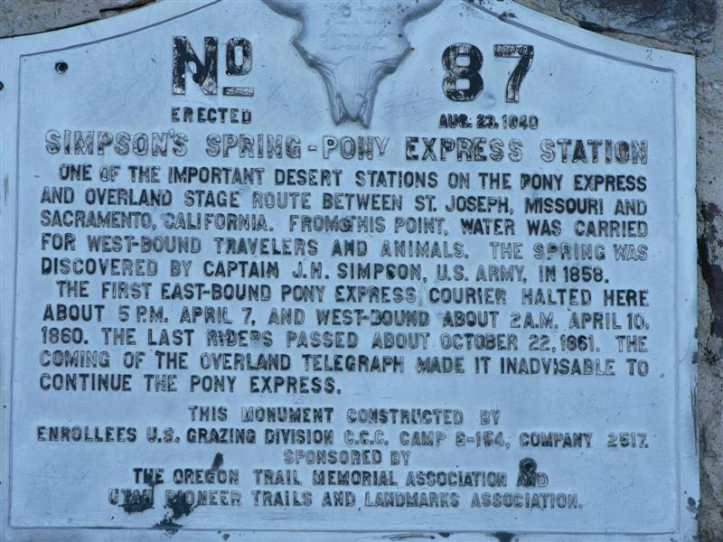

The station now located on BLM land, bears the name of explorer Captain J. H. Simpson who stopped here in 1858 while searching for the overland mail route between Salt Lake City and California. It was one of the most dependable watering points in this desert region. Captain Simpson first named the spring “Pleasant Spring” because of the good water. He later renamed the spring “Simpson Springs” because of the spring’s significance as the “last stop for water” for travelers heading west. The water at became a necessity for the Pony Express from 1860-1861 and for the Overland Stage from 1861 to 1869. Even before the days of the Pony Express, freighting companies used the springs as a watering stop. George Chorpenning established a mail station at this site in 1858. At the turn of the century, the spring was still being used by freighters hauling supplies from mining towns around Gold Hill to western Utah. It is still a key watering location for livestock.

A number of structures have been built and destroyed in the vicinity of Simpson Springs over the years. It is not known for sure which served as a station for both the mail route and the Pony Express. There is a monument and restored structure (reconstructed in 1974 by the FFA) located on a building site which dates to the period (1860) and closely resembles the original. The site, nature and use of the old buildings were determined by archaeological investigation. It also has an information kiosk and ruins of Alvin Anderson’s cabin. Nearby is a camp ground and the site of a Civilian Conservation Corp camp from the 1930’s.

The first east-bound Pony Express courier halted here about 5 p.m. April 7, 1860 and westbound about 2 a.m. April 10, 1860. The last riders passed October 1861. The coming of the Overland Telegraph made it inadvisable to continue this station. The building at the site was rebuilt by the Tooele F.F.A. Chapter in 1976 as a sesquicentennial project.

A Civilian Conservation Corp (CCC) Camp was built west of the site in the 1930’s. One can see remnants of it today. The BLM has developed the area and installed camping facilities.

115. **River Bed Station** (N39 57 35.8 W112 53 42.5) (M#88)

Location: NE1/4NE1/4 Section 18, Township 10 South, Range 9 West, Salt Lake Meridian, 8 miles from Simpson Springs.

After Simpson Springs is the River Bed Pony Express Station, which lies on the floor of the ancient Sevier River bed formed by evaporation of Lake Bonneville, that drained from the area of Garfield County into Lake Bonneville. The water contained in the northern portion of the great inland sea had a greater surface than the southern portion. Consequently more evaporation occurred in the northern part. Water seeks its own level and in this case, the water was squeezed into a low channel between two mountain ranges on the east and west. Here the movement of the water from south to north dug the river as the lake receded.

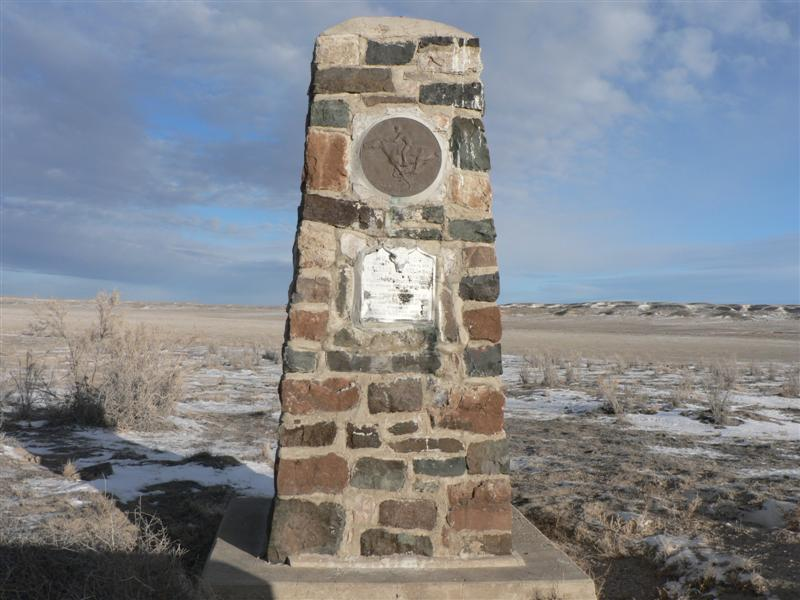
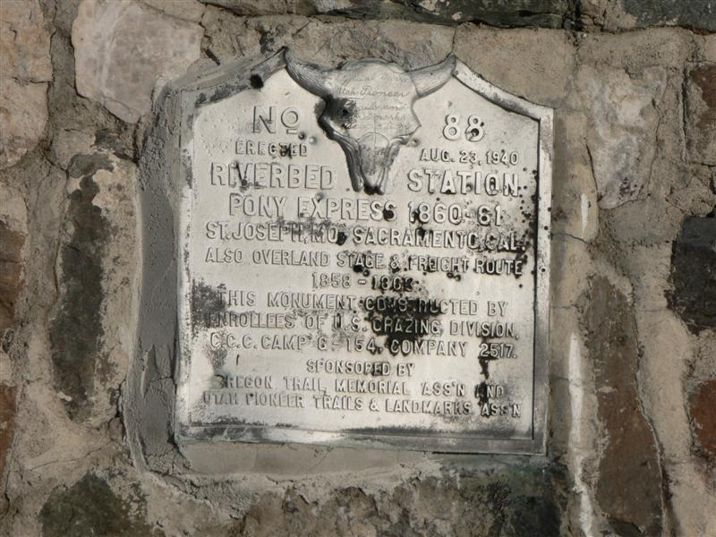

The road drops into the old bed of the Sevier River and the site of Riverbed Station. It was built near the end of the Pony Express era, and is not mentioned in the mail contracts or schedules. Substantial structures were found here to serve the stagecoach line. It is on BLM land and has a monument however, nothing remains but the original trail can be seen north of the monument.

Because of flash flooding, little evidence today remains of the station’s existence.  It is mentioned that it was hard to keep a station keeper at Riverbed because the area was supposedly haunted by “desert fairies.” A monument was established at the site by the Civilian Conservation Corp in 1939 or 1940.

116. **Dugway Station/Dugout** (N39 51 29.7 W113 02 09.6) (M#89)

Location: SE1/4SW1/4 Section 13, Township 11 South, Range 11 West, Salt Lake Meridian, 10 ½miles from Riverbed.

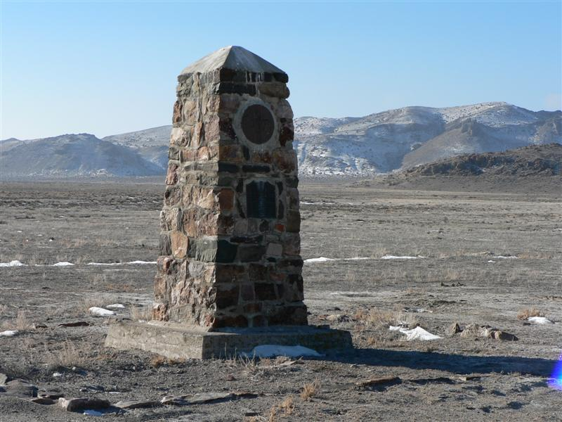
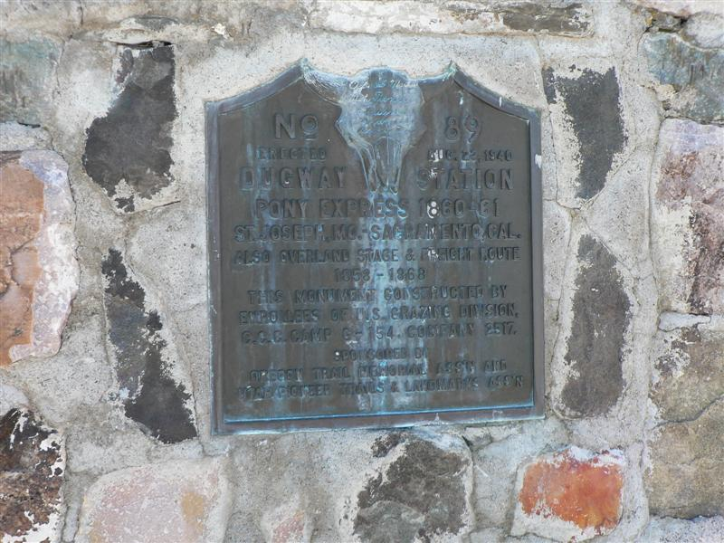

Water for Dugway Station had to be hauled from Simpson’s Springs. Although three wells were dug over several years, one reaching a depth of 120 feet, no water was found. Noted as a “substation” by Horace Greeley,  nothing very permanent was ever constructed at the site. In 1860 a shelter was placed over a dugout and an adobe chimney installed. In the 1890’s, the location was utilized as a halfway stop by the Walters and Mulliner Stage Co. on the route between Fairfield and Ibapah. A monument is located at the site today. Physical evidence at the station site is limited to a disturbed area containing poorly preserved metal objects (possibly from a corral or blacksmithing area north of the wash) and some concentrated stone.

mapAlso known as Shortcut Pass, it is located on BLM land east of Dugway Pass, which connects the Dugway mountain range to the north and the Thomas range on the south. The station was located ~1½ mile south of the modern road, about 8¼ miles west of Riverbed. Burton says that the station was simply a dugout roofed over with split cedar logs, with a crude adobe chimney. Three wells were attempted, the deepest being dug to a depth of more than 153 feet. All were dry, and water had to be hauled from Simpson or Riverbed. Nothing remains but a monument.

117. **Black Rock Station** (N39 52 41.1 W113 16 17.5) (M) east

Location: NW1/4SE1/4 Section 12, Township 11 South, Range 12 West, Salt Lake Meridian, 13 ¾ miles from Dugway.

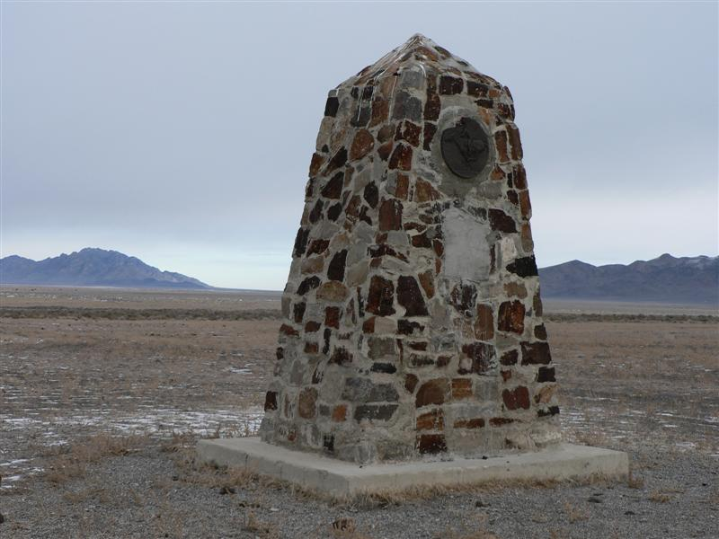

Also known as Butte, or Desert Station, it was named for the black basalt outcropping just to the north of the road and the monument. Sharp says it was also known as Rock House. Initially called Butte or Desert Station, the rock structure was constructed as part of trail improvements undertaken by the Overland Mail Company after acquiring the Express in July 1861.

Little is known about Blackrock station, or its usage possibly due to it being a non-contract station. A structure of native black stone was apparently built here in 1861, while other structures in the area are suggested. Reconnaissance and infrared photographs have also failed to produce any evidence. Only a vandalized monument marks its general location.

Informants say the station site lies west and north of the volcanic outcrop known geographically as Blackrock. The old Lincoln Highway (1913-1927) first encountered and utilized the old Overland Route about ¼ mile east of the monument. This routing was used as an alternate to the main road during wet weather.

118. **Fish/Smith/Fresh Springs Station** (N39 50 52.9 W113 24 38.9) (M)

Location: NW1/4NE1/4 Section 23, Township 11 South, Range 14 West, Salt Lake Meridian, 10 miles from Blackrock Station.

J.H. Simpson placed two mail stations in this area: the one at Fish Springs first used by Chorpenning and another about 3 ¼ miles north at Warm Springs. The station at Warm Springs was apparently abandoned because of bad water.

The original Chorpenning trail went south and west from Blackrock to where the salt-mud desert could be traversed. The trail then turned north to Fish Springs and passed Devil’s Hole, a local landmark. Later a better route was constructed across the flats on much the same route as the present road. This new route was used by the Express, stage and telegraph. From Fish Springs the Express rider would go over the pass just southwest of the station site, making the distance to Boyd’s Station about 9 miles. The stage freight, telegraph and Express (in bad weather) went around the north end of the Fish Springs Range making the trip about 14 miles. Through the years, Fish Springs, being about half-way between Rush Valley and Deep Creek, became a very prominent stop. In the latter part of the Nineteenth Century, John Thomas established a ranch near the station site and continued to serve the public. The Thomas Ranch buildings were torn down in the 1930’s and today only a foundation remains to mark the location of the ranch house. The site is located on the Fish Springs National Wildlife Refuge.

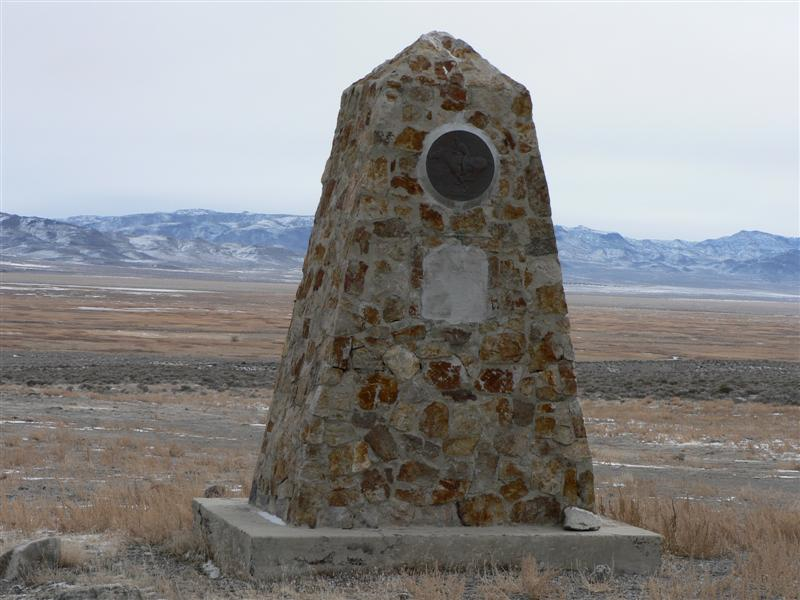

[Fish Springs](https://www.expeditionutah.com/forum/index.php?threads/pony-express-trail-9-11-09.997/) was the 21st contract station in Utah. Sharp mentions it as a home station. The area, named for the numerous small fish found in the abundant warm springs, has been an important oasis in the Great Basin desert since prehistoric times. Although the monument (N39 50 53.0 W113 24 39.0) was built adjacent to the road, the station stood a distance to the east, near the present-day camp ground. The best estimate places the old station just south and west of the big trees visible to the east, near what is called the House Spring. Simpson described a thatch-roofed shed on the site in 1859, but extensive development and activity at Fish Springs since the days of the Pony have rendered difficult any accurate interpretation of the its early appearance. Today, the station site and the surrounding area are a part of Fish Springs National Wildlife Refuge, administered by the U.S. Fish and Wildlife Service. The Refuge, established in 1959, covers almost 18,000 acres, including approximately 10,000 acres of marsh land. It serves as an important stop on the migration routes of thousands of birds from dozens of species, as well as a prime location for a variety of fields of wildlife research.

119. **Boyd’s Station** (N39 50 37.7 W113 33 11.9) (M)

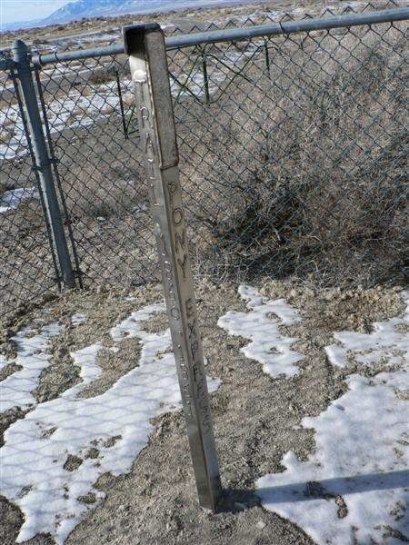

Location: SE1/4SE1/4 Section 20 Township 11 South, Range 15 West, Salt Lake Meridian, 14 miles from Fish Springs Station, via a road around the north end of the Fish Springs Range and 9 miles over the pass to the west of the station.

Although Boyd Station is not identified in the 1861 mail contract, it was named by Howard Egan as an Express Station. The structure was small, built of stone and contained gun-ports.

Boyd Station survives as one of the best preserved Express Stations in Utah. This preservation is probably due to the fact that Bid Boyd, station master, continued to occupy the site into the current century.

Limited excavations and structural stabilization were undertaken at the site in 1974 and 1975. The site is interpreted on the ground by the Bureau of Land Management.

The station may also have been known as Butte or Desert Station. It does not appear on the 1861 mail contract, but a description of a stop here exists, and Egan mentioned it as a Pony Express station. It was built by and named for station keeper George Washington Boyd in about 1855. George W. died in Salt Lake City in 1903. “Bid” Boyd, a relative of George, lived at the station until around the turn of the century. According to local resident and Pony Express historian David Bagley, he didn’t do much but hang out there and enjoy the solitude. In Saddles and Spurs, the Settles say that Boyd Station was a log structure, but the stabilized ruins are of stone, in agreement with most other accounts. James Sharp says it was a one-room stone cabin which had gun ports on all four sides. There was apparently a small spring of very brackish water near Boyd Station. A well was dug to try to improve the water supply, but all that was found was brine so strong they used it to cure meat, according to Sharp. A poison spring was found a distance to the north, marked by numerous bones of dead animals. The stabilized ruin at Boyd’s, on BLM-administered land, is one of the best preserved of the Pony Express stations in western Utah. There is no monument but has a small information kiosk.

At this juncture the Express diverted from the old Chorpenning trail and headed straight west to Callao and Willow Springs Station. Chorpenning had gone south into Pleasant Valley and then around the south end of the Deep Creek Mountains.

120. **Willow Springs Station** (N39 54 01.1 W113 42 50.9) (M#83) (P)

Location: NW1/4SW1/4 Section 6 Township 11 South, Range 16 West, Salt Lake Meridian, 8 miles from Boyd Station.

A great deal of controversy has arisen over the location of the Willow Springs Station. Descriptions given by Nick Wilson (an Express rider) and Sir Richard Burton do not describe the location of the place now claimed to be the station site. A foundation, identified tentatively as dating to the proper period and similar to the structure depicted in the sketch from an 1868 photograph, has been found at the spot where an 1882 survey plat locates the Willow Springs Stable. This structure, located on the Dorcey Sabey property, is approximately 100 feet northeast of F. J. Kearney’s boarding house . This facility is about 3/4 mile east of the structure popularly known as the station house. Further archaeological investigations are necessary to establish the true location of the station.This station is on private land in the small ranching community of Callao. There is a monument next to the road. The locals are sure that it is on the Bagley ranch and still stands. Originally an adobe structure, it was covered with wood to keep it from washing away.

121. **Willow Creek/Six-Mile Station** (N39 57 37.0 W113 45 20.0) (NM) (P)

Location: SE1/4NE1/4 Section 16, Township 10 South, Range 17 West, Salt Lake Meridian, 6 miles from Willow Springs Station.

The 1875 cadastral survey plat, locates a cabin, springs, and connecting roads at a location along Six-Mile Creek. This, coupled with historic written accounts and knowledge that Pete Joyce built and occupied a log cabin at this location, suggests its use as a station house. It is on private land next to the road but nothing remains and no monument as well.

122. **Canyon/Burnt Station** (N40 04 36.6 W113 50 44.4) (M)

Location: SW1/4NW1/4 Section 18, Township 9 South, Range 17 West, Salt Lake Meridian, 6 miles from Willow Creek and 12 miles from Willow Springs Station.

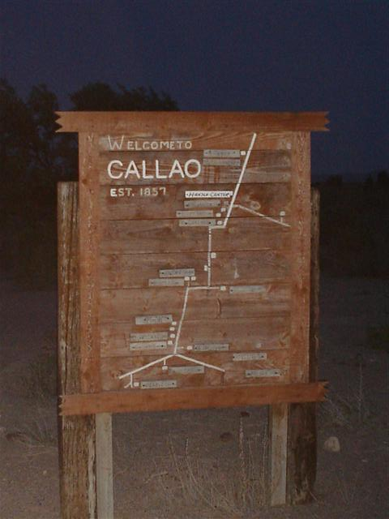
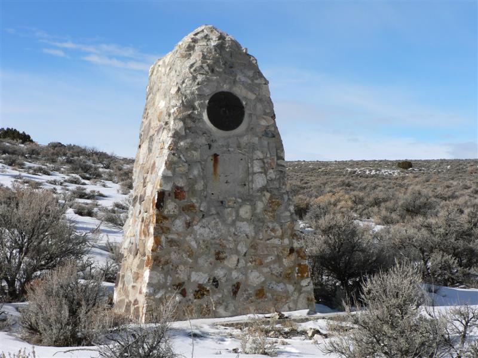

This station has had two names as there was two apparent attempts at a Pony Express station in Overland Canyon were destroyed by fire. The first was built in the mouth of Blood Canyon near available water, and seems to have been rather short-lived . The second Canyon Station was located just west of the monument (N40 04 37.0 W113 50 44.0) which is visible across a deep wash west of the road. The station is said to have consisted of a log house with adjoining stable, and a dugout where meals were cooked and served. 5 express employees and 2 soldiers were killed when Canyon Station was burnt in July of 1863. Looking to the west across Clifton Flat, you will see a 2-track which is probably the remnant of the old stagecoach and pony express road. Both are on BLM land and nothing remains.

Canyon Station was strategically built in 1863 high above the mouth of Overland Canyon to replace an earlier, indefensible station located up Overland Canyon about 2-3 miles. Indians had beseiged and burned the original Canyon Station earlier the same year.

The original Canyon Station, also known as Burn’t Station, had been built by Howard Egan as an Express Station and was first described in August of 1861. A marker built and placed by the Civilian Conservation Corp (C.C.C.) is apparently located improperly in Township 9 South, Range 18 West, Section 2 (SE1/4NW1/4). The station is believed to have been in the form of a dugout located at the mouth of Blood Canyon, so named because of the Indian attack in 1863.  Other evidence indicates the site may be to the west on Clifton Flat. Descriptions vary on structural features. Apparently a dugout with stable or barn was built and possibly a log house.

Locally called Round Station (N40 02 40.5 W113 48 15.0), this recent connotation originates because prior to archaeological investigations in 1974, the only discernible feature was a round, relatively complete, fortified rock structure, which included gunports. This had been interpreted as the station house. Excavations revealed the actual station house foundation (as well as the corral area) to be east of the round fortification. The Gale Parker’s recall their grandfather having spoke of a roof being on the fortification.

Artifacts collected indicate no extensive use after 1870. The Bureau of Land Management has stabilized the fortification and the station foundation, and has provided an interpretive ramada and parking facilities (See Photos 36 & 37).

This stabilized fortification, was built in 1863 to serve the Overland Stage. It was probably the third incarnation of Canyon Station, the first 2 having been burned by Indians. The ruin is that of a structure probably used for defense, and the foundation of the station is visible to the south and east across the parking lot. The interpretation is the product of a cooperative agreement among the BLM, National Park Service, and the Utah Division of the National Pony Express Association.

123. **Deep Creek/Eagan’s Station** (N40 01 47.2 W113 59 12.5) (M#47)

Location: Lot 4, Section 9, Township 9 South, Range 19 West, Salt Lake Meridian, 14 miles from Round Station via the original trail.

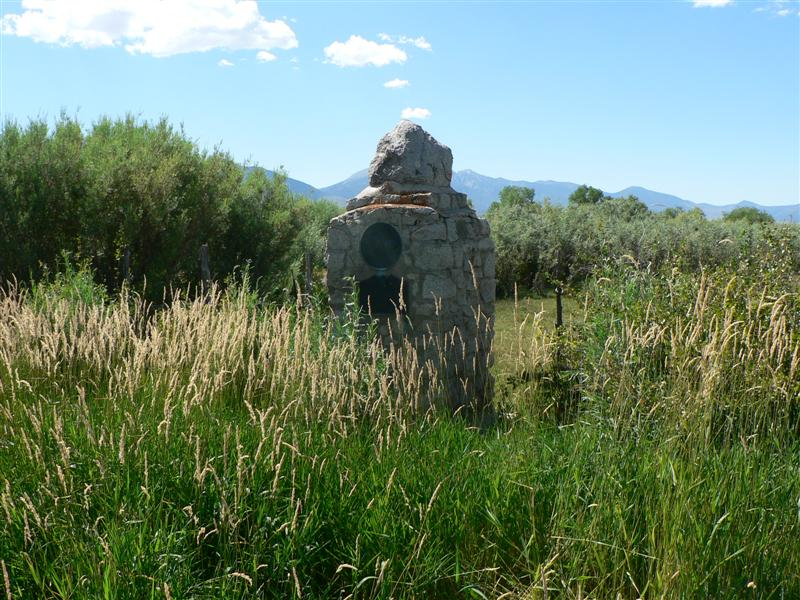
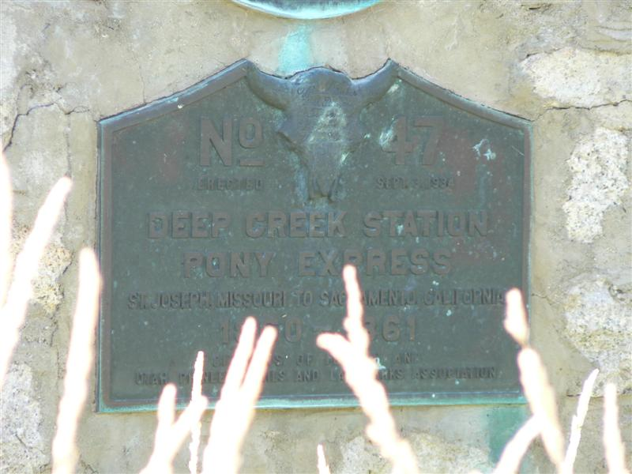

Deep Creek was the home of Howard Egan, the division superintendent for service between Salt Lake City, Utah, and Roberts Creek (near Eureka, Nevada). This well-equipped and service functioning facility was the most westerly station located within the present boundaries of Utah. The western boundary of the Utah Territory at this time was the California state line and Genoa the most westerly Utah Territory station.

Harrison Sevier was the station master. Buildings included an adobe station, house, and barn. The telegraph established a repeater station at this location in 1861 with George Ferguson being the telegrapher. The station site is presently on the ranch of Sidney (DeVerl) Nichols, Jr. Incidentally, Joan and Hilda Erikson paid for the last telegraph message to be sent from this station in 1869.

Located at the Ibapah Trading Post (which, at times, has fuel).  Eagan laid out the road for that stretch and supervised its construction. Nothing remains. A monument (N40 01 47.0 W113 59 12.0) is a couple of miles south on the trail. This was the last station in the state.

### NOTES: (P) – Private Land; / – alternative name (alternative location); (M#) – direction to monument or comment; (NM?) No Monument?; ($) – Fee;

More information is available on [this NPS website.](http://www.nps.gov/history/history/online_books/blm/ut/2/index.htm)

## Trip Reports
*May need to register [free] to view.*

* [5 Mile To Nevada Via The Pony Express Trail & More](https://www.expeditionutah.com/forum/index.php?threads/5-mile-to-nevada-via-the-pony-express-trail-more.6327/)
* [Pony Express to the Entire Great Salt Lake](https://www.expeditionutah.com/forum/index.php?threads/pony-express-to-the-entire-great-salt-lake.6669/)
* [Pony Express Trail 9/11/09](https://www.expeditionutah.com/forum/index.php?threads/pony-express-trail-9-11-09.997/)
* [Pony Express Trail: UT/NV/CA - October 2010](https://www.expeditionutah.com/forum/index.php?threads/pony-express-trail-ut-nv-ca-october-2010.5926/)
* [KSL: Exploring the historic Pony Express Trail in Utah's West Desert](https://www.expeditionutah.com/forum/index.php?threads/ksl-exploring-the-historic-pony-express-trail-in-utahs-west-desert.5230/)