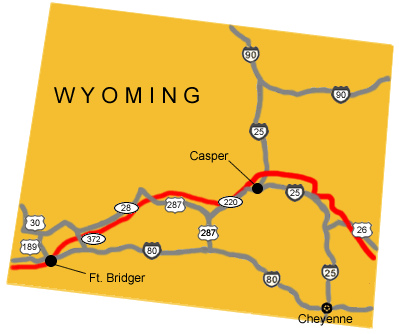

# Wyoming Pony Express Stations

## DIVISION 2

54. **Cold Springs/Spring Ranch/Torrington Station** (N42 01 55.0 W104 09 03.0)

Near this spot up until about a half a century ago, there was a cluster of famous cold springs. No one knows how long they flowed but in semi-arid wilderness such as this country then was, they must have been known far and wide, for nature has no finer, more refreshing gift or both man or beast than a drink of cold pure water after long hours or days on a hot dusty trail.It is therefore not surprising that when the Pony Express was launched, these cold springs became the site of one of its stations. A Frenchman by the name of Regnal was Station Tender. It was located 12 miles from Horse Creek Station in Nebraska and 13 miles from Verdling’s Ranch Station.

55. **Verdling’s/Bordeaux/Bedeau’s Ranch/Beauvias/Fort Benard Station**

Roughly 23 miles inside Wyoming’s eastern border, is Verdling’s Ranch, the 48th westbound Pony Express Relay Point. The site had formerly been the trading post of  French-Canadian George P. Beauvias and his Indian wife and children who witnessed the Grattan Massacre on August 19, 1854. Beauvias subsequently sold the property to James (or “Mato” [Bear] as the Sioux called him) Bordeaux, who served at the Pony Express Station there in 1860 as its Station Tender. Located 13 miles from Cold Springs Station and 9 miles from Fort Laramie. It was later owned by M. Bordeaux, who was Station Tender in 1860. G.P. Beauvais … name was variously spelled “Bovery,” Bouvery,” “Boverie” and Bovey.

56. **Fort Laramie Station/Fort William/Fort Platte/Fort John** (N42 12 38.0 W104 31 26.0)

In 1834, Robert Campbell and William Sublette founded a trading post on the Laramie River about 1½ above its junction with the North Platte River.  They named it Fort William. In 1835 they sold out to a syndicate of trappers, who shortly afterward sold it to the American Fur Company. A post called Fort Platte is believed to have been built by rival trappers in 1841, about 1½ miles from Fort William and nearer the confluence of the Laramie and Platte Rivers. The owners of Fort William then enlarged the original fort and furnished it with bastions, blockhouses and loopholes. The rebuilt structure was named Fort John for John B. Sarpy, an officer of the company.

For a time, the names Fort William and Fort John were used interchangeably for the post; then, it is said, a shipping clerk by mistake marked a box ‘Fort Laramie’ instead of ‘Fort John on the Laramie.’ Robert Campbell thought the new name a good one and adopted it immediately. Fort Laramie Post Office was established on March 14, 1850 in Nebraska Territory. It was Wyoming’s first post office.

When the Government, on Fremont’s recommendation, bought and garrisoned Fort Laramie in 1849, it was already known as a major stopping place on the great Western trails and as the center of a mountain and plains region, hundreds of miles in extent. It was abandoned in 1890 as a military post. Fort Laramie is listed as a Pony Express Station but officially it was not operated as a station but as offices for both Stage and Pony Express Stations.

57. **Nine Mile/Sand Point/Ward’s/Central Star/9-Mile Station/Star Ranch** (N42 14 51.0 W104 42 20.0)

Sand Point, as the meadow at the foot of the Cliff [Register Cliff] was called, was the first stopping place of the emigrants west of Fort Laramie. Here William Guerrier and his partner, Seth Ward, kept a trading post (Ward and Guerrier Trading Post) and after 1861 was called Sand Point.> Located 9 miles from Fort Laramie and 12 miles from Cottonwood Station on south bank of the North Platte River. It was a Relay Station for Pony Express Riders and Stage Drivers.

58. **Cottonwood Station** (N42 18.834 W 104 53.328)

Pony Express Station 12 miles from Nine Mile House Station and 15 miles from Horseshoe Station near Cottonwood Creek. Station Tender Hod Russell was killed here by rider Jennings, who was hung at Fort Laramie for the crime.

59. **Horseshoe Creek/Horseshoe/Horseshoe Stage Station** (N42 28 17.0 W105 01 38.0)

It is located 15 miles from Cottonwood Station and 10 miles from Elk Horn Station and existed from 1861-1868 as a Frontier Overland Stage, Pony Express and Overland Telegraph Station. The site is marked by a white post. On route of the old Oregon, Mormon and California Trails. It was a home and headquarter station for Superintendent Joseph A. Slade. He was Superintendent for the Bromley’s Division that covered all stations from Horseshoe west to Salt Lake City. A notorious character, Joe Slade, ruled this vicinity with an iron hand. Allegedly, he cut off the ears of an associate to force obedience to his will, carried the pieces in his pocket, and on occasions when fellow employees were to doubt his authority, Slade would bring forth the several aural appendages and finger them nervously. It is said the scheme worked. Slade was later hung by vigilantes in Montana. The station was later destroyed by a 3 day siege by Indians, which began March 19, 1868.

## DIVISION 3

60. **Elk Horn Station**

Located 10 miles from Horseshoe Pony Express Station and 15 miles from LaBonta Station; the old Emigrant Road crosses Elkhorn Creek just north of the station site.

61. **La Bonte/La Bonte Stage Station** (N42 36 19.0 W105 22 47.0)

It is located 15 miles from Elk Horn Station and 10 miles from  Bed Tick Station. Also, a creek and town in Converse County, Wyoming, named for La Bonte (Labonte, LaBonte), an early French trapper. He was a trapper with “Uncle Dick” Woolston’s party in 1838 was killed in Utah. The Indians after killing this noted character, cut flesh from the bones and ate it. La Bonte belonged in Wyoming and had lived for a number of years on the North Platte in what is now Converse County. La Bonte Creek, which flows into the North Platte and La Bonte Station on the old Overland Trail were named after this old trapper.

62. **Bed Tick Station**

Located 10 miles from LaBonta Station and 8 miles from Lapierelle Station on the south side of Bedtick Creek.

63. **Lapierelle/La Prele Station**

Located 8 miles from Bed Tick Station and 10 miles from Box Elder Station on the south side of La Prele Creek and just north of the old Emigrant Road.

64. **Box Elder (Creek) Station**

Located 10 miles from Lapierelle Station and 10 miles from Deer Creek Station south of Box Elder Creek.

65. **Deer Creek Station** (N42 51 41.0 W105 52 20.0)

Located just east of present Glenrock, Wyoming, Deer Creek Station, on the route of the Oregon Trail, served as a Pony Express Station prior to its designation as a telegraph station in 1861. According to one early telegraph operator, “Deer Creek was 100 miles west of Fort Laramie, and 28 miles east of where Casper was later situated. It is located 10 miles from Box Elder Station and 10 miles from Bridger Station on the west bank of Deer Creek. The station was owned and operated by an Indian Trader by the name of Bisonette, who was Station Keeper for a while. Deer Creek Station was the name applied in the 60’s, but as that outpost fell into disuse, a settlement grew up at the mouth of Deer Creek, which was called Mercedes. After the discovery of coal, the place was named Nuttall, from Wm. Nuttall, who found and developed the coal property. In 1887 it took the name of Glenrock (when the buildings were moved to the present location), from the sandstone eminence near the refinery.” The name Glenrock means “Rock in the Valley”.

66. **Little Muddy Station**

Located near Little Muddy Creek.

67. **Bridger Station**

Named after Jim Bridger, as was Fort Bridger and Bridger. Located 10 miles from Deer Creek Station and 15 miles from North Platte Station west of Muddy Creek and north of the Old Emigrant Trail. Bridger Station Post Office was established on July 15, 1869 in Carter County. Edward D. Titus was the postmaster. It was discontinued on October 10, 1871.

68. **Platte Bridge/Fort Caspar/North Platte Station**

Located 15 miles from Bridger Station and 10 miles from Red Butte Station in the present Fort Caspar area just west of the south end of the marker for Old Platte Bridge. The Station Tender was Louis Guenot.

Casper – From Independence Rock the Pony Express Trail parts proximity with paved highway and heads across country to Casper which began as a ferry site on the Oregon Trail in 1847, when a group of Mormon emigrants, who were camping here, realized that there was money to be made by boating travellers across the North Platte River.

The center piece of the Platte Bridge Station and Fort Caspar was the bridge built here by Louis Guinard in 1859-1860. The bridge superstructure stood on 28 wooded cribbens filled with rock and gravel. Not counting the approaches, the bridge was 810′ long and 17′ wide. The total cost of construction was estimated at $40,000. The toll for wagons to cross was $1 – $6 determined by the height of the river. An additional toll was charged for animals and people. A military post (later named Fort Caspar) was established to protect the span and its traffic. The bridge was used until Fort Caspar was abandoned in 1867.

Fort Caspar Museum located ½ mile north of SR20 off Wyoming Blvd, at 4001 Fort Caspar Road, is a reconstruction of Fort Caspar, named in honour of Caspar Collins, a lieutenant killed while trying to rescue a wagon train from the Indians in 1865.

69. **Red Butte (s) Station**

Located 10 miles from North Platte Station and 12 miles from Willow Springs Station about 200 feet southwest of the Red Buttes Oregon Trail Marker and south of the old Goose Egg Ranch house. Red Buttes Pony Express Station was located on a ridge overlooking the North Platte River at Bessemer Bend. Explorers, fur traders, mountain men and emigrants camped at this site. Although the main route of the Oregon Trail was located a few miles north of this site, many emigrant travelers crossed the North Platte River here for the last time on their trek to the west. They preferred using this favorable ford rather than waiting in line and paying the tolls and ferry fees required at lower crossings. Ample grass, good water and pleasant surroundings made this a favorite campsite for some travelers, since the route to and from the Sweetwater River was three days of rough, dry country and poisonous alkali water.

Pony Express lore recalls than William “Buffalo Bill” Cody, one of the youngest Pony Express riders at the age of 14, made the longest non-stop ride from this station. Completing his own run of 116 miles between Red Buttes and Three Crossings, he found his relief rider had met any untimely death, causing Cody to ride an extra 76 miles to Rocky Ridge Station. He immediately returned from Rocky Ridge to Red Buttes, completing the route in record time.

70. **Willow Springs Station**

Located  near Willow Creek and Spring. Located 12 miles from Red Butte Station and 14 miles from Horse Creek Station.

71. **Horse/Greesewood Creek Station**

Located 14 miles from Willow Springs Station and 12 miles from Sweetwater Pony Express Station on east bank of Horse Creek and just north of the old Emigrant Road.

72. **Sweetwater Station** (N42 29 53.0 W107 06 49.0)

Located 12 miles from Horse Creek Station, 6 miles from Devil’s Gate Station and 12 miles from Plant’s Station on north bank of the Sweetwater River and just south of the old Emigrant Road. Independence Rock is about one mile west.

73. **Devil’s (Devils) Gate Station** (N42 26 26.0 W107 12 48.0)

This station was not mentioned in the 1861 Overland Mail Contract. Located 6 miles from Sweetwater Pony Express Station and 6 miles from Plant’s Station.

The Pony Express Route and the Oregon Trail are the same through this part of Wyoming. Split Rock Station and Devil’s Gate Station are located one “Oregon Trail Day” apart.

Devil’s Gate, a 370′ high, 1500′ long cleft, carved over the centuries by the Sweetwater River, was a major landmark on the Oregon Trail. It provided a pleasant change for weary travelers coming across the rough, dry country from the North Platte River, a four day trek from the east.

According to Shoshone and Arapahoe legend a powerful evil spirit in the form of a tremendous beast with enormous tusks ravaged the Sweetwater Valley, preventing the Indians from hunting and camping. A prophet informed the tribes that the Great Spirit required them to destroy the beast. They launched an attack from the mountain passes and ravines, shooting countless arrows into the evil mass. The enraged beast, with a mighty upward thrust of its tusks, ripped a gap in the mountain and disappeared through Devil’s Gate, never to be seen again.

74. **Plant’s/Plante Station**

Located 12 miles from Sweetwater Pony Express Station, 6 miles from Devil’s Gate Station and 12 miles from Split Rock Station about 400 feet south of the Sweetwater River. The Station Tender was Plant and was probably the same Plant who was Tender at Split Rock. Believed that Sweetwater and Plant’s Stations were abandoned and that two Station Tenders with the same name was further evidence of the abandonment of Plant’s Station.

75. **Split Rock Station**

From South Pass, the Pony Express Trail followed the Sweetwater River northeastward to Split Rock Station which was located 65 miles north of Rawlins on US287 heading for Lander. Located 12 miles from Plant’s Station and 14 miles from Three Crossings Station. The Station Tender was Plant or Plante. Split Rock Relay Station was a crude log structure with a pole corral and was located on the south side of the Sweetwater River.

Split Rock is a massive, cleft up-thrust of igneous material. In this vicinity, Russell, Majors & Waddell erected a stage station in 1859. It can be seen as a cleft in the top of the Rattlesnake Range. This was an important landmark to early travelers, since it can be seen for a full day’s journey from the east, and for 2 days behind as they continued westward. There are 35 highway miles between Split Rock and Devil’s Gate.

Pony Express lore tells that William “Buffalo Bill’ Cody exchanged horses at Split Rock Station on a record ride from Red Buttes Station to Rocky Ridge Station and back. Due to another rider’s untimely death, Cody was forced to do an extra leg to his normal relay and eventually covered a total distance of 322 miles in 21 hours and 40 minutes, using 21 horses in the process.

76. **Three Crossings Station**

Three Crossings on the Sweetwater River, so called because the trail crossed the stream three times within ¼ mile. Located 14 miles from Split Rock Station and 12 miles from Ice Springs Station south of the Sweetwater River. A telegraph and stage station of the 1860’s, it was to this station in 1860 that Bill Cody, 15 year-old Pony Express carrier, rode from Red Buttes on the Platte, 76 miles away. There he found that the rider of the 85-miles stretch to Rocky Ridge had been killed. Cody thereupon, without resting, rode to Rocky Ridge and returned to Red Buttes, with eastbound mail, on time. This 322-mile ride is the longest on the records of the Pony Express.

77. **Ice Slough/Ice Springs Station**

Located 12 miles from Three Crossings Station and 12 miles from Warm Springs Station just north of the Old Emigrant Road and South of Ice Springs Creek.

78. **Warm Springs Station**

Located 12 miles from Ice Springs Station and 12 miles from Rocky Ridge Station (St. Mary’s Station) above the warm sulphur springs.

79. **Rocky Ridge/St. Mary’s Stage Station** (N42 28 41.0 W108 21 41.0)

Located 12 miles from Warm Springs Station and 12 miles from Rock Creek Station on east side of Silver Creek. Known by many as St. Mary’s Station. This was a Home Station and William Reid was Station Tender. The site of St. Mary’s Stage Station, also called Rocky Ridge Station because of a cliff near by, is marked with a stone tablet. The station was built in 1859 by Russell, Majors and Waddell, and when the transcontinental telegraph line was established in 1861, St. Mary’s was made a depot. In May, 1865, while the 5-man garrison hid in an abandoned well, 150 Cheyenne and Arapaho burned the station and cut 400 yards of telegraph wire. When the ammunition in the buildings exploded, they fled. The station was rebuilt, but nothing remains except old square-cut nails, melted glass, broken pottery, and pieces of telegraph insulators.

80. **Rock Creek Station**

Located 12 miles from Rocky Ridge Station (St. Marys Station) and 12 miles from Upper Sweetwater Station near old Lewiston town site. It was thought that because of station’s proximity to Strawberry Creek, it should have Strawberry for a station name. The Station Tender was McAchran.

81. **Upper Sweetwater/Burnt Ranch, Gilbert’s Trading Post/The Ninth Crossing of the Sweetwater/Ford Number 9/South Pass Station** (N42 20 35.1 W108 53 12.2)

Located 12 miles from Rock Creek Station and 12 miles from Pacific Springs Station.  This location has been known as the “South Pass Station” while it was being used as a military post, as the “Burnt Fork” following the time that it was burned, “Burnt Ranch” and “The Ninth Crossing of the Sweetwater” and Gilbert’s Trading Post. Station Tender was Gilbert. It was used as a Pony Express station, a telegraph station and as a stage station during the period these different enterprises functioned through this area.’

South Pass was perhaps the most significant transportation gateway through the Rocky Mountains. Indians, mountain men, Oregon Trail emigrants, Pony Express riders, and miners all recognized the value of this pass straddling the Continental Divide.

Bounded by the Wind River Range on the north and the Antelope Hills on the south, the pass offered overland travelers a broad, relatively level corridor between the Atlantic and Pacific watersheds. For early travellers passing through South Pass, the gradual incline left them unaware that they were crossing the Continental Divide. Between 1840 – 1860 an estimated 300,000 settlers traveled through the gap, their wagon wheels leaving deep ruts in the earth.

On the South Pass is the Whitman Monument and a roadside pull-out pointing out and describing historical and geographical features of the South Pass Area. To the east of the highway and with the aid of binoculars the Pacific Springs area can be seen marked by a few ancient buildings on the Hay Ranch.

82. **Pacific Springs Station** (N42 20 13.0 W108 56 18.0)

Located 12 miles from the Upper Sweetwater Station and 12 miles from Dry Sandy Station. Station Tender was Botswain. A favorite camp site for emigrants ‘just over the hump.’ The water of the spring originates less than 4 miles from the Continental Divide and eventually reaches the Pacific Ocean. Here is the site of a stage and pony express station of the early 1860’s.

83. **Dry Sandy Station**

Located 12 miles from Pacific Springs Station and 15 miles from Little Sandy Station on the west bank of Dry Sandy Creek and just south of the old Emigrant Road.

84. **Little Sandy Creek Station**

Located 15 miles from Dry Sandy Station and 13 miles from Big Sandy Station on an elevation west of Little Sandy Creek.

85. **Big Sandy Station (N42 06 34.4 W109 27 00.7)

Located 13 miles from Little Sandy Station and 15 miles from Big Timber Station at west edge of the town of Farson and east of Big Sandy Creek. It was burned by Indians in 1862. The Sandy and Little Sandy flow past on the west and south.

86. **Big Timber Station**

Located 15 miles from Big Sandy Station and 15 miles from Green River Station probably on north bank of Big Sandy Creek.

87. **Green River (Crossing) Station**

Located 15 miles from Big Timber Station and 20 miles from Ham’s Fork Station on the west bank of Green River above the mouth of Big Sandy Creek. McCarthy was Station Tender.

88. **Michael Martin’s Station**

89. **Ham’s Fork Station** (N41 35 24.8 W109 58 09.9)

Located 20 miles from Green River Station and 20 miles from Millersville Station at the west boundary of the present day town of Granger (where Ham’s Fork flows into the Green River). David Louis was Station Tender. Michael Martin’s Station was between Green River Station and Ham’s Fork Station and Church Buttes Station was between Ham’s Fork Station and Millersville Station. The Granger Pony Express Station was located off US30 just west of Little America on I80. Ruins and a monument now mark the location.

90. **Church Butte(s) Station**

Appears to have been a relay station between Millersville Station and Ham’s Fork Station. It was probably near Church Buttes.

91. **Millersville Station/Jack Robinson’s Trading Post** (N41 23 24.0 W110 12 31.0)

The station received its name from A. B. Miller, a partner of William Russell and William Waddell. Located 20 miles from Ham’s Fork Station and 12 miles from Fort Bridger. Reported to have been at or near where the old Emigrant Road crossed Smith’s Fork. This was formerly Jack Robinson’s Trading Post and the Station Tender was Holmes. An early stage station named for a well known stage driver.

92. **Fort Bridger** (N41 24 08.2 W110 14 19.0)

Named after Jim Bridger. The first owner of the fort was perhaps the most picturesque figure in early Wyoming. He was often called the ‘Daniel’ Boone of the Rockies. Fort Bridger, which he built and Bridger’s Pass, which he discovered were named for him. This historical fort has several interesting old buildings still standing; the old pony express barn and the Mormon protective wall are still in existence there, and fitting ceremonies will make this site one of the landmarks for history.

It was located 12 miles from Millersville Station and 12 miles from Muddy Station. Thomas O. King was a rider here. According to “Saddles and Spurs by Settle and Settle” he is credited with making the longest ride, which was from Salt Lake to Hams Fork, a distance of 149 miles.

Fort Bridger was established in 1843 (1842?) by Jim Bridger and Louis (Benito) Vasquez. Strategically located on the Black’s Fork River, the fort was second only to Fort Laramie as the most important outfitting point for the emigrants and Mormons travelling the Oregon Trail on the Overland Route between the Missouri River and the Pacific Coast.

Some of the buildings constructed during the Army occupation from 1858 – 1890 are in ruins, but many still stand, preserved and maintained as a reminder of Wyoming’s past. A museum houses artifacts of Indian cultures and the periods of military occupancy. Living-history interpretive demonstrations on military and pioneer life are presented throughout the summer.

Fort Bridger, Wyoming is situated near Carter’s Station, Union Pacific Railroad, Uinta County; now a town of that name.

93. **Muddy (Creek) Station** (N41 18 12.0 W110 32 23.0)

Located 12 miles from Fort Bridger and 11 miles from Quaking Aspen Station on north side of Muddy Creek. It was a Home Station.

94. **Quaking Asp/Aspen/Springs Station**

Located 11 miles from Muddy Station and 12 miles from Bear River Station. A Quaking Aspen grove and spring are south of the station site.

95. **Bear River Station**

Located 12 miles from Quaking Aspen Station on the Bear River. Bear River Station was the last station in Wyoming with the next station to the west, Needle Rock Station, Utah.