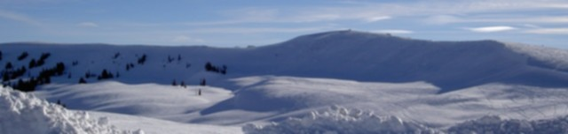
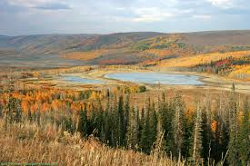

# Skyline Drive - Central Eastern Utah

Many states have something called “Skyline Drive” but this one is in the Manti-LaSal National Forest and runs along the plateau atop of the Wasatch Mountains front range in Central Utah for approximately 100 miles or 175  kilometres providing access to forested mountains, alpine meadows and numerous lakes, streams and camping areas. At elevations ranging from about 9,000 to 11,000 feet above sea level, it is one of the highest roads in America with the highest point at an elevation of 10, 897 feet. Due to the elevation, it is impassable even by four wheel drive due to snow during all but a few summer and fall months of the year.  It is open to snowmobiles during the Winter.

Views of Sanpete Valley, mile-deep canyons, lakes, alpine meadows and forests and surrounding valleys are spectacular. Wild flowers are plentiful in late spring, summer and early fall.  Deer, elk and other wildlife live in the glades and meadows. The drive is especially beautiful in the fall when leaves begin to change.

There are various ways to get to Skyline Drive. Many of these are other trails that come up from the valleys in the west. From the north, the road begins at Tucker, on U.S. 6, and extends south to I-70 (exit 73). The first 27 miles (Tucker to the junction of Hwy 31) are graded and suitable for travel in any kind of vehicle. There are access roads from Indianola, Tucker, Fairview, Huntington, Scofield, Mt. Pleasant, Spring City, Ephraim, Orangeville, Manti, Sterling, Ferron and Mayfield, allowing riders to tour all or part of the road. Several roads ascend canyons and provide access to the Skyline Drive. Hwy 31 through Fairview and Huntington Canyons is paved and provides year-round access to the central portion of the Skyline. Hwy 96 is also paved and connects to Hwy 31 on the Skyline after passing Scofield Reservoir and Electric Lake.

Various side trails to many other trails as well as ponds, lakes and streams along the way that are excellent fishing (Rainbow, Cutthroat, Brown Trout ) holes but don’t forget to get a license first.

While some sedans and mini-vans are seen on the trail, the southern portion is rough and suitable for high clearance four-wheel drive vehicles.  Drivers need to be on the lookout for ATV and dirt bike riders who commonly use the high mountain track. The road is impassable except by snowmobile during winter, and can become impassable during summer rain storms. Certain sections of the road are not open until late July or early August.

Manti-La Sal National Forest historian Carl Anderson knows well the story of this road, who spent a weekend near the top of Skyline Drive looking for illegal wild seed collectors in the forest. Sections of the road have been in place since the 1880s, when Sanpete County settlers began cutting timber in nearby mountains to build homes and churches. In fact, some of the tallest Engleman spruce trees were used as scaffolding during construction of Church of Jesus Christ of Latter Day Saints’ temple in Manti.

In 1879, as railroads in the area were being built, the wood used to make railroad ties became a cash crop. Loggers could get 40 cents for a single tie, often more than a day’s wages. Sawmills sprung up in nearly every canyon.

But all the timber harvesting would soon have consequences. Sanpete County towns began to experience heavy flooding as water poured down mountains now denuded of trees. There were major floods in Manti in 1899 and again in 1902. Concerned officials from such towns as Manti went to Washington, D.C., and asked the government to take over management of lands on the Wasatch Plateau.

> “Teddy Roosevelt created the Manti Forest Reserve under the Department of Interior in 1903,” said Anderson. “In 1905, the U.S. Forest service was created under the Department of Agriculture and the Manti National Forest was created in the last minutes of the Roosevelt administration. In 1949, it was consolidated with the La Sal National Forest.”

Even as late as the 1950s, terracing work still visible from the Skyline Drive was done on west-facing Sanpete County mountains to prevent erosion.

But it took the Civilian Conservation Corps to connect parts of the dirt trail into what is now Skyline Drive in the 1930s.

> “It was mostly developed as a recreation trail,” said Anderson. “Seely Creek was the site of the highest CCC camp in the nation. There is still evidence of old recreation camps and fire pits, but you need to know where to look.”

## Trip Reports & Planning Resources

* [Cruiser Outfitters - Strawberry Ridge & Skyline Drive - July 13th-15th, 2007](http://cruiseroutfitters.com/PG_skyline_july_07.html)
* [Cruiser Outfitters Skyline Drive & San Rafael Swell - September 2-4, 2006](http://cruiseroutfitters.com/PG_Skyline_Swell_06.html)
* [Skyline Drive - Sept 2006](https://www.expeditionutah.com/forum/index.php?threads/skyline-drive-sept-2006.21/)
* [Skyline Drive - Tucker to Salina Utah](https://www.expeditionutah.com/forum/index.php?threads/skyline-drive-tucker-to-salina-utah.942/)
* [Skyline Drive Trail / San Rafael Swell 9/2-4/06](https://www.expeditionutah.com/forum/index.php?threads/skyline-drive-trail-san-rafael-swell-9-2-4-06.125/)
* [Just a Sunday Drive](https://www.expeditionutah.com/forum/index.php?threads/just-a-sunday-drive.343)
* [Skyline Drive Update 2019](https://www.expeditionutah.com/forum/index.php?threads/skyline-drive-update-2019.6597/)
* [48 Hours Along The Spine Of Utah](https://expeditionportal.com/forum/threads/48-hours-along-the-spine-of-utah.196198/)
* [Skyline Drive](https://www.expeditionutah.com/forum/index.php?threads/skyline-drive.6250/)
* [Sanpete County Recreation & Points of Interest Map](http://www.utah.com/art/maps/offroad/skylinemap.pdf)

## Check Current Conditions

* Ferron Ranger District: 435-384-2372
* Sanpete Ranger District: 435-283-4151
* Price Ranger District:  435-637-2817.

## GPX Files

[SkylineDrive_UT.gpx](SkylineDrive_UT.gpx)