# San Rafael Swell Northern Loop

The San Rafael Swell Northern Loop covers some of the most scenic views Central Utah has to offer. This route covers an amazing amount of areas in the San Rafael Swell, north of Interstate 70.  From the amazing rock art and western outlaw lore in Buckhorn Wash to Utah’s famous ‘Little Grand Canyon’ at the Wedge Overlook.

## Route Sketch

This route is laid out assuming you would start from the north however one could complete the loop in either direction and starting at any point.

Buckhorn Wash, MK Tunnels (Government Caves), Dinosaur Footprint,  Buckhorn Pictograph Panel, Swinging Bridge, Fix-It Pass, Devil’s Racetrack, Eva Conover Road, Fuller Bottom, Wedge Overlook.
(see notes for details on each location)

## Notes

Old Spanish Trail: [See the Feature Trail report on ExpeditionUtah](../oldSpanish/_index.md)

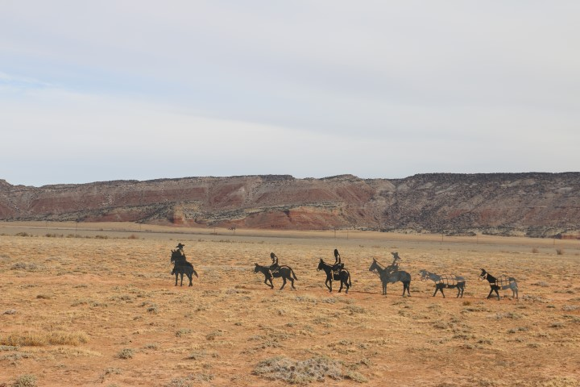

### Wedge Overlook

Nicknamed the “Little Grand Canyon,” it is the deepest part of the San Rafael River canyon located directly beneath the Wedge Overlook (Overlook) in the San Rafael Swell (Swell). Looking down river from the Overlook, you can see where Buckhorn Draw—a narrow, winding canyon walled in by scenic sandstone cliffs—meets the San Rafael River canyon. 

Source: [http://geology.utah.gov/surveynotes/geosights/wedge_overlook.htm](http://geology.utah.gov/surveynotes/geosights/wedge_overlook.htm)

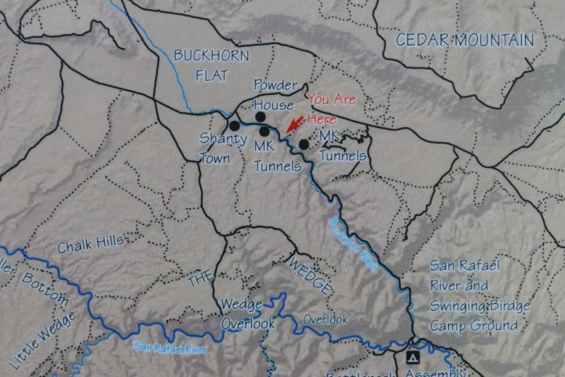

### Buckhorn Wash

Buckhorn Wash Road contains some of the San Rafael Swell treasures.  Along with Indian rock art, hiking trails, dinosaur foot prints, primitive camping, canyoneering, geocaching, and rock climbing you will never run out of things to do along the Buckhorn Wash Road.  You can spend a day or two of hiking and camping in one of the many steep sandstone canyons, and explore beautiful country that has been relatively untouched for hundreds of years. You can also find where past outlaws left their mark while traveling through the San Rafael Swell.  There are several panels of pictographs and petroglyphs along the road, making the road a delight for sight seers, geologists and anthropologists.  The Barrier Canyon people lived in this area 2,000-10,000 years ago. As they passed through Buckhorn Wash, they painted colorful images on a large cliff face. Other native groups added other images.  Painted over a 160-foot-wide rock canvas is the Buckhorn Wash Pictograph Panel. This is a large public Barrier Canyon style panel within the walls of a huge alcove along the Buckhorn Wash Road. The panel is thought to be about 2,000-6,000 years old and created by the Western Archaic Culture.  For a list of things to along the Buckhorn Wash road please refer to Emery County’s fantastic [brochure](http://www.emerycounty.com/travel/brochures/roadslesstraveled.pdf) and [map](http://www.emerycounty.com/travel/maps/MapRevised2009.pdf).

Source: [http://www.sanrafaelcountry.com/buckhornwash.html](http://www.sanrafaelcountry.com/buckhornwash.html)

### Shanty Town

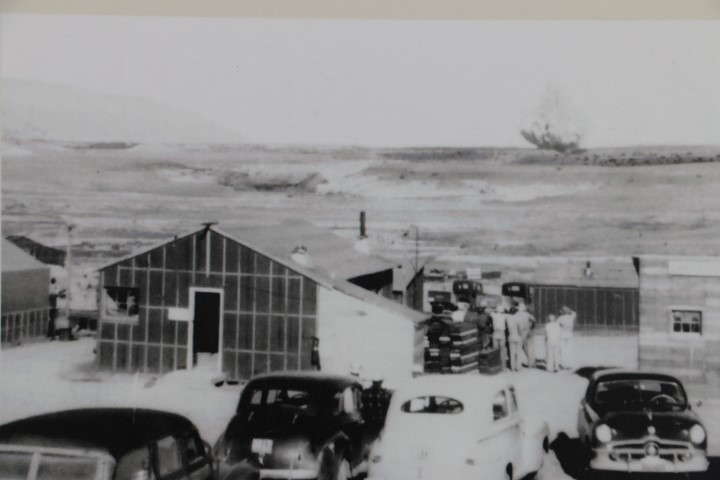

[See the ghost town report with Shanty Town site information, location and pictures here.](https://www.expeditionutah.com/forum/index.php?threads/ghost-town-shanty-town-emery-county.4458/)

IMG_2243 (Small)

### MK Tunnels

These Potential underground military defense positions, similar to the Cheyenne Mountain NORAD facility in Colorado are also known as the ‘Government Caves’. Had the desert sandstone withstood surface “attacks” better then they apparently did, the San Rafael Swell might be a military base today. Several horizontal tunnels were blasted into the hillsides, surface explosions were set to test as if they were missile attacks. The results are best seen in person! [Read more on the Expedition Utah forum](https://www.expeditionutah.com/forum/index.php?threads/mk-tunnels-aka-government-caves.71/). Also, see the [Map to MK Tunnels](http://www.emerycounty.com/travel/Maps/mktunnels.pdf). (Source: expeditionutah.com)

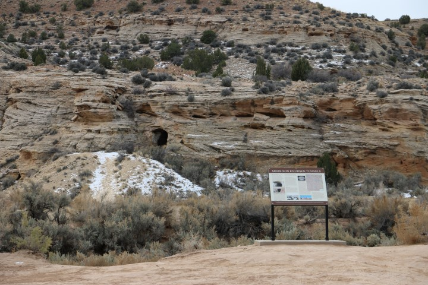

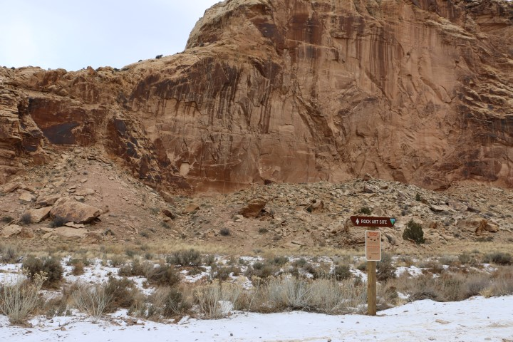

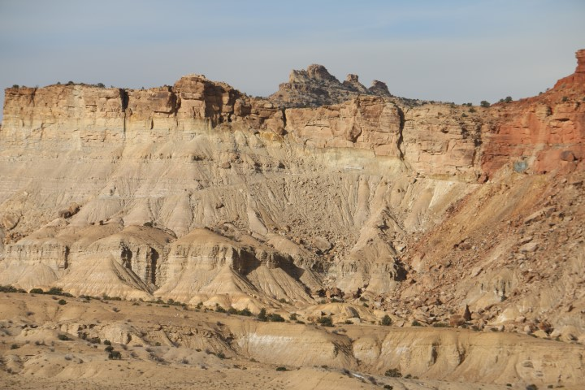
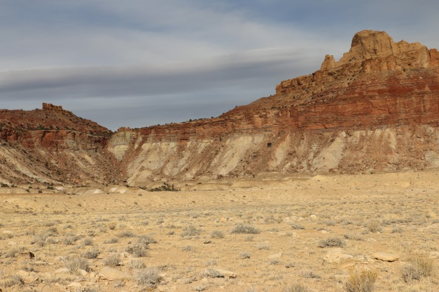
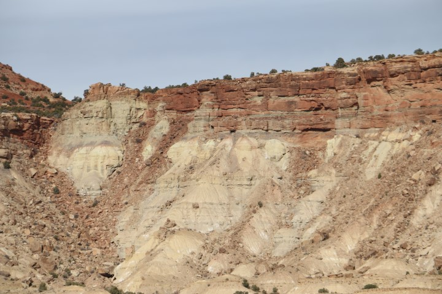

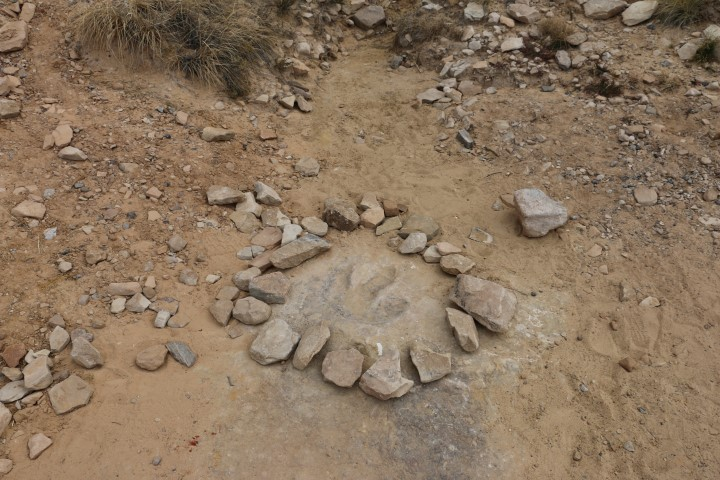

### Buckhorn Pictograph Panel

One of the highlights of the entire San Rafael Swell is the mysterious Buckhorn Wash pictograph panel spanning over 130 feet. A pictograph is painted onto a surface, and a petroglyph is carved or pecked into the stone. There are some faint petroglyphs here, but the red pictograph figures are the stars of this site! The main panel was painted well over 2,000 years ago by a Indian culture archeologists have named “Barrier Canyon Culture”. The Barrier Canyon people were an archaic age hunter-gatherer society, living in caves or brush shelters. The red pigment was created using powdered hematite, and possibly mixed with animal fat, eggs, or some other fluid. For a brush, they may have used fingers or brushes made from animal fur or slender grasses. When painted on freshly exposed sandstone, the stone absorbs the pigments, thus preserving them for thousands of years. The images here are fascinating, and defy interpretation. It is crucial to remember that sites such as these are irreplaceable, and are considered sacred by many indigenous Americans. Treat these ancient links to the past with honor and respect. There is also a boulder here carved with the names of the same hard working CCC boys that built the swinging bridge over the San Rafael River. To drive to the panel please refer to the [travel guide](http://www.emerycounty.com/travel/brochures/roadslesstraveled.pdf) and [map](http://www.emerycounty.com/travel/maps/MapRevised2009.pdf). 

Source: [http://www.emerycounty.com/travel/san-rafael-swell-buckhorn-wash-rock-art-panel.html](http://www.emerycounty.com/travel/san-rafael-swell-buckhorn-wash-rock-art-panel.html)

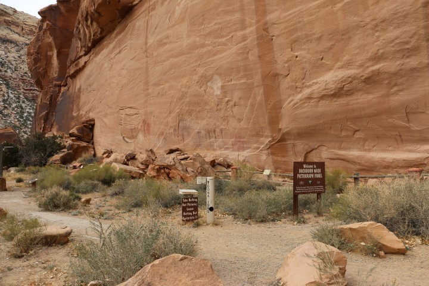

### Swinging Bridge

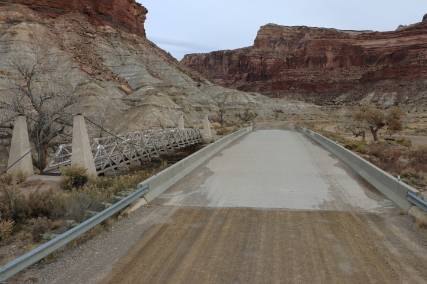

The 160 foot suspension bridge known as the Swinging Bridge was built by the Civilian Conservation Corps in 1937, and dedicated by then Utah Governor Henry H. Blood.  The Swinging Bridge was the only bridge over the river until the early 1990’s.  Though you can no longer drive on the bridge, it is perfectly safe to walk on.  The bridge can be reached by traveling from Cleveland, Huntington, or Castle Dale on the Buckhorn Wash Road, or from Interstate 70 via the Cottonwood Wash Road.

Source: [http://www.sanrafaelcountry.com/san-rafael-swell-swinging-bridge.html](http://www.sanrafaelcountry.com/san-rafael-swell-swinging-bridge.html)

### Bottleneck Peak

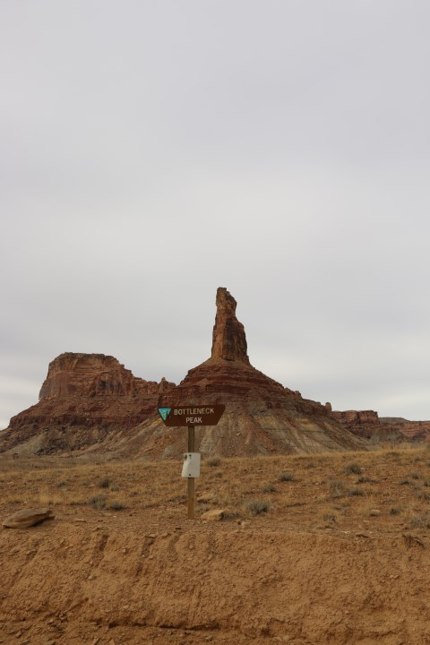

### Sinkhole: See Buckhorn Wash

### Others

* Fix-It Pass
* Devil’s Racetrack
* Eva Conover
* Fuller Bottom

## Vehicle Requirements

This route is suitable to all high-clearance 4×4 vehicles with low-range and 33″ or larger tires, others are not recommended particularly on the Devils Racetrack Trail. Check conditions at the Fuller Bottom crossing of the San Rafael Swell River Plan to have at least a 100 mile (off-road) fuel capacity from one end of the loop to the other. The nearest fuel is Huntington, Ferron and Castle Dale to the west or Wellington to the north, both are along the common loop access points so spare fuel containers are not often needed. There are no services in these areas, plan to cover all your own water, food, vehicle and camping needs. It is not uncommon to spend days in this area without seeing other travelers, plan accordingly.

## Resources

* [ExpeditionUtah Forum Trip Reports](https://www.expeditionutah.com/forum/index.php#trip-reports.12)
* [Bureau of Land Management – San Rafael Swell](http://www.blm.gov/ut/st/en/fo/price/more/san_rafael_swell.html)
* [Emery County – Road Less Traveled Guide](http://www.emerycounty.com/Travel/Brochures/RoadsLessTraveled.pdf)
* [Emery County OHV Travel Map](http://www.emerycounty.com/travel/maps/emery_co_ohv.pdf)
* [Emery County Map Database](http://www.emerycounty.com/travel/san-rafael-swell-maps.html)