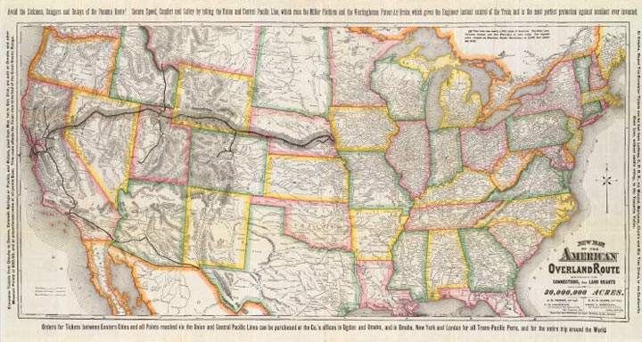

# The Transcontinental Railroad Route

## Background & History

The Transcontinental Railroad Back Country Byway represents an epic achievement in American history, linking East to West in the new nation. Today the landscape looks much the same as it did in 1869, but the rails, the towns, and even the lonely rail sidings are gone. Now the visitor can only imagine the vision and effort of those who struggled to build the nation’s first transcontinental railroad.

The Central Pacific Railroad began laying track east from Sacramento in 1863. After tackling the rugged terrain of the Sierra Nevada Mountains and crossing the Great Basin, the railroad reached Utah in March 1869. The Byway follows the last 90 miles of grade laid by the Central Pacific before their rails met the Union Pacific’s at Promontory Summit.

As you travel west from Golden Spike National Historic Site, you can see two parallel grades. In an effort to reap greater government subsidies, the two competing railroads laid grade along side each other for over 200 miles.

On April 28, 1869, the Central Pacific crews laid 10 miles of track in one day, a record which resulted from a bet between the two railroads. The Central Pacific crews rested at Camp Victory (Rozel), just west of the back country byway information site.

After the rails were joined on May 10, 1869, the new railroad had to be operated and maintained. Along the Promontory Branch, 28 sidings, stations, and associated towns were built to service up to ten trains a day. From Kelton, with a population of about 700, a major stagecoach line and mail and freight route supplied Idaho, Oregon, and the Intermountain North. Terrace, with nearly 1000 residents, was the largest community and served as the maintenance headquarters for the Salt Lake Division. The town included a roundhouse, a machine shop, and an eight-track switch yard, along with hotels, a saloon/justice of the peace, a library/bathhouse, and many other thriving businesses.

The Promontory Branch of the railroad was replaced in 1904 by the Lucin Cutoff, a shorter route built on pilings across the Great Salt Lake. The original grade saw only local use afterwards, and railroad facilities and dependent towns were soon abandoned. The rails were removed in 1942 for use in the war effort.

Today cattle graze where once thousands labored to open the West to industry and commerce. The Transcontinental Railroad Back Country Byway is interpreted at over 30 sites along the grade. Enjoy the past as you travel this route on Utah’s public lands.

## Future

Public lands are continually being reconsidered in this region and it wouldn’t be completely unrealistic to see one or more sections of the Transcontinental Railroad Route re-routed for motorized vehicles or closed all together. We will attempt to update this article as often as possible, if you see a change we have not addressed, please let us know. Lastly, always check with state and federal land management agencies prior to embarking on a trip.

## Trail Segments

**Promontory to Lucin:** This route follows the original railroad grade nearly the entire way between Promontory to Lucin, passing a handful of now ghost towns reminiscent of the past.

**Lucin to Wendover:** This section follows a high speed graded dirt road from splitting from the Transcontinental Railroad Route at Lucin and heading south ending back on the highway near the Bonneville Salt Flats and Wendover, Utah.

## Trail Conditions

The majority of the route from Promontory, Utah to Wendover, Utah is passable in 2-wheel drive however wet weather can make it impassible to even 4WD vehicles.

## Stops Along the Route (listed in east to west travel)

* Kelton (Ghost Town)
* Red Dome (Ghost Town)
* Terrace (Ghost Town)
* Watercress (Ghost Town)
* Lucin (Ghost Town)

## Side Trips & Area Attractions (listed in east to west travel)

* [ATK/Thiokol Rocket Display](http://www.utahoutdooractivities.com/morton.html)
* [Golden Spike National Historic Site](http://www.nps.gov/gosp/index.htm)
* [Locomotive Springs State Waterfowl Management Area](http://desertislands.org/loco.htm)
* [Spiral Jetty](http://www.diaart.org/sites/main/spiraljetty)
* [Hogup Pumping Station](http://www.water.utah.gov/construction/gsl/operating.htm)
* [Republic of Zaqistan](https://www.zaqart.com/zaqistan/zaqistan.shtml)
* [Devils Playground](http://geology.utah.gov/surveynotes/geosights/devils_playground.htm)
* [Lucin Ghost Town](https://www.expeditionutah.com/forum/index.php?threads/ghost-town-lucin-utah.3056/)
* [Lucin Sun Tunnels](http://ludb.clui.org/ex/i/UT3126/)
* [Grouse Creek](http://www.grousecreek.com/)
* [Silver Island Mountains](http://www.blm.gov/ut/st/en/fo/salt_lake/recreation/back_country_byways/Silver_Island_Mountains.html)
* [Bonneville Salt Flats](http://www.utah.com/playgrounds/bonneville_salt.htm)
* [Wendover Airfield](http://www.wendoverairbase.com/)

## GPS Coords & Maps

* [Box Elder County Transportation Map](http://siterepository.s3.amazonaws.com/00065200908031127062114.pdf)
* [Tooele County Transportation Map](http://www.co.tooele.ut.us/PDF/Maps/Roads/udot_b_roads2006.pdf)

Camping Areas: This area is open to primitive camping throughout the BLM land. As this area is rather exposed, campsites with shelter from the desert winds are few and far in between.

## Planning a Trip

**BLM:** This area is managed by the Salt Lake Field Office of the Bureau of Land Management

## Vehicle Prep

### Food/Water/Fuel

* Corrinne, Utah – Fuel/Food
* Promontory, Utah – No Services
* Lucin, Utah – No Services
* Montello, Nevada – Food & Fuel
* Grouse Creek – Fuel available on occasion
* Wendover, Utah – Fuel, Food & Lodging
* Delle, Utah – Food & Fuel (access via Hogup and Lakeside Mountains)

## References:

### Online

* [Utah.com - Transcontinental Railroad](https://utah.com/transcontinental-railroad)
* [SLTrib: Chinese railroad workers honored for linking East and West](https://www.expeditionutah.com/forum/index.php?threads/sltrib-chinese-railroad-workers-honored-for-linking-east-and-west.4087/)
* [SLTrib: A Look Back: Photos of the Transcontinental Railroad and Golden Spike](https://www.expeditionutah.com/forum/index.php?threads/sltrib-a-look-back-photos-of-the-transcontinental-railroad-and-golden-spike.3282/)
* [Old Airmail Beacons](https://www.expeditionutah.com/forum/index.php?threads/old-airmail-beacons.1467/)

### Books

* Massey, Peter & Wilson, Jeanne – Utah Trails: Northern Region – Trail #12
* Huegel, Tony – Utah Byways – Tour #1
* [Book: Utah, Its Resources and Attractions, 1901 By Union Pacific Railroad Company](https://www.expeditionutah.com/forum/index.php?threads/book-utah-its-resources-and-attractions-1901-by-union-pacific-railroad-company.3802/)

### Trip Report Links

* [Freeze Your Tail Off X, OLAFistan 2.0](https://www.expeditionutah.com/forum/index.php?threads/freeze-your-tail-off-x-olafistan-2-0.6421/)
* [https://www.expeditionutah.com/forum/index.php?threads/freeze-your-tail-off-2013-reports-pics-here.3821/](https://www.expeditionutah.com/forum/index.php?threads/freeze-your-tail-off-2013-reports-pics-here.3821/)
* [The Artsy-Fartsy Railroad Tour of 2016](https://www.expeditionutah.com/forum/index.php?threads/the-artsy-fartsy-railroad-tour-of-2016.5425/)
* [Expedition Utah Transcontinental Railroad Trip Report (September 2012)](https://www.expeditionutah.com/forum/index.php?threads/expedition-utah-transcontinental-railroad-trip-report-september-2012.3044/)
* [Ghost Towns & Railroad Run 4-19-08](https://www.expeditionutah.com/forum/index.php?threads/ghost-towns-railroad-run-4-19-08.38/)
* [Golden Spike and the Spiral Jetty](https://www.expeditionutah.com/forum/index.php?threads/golden-spike-and-the-spiral-jetty.301/)