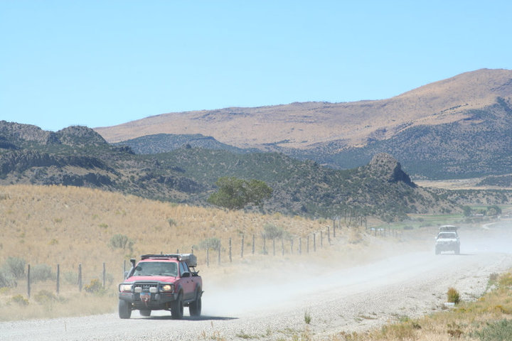

# Utah Converse

## Four Corners (UT/CO/AZ/NM) to Three Corners (UT/NV/ID)

Introducing the Utah Converse, brought to you by ExpeditionUtah and the Utah Cruiser Expedition crew. The Utah Converse route was inaugurally run in the fall of 2010 as part of the Utah Cruiser Expedition II. Formed by Dave Connors of [ExpeditionAmericas.com](http://expeditionamericas.com/), this group of rag-tag Utah explorers met several times over a set of paper maps with a simple goal in mind, a corner to corner dirt run through Utah. While members of our group had traversed many segments of the trip in different trips, none had done it non-stop end to end. With a mission in mind it was time to lay out the routes for each day, each of which was captained by a different member of the group, thus taking ownership for the route, the timing and the campsite for that night. By doing so it was truly a team effort and we were treated to detailed route information and historical data along the route. A detailed trip report of our trip can be found on the [Expedition Portal forum HERE](http://www.expeditionportal.com/forum/threads/48929-Utah-Cruiser-Expedition-2010), thanks to Adam Tolman for documenting our adventure. As Adam did such a great job documenting our trip, the goal with this page is to simply serve as a resource for planning a similar trip. We’ve received great interest in this route over the years, many asking if we would host a group run open to the public. At this time we have no plans to do so but get some of your travel mates together and use this resource to plan your own Utah Converse voyage! – KW

Our voyage started with a transit stage from Salt Lake City to the Four Corners (UT/CO/AZ/NM) area. While all of our participants reside in the greater Salt Lake City area, we had varied departure times and thus finding a group camp site for the evening was easier than trying to get everyone to caravan down.

## Segment 1 – Four Corners to Poison Springs

**Route Sketch:** The route starts at the popular [Four Corners Monument](http://www.navajonationparks.org/htm/fourcorners.htm) and visitors center and continues northwest on the Navajo Indian Reservation and later intersects the Yellow Rock Point and Lone Mountain Roads before hitting the pavement (SR262 & CH414) briefly at Montezuma Creek. The route continues north through Montezuma Creek and into Blanding where we fueled the rigs before climbing into the Abajo/Manti-La Sal Mountains to the west of town.  We crossed over the Abajo’s and down into Hite (fuel available) via Wooden Shoe Road. From Hite we traveled north on the NPS 633 to our camp in Poison Springs Canyon at the Dirty Devil River crossing.

**Notes:** Travel on the Navajo Indian Reservation requires a special travel permit that is available at the 4-Corners monument visitors center. Keep in mind the visitors center has seasonal hours and the permits may not always be available. Our original plans had been to cross the San Juan River at Aneth but the water was far too deep and the entry and exit were far from ideal. We opted instead to cross at Montezuma Creek on the bridge. The Abajo/Manti-La Sal Mountains are high elevation and thus trails are often under snow even into the early summer months. Check ahead to make sure the area is clear and passable. The Dirty Devil River crossing in Poison Spring Canyon can be impassible at times throughout the year, particularly in the spring and/or after major weather in the area. Please visit the [ExpeditionUtah River Flow Data](https://www.expeditionutah.com/forum/index.php?threads/river-flow-data-for-utah-river-crossing-information.1393/) page for more info. It’s generally accepted that 150 cfs is the high limit for crossing the Dirty Devil in a properly equipped vehicle. 

## Segment 2 – Poison Springs Canyon to Skyline Drive

**Route Sketch:** Poison Springs Canyon west, short stint of pavement (SR95) south to the Bull Creek Pass Scenic Byway via the Henry Mountains, passing Eagle City (ghost town) and Wickiup Pass. North on the Henry Mountain Access Road into Hanksville (fuel), west on SR24 to Cainville Wash Road, Lower Last Chance Loop Road and the Cathedral Valley Road through the Capitol Reef National Park area. Upper Last Chance Road to Interstate 70, Miller Canyon Road to Emery (fuel available). Link Canyon to our Skyline Drive Camp.

**Notes:** Travel through Poison Springs Canyon out of the Maze can be impassible during certain times of the year, particularly after heavy rainfall. The Henry Mountains and Skyline Drive Routes are high elevation and thus trails are often under snow even into the early summer months. Check ahead to make sure the area is clear and passable.

## Segment 3 – Skyline Drive to Newfoundland Mountains

**Route Sketch:** Skyline Drive, Mayfield-Ferron Scenic Byway, Sixmile Canyon into Manti (fuel available). SR132 to Chicken Creek Road Scenic Backway to SR28. Levan/Nephi (fuel if needed) and west along SR132, Spring Canyon and the Jericho Junction Road. West on the Callao Road to Desert Mountain, north on Government Creek Road over Ericson Pass to Dugway. North on SR196 to White Rock Road, South Cedar Mountain Road, Rydalch Canyon and the Ceder Mountain Road. East over Hastings Pass to Delle (fuel available). From Delle, north along the Lakeside Mountains to Wrathall Pass. Puddle Valley Highway (dirt) to Lakeside. Lucin Cutoff west to Hogup Pumping Stations. Continue west along the Lucin Cutoff to the [Newfoundland Mountains](https://www.expeditionutah.com/forum/index.php?threads/the-mines-camps-of-the-newfies-newfoundland-mountains.611/) where we camped for the night.

**Notes:** Fuel is available in Delle along Interstate 80. This will be your last fuel option until Grouse Creek in NW Utah.

## Segment 4 – Newfoundlands to Utah/Nevada/Idaho Border

**Route Sketch:** Departed Newfoundland Mountains east to the Hogup Pumping Station. North along the Hogup Mountains to the Transcontinental Railroad. Cross Over SR30 on the Rosebud Creek Road to Ingham Pass and west down Ingham Canyon into Grouse Creek (fuel available). Morse Canyon to Straight Fork Creek. Take the Hardesty Creek Road NW in Nevada before turning back NE on the Goose Creek Road back into Utah, arriving at the Utah/Idaho border.

**Notes:** The Grouse Creek Country Store has fuel available 24/7 at the pump and offers a small selection of food and snacks inside however store hours are limited so plan accordingly. The Three-Corners (UT/NV/ID) corner is located on private property. As luck would have it, one of the corners ranch owners happened across our group as we sat at the UT/ID border high-fiving. She offered to grant us access to the exact spot (marked my a small monument) at a future date. Next time!

**Overall Logistics Note:** Each segment of the route can and have been accomplished in a single day (for example our original trip) however it is highly recommended that you allot more time, possibly moving camping locations to accommodate different daily mileages. Our schedule was quite tight and often had us leaving early in the morning and getting into camp later in the evening. While many don’t prefer this type of schedule our group in fact embraced it and that made it part of the appeal. Again many of us had done a great deal of this trip before, just not end to end. I’ve made slight changes to the route based on our experience and subsequent or prior travels in those areas. Overall, be flexible. While this route sketch provides a back bone for the trip, there are dozens if not hundreds of slight variations available on this route to cater it to your wants and needs.

**Overall Trip Notes:** Because of our large group we opted to do group meals, more specifically do group lunches and dinners all provided by Chef Paul May and Sous Chef Jeremy Green. Paul & Jeremy spread the food load out among the attendees fridges and we each too turns doing cleanup after the meals. This provided optimal efficiency and allowed our group to get on the trail earlier and eat as a team each evening.  Each vehicle consumed over 100 gallons of fuel (that includes both transit legs to and from Salt Lake City). While fuel was available at locations throughout our route, most of us also carried at least 10 gallons of additional fuel. Vehicle were outfitted quite similarly to handle the terrain and more importantly the speeds we encountered; aftermarket suspensions, 1-2″ taller tire sizes and a plethora of gear upgrades to make the trip more comfortable.

## Planning Your Own Trip?

Be sure to participate in the [ExpeditionUtah Forum](http://www.expeditionutah.com/forum), there are many threads covering areas of this route and we would love some follow-up on route conditions and route variances you take. Please share a trip report on the forum as well, our community is completely user driven and there is no better way to learn and inspire than by sharing and enjoying the travels of others.

Created: 01/01/11
Last Updated: 07/03/16
©2010-2016 ExpeditionUtah.com
Photos: © 2016 Adam Tolamn