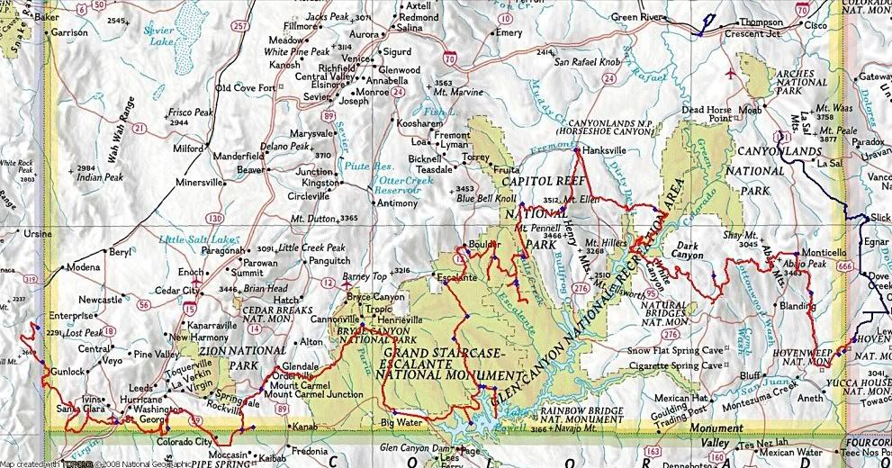
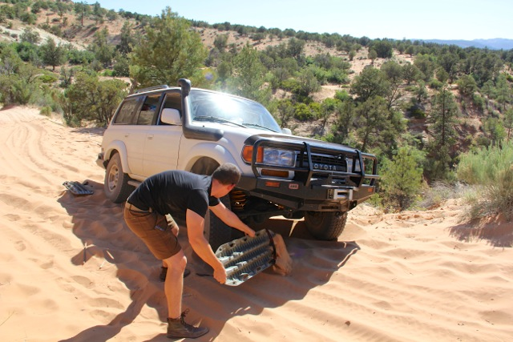

# The Utah Traverse

## The Route
> “There are countless route options and even methods of travel with which a trip across southern Utah can be put together. One day on paved roads or two months exploring every spur, the sky isn’t even the limit if you consider remote landing strips. Thinking about spending two months reminds me when while at an REI store years ago I listened to a presentation by folks who nearly crossed all of southern Utah by foot while avoiding roads of any kind as much as possible.

> The ideal traverse will vary greatly depending on who you talk to. For those here on Expedition Utah it’s safe to say the ideal vehicle dependent route avoids pavement by rule and escapes crowds often while taking the traveler across Utah’s most wild and beautiful desert and mountain landscape. Some of the most ideal segments unfortunately have been closed to vehicular travel. Although this trip may pale in comparison to proper expeditions conducted regularly around the globe it was truly an epic trip for us…”

[Read more about this trip here.](https://www.expeditionutah.com/forum/index.php?threads/southern-utah-traverse-2009.1127/)

## GPS Track File:
Download the 2009 Southern Utah Traverse [GPX File](utahTraverse.gpx)

## History
The “Utah Traverse” proper route first popped up on ExpeditionUtah in 2008 at the hands of forum member and long-time Southern Utah traveler Sinuhe Xavier. You can [read more about his thought process and planning](https://www.expeditionutah.com/forum/index.php?threads/the-utah-traverse.331/) behind the Utah Traverse.

The Utah Cruiser Expedition group (many of which ended up here on ExpeditionUtah) planned and completed a similar route in the Fall of 2005, their trip was featured in the November/December 2005 issue of the [Toyota Trails magazine](http://tlca.org/toyota-trails/) and can be seen [here](http://www.expeditionamericas.com/exam/uce.pdf). The group has since gone on to tackle the Utah Inverse (North-South across Utah) and the ultimate route, the [Utah Converse](https://www.expeditionutah.com/featured-trails/utah-converse/). The Utah Converse treks from 4-Corners UT/CO/NM/AZ to 3-Corners UT/ID/NV, utilizing primarily off-road routes to converse the state east-to-west as well as south-to-north.

Covering such an unique and remote portion of Utah inspired countless others to plan their own Utah Traverse and make their way across some of Utah’s most idyllic terrain. Check out the many trip reports found on the Utah Traverse below.

## Trip Reports & Planning Threads

* [Southern Utah Traverse 2009](https://www.expeditionutah.com/forum/index.php?threads/southern-utah-traverse-2009.1127/)
* [Floridians do Utah - (a traverse plus some other stuff)](https://www.expeditionutah.com/forum/index.php?threads/floridians-do-utah-a-traverse-plus-some-other-stuff.2903/)
* [EU.com Utah Traverse 2009 - Beta Planning Thread](https://www.expeditionutah.com/forum/index.php?threads/eu-com-utah-traverse-2009-beta-planning-thread.346/)
* [Southern Utah Traverse, Sept 4–13](https://www.expeditionutah.com/forum/index.php?threads/southern-utah-traverse-sept-4%E2%80%9313.838/)
* [Utah Traverse progress](https://www.expeditionutah.com/forum/index.php?threads/utah-traverse-progress.986/)
* [Utah Cruiser Expedition](http://www.expeditionamericas.com/exam/uce.pdf)

## Video Trip Reports

* [Arizona Land Rover Owner’s club drives the Utah Traverse](https://www.youtube.com/watch?v=U3Nl4Mr4qXM)
* [BOLD Overland S3 E1 Utah Traverse Expedition: Westbound and Down](https://www.youtube.com/watch?v=HrHUC5T9kSY)
* [BOLD Overland S3 E2 Utah Traverse Expedition: High Desert Nights](https://www.youtube.com/watch?v=YbQ8NAcEFI0)
* [BOLD Overland S3 E3 Utah Traverse Expedition: Where the Wind Blows](https://www.youtube.com/watch?v=iZ89vBJ9zZ4)
* [ONTV: Overlanding USA - S2 E1 - Utah Traverse](https://youtu.be/pDSiR_NzMHk)
* [ONTV: Overlanding USA - S2 E2 - Utah Traverse](https://www.youtube.com/watch?v=CNuHF7wp-o4)
* [ONTV: Overlandingusa - S2 E3 - Utah Traverse](https://youtu.be/gEZu-MnnjV0)